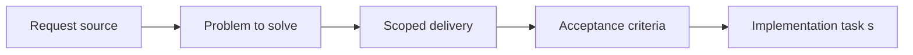

## item_027_add_companion_doc_creation_flows_and_regression_coverage_in_plugin - Add companion doc creation flows and regression coverage in plugin
> From version: 1.9.0
> Status: Done
> Understanding: 98%
> Confidence: 96%
> Progress: 100%
> Complexity: Medium
> Theme: Companion-doc creation and regression safety
> Reminder: Update status/understanding/confidence/progress and linked task references when you edit this doc.

# Problem
Companion docs needed a clear creation path from the plugin itself.
Without it, the new workflow model would stay partially external to the cockpit and users would still need to hunt for scripts or create docs manually.

# Scope
- In:
- Add a generic `Create companion doc` flow from the details panel, tools menu, and command palette.
- Reuse kit-side generators for product briefs and ADRs.
- Add regression coverage around creation and navigation actions.
- Out:
- Heavy automated detection of whether a companion doc should be created.

# Acceptance criteria
- AC1: The plugin exposes an intentional companion-doc creation flow, preferably via a generic `Create companion doc` action.
- AC2: Regression coverage exists for companion-doc creation, opening, and supporting workflow integration.

# AC Traceability
- AC1 -> Implemented in `src/extension.ts`, `package.json`, and `media/main.js` with interaction coverage in `tests/webview.harness-a11y.test.ts`.
- AC2 -> Regression coverage extended across indexer, maintenance, and webview layers.

# Decision framing
- Product framing: Not needed
- Product signals: (none detected)
- Architecture framing: Not needed
- Architecture signals: (none detected)

# Links
- Product brief(s): (none yet)
- Architecture decision(s): (none yet)
- Request: `req_022_align_vs_code_plugin_with_companion_docs_workflow`
- Primary task(s): `task_021_align_vs_code_plugin_with_companion_docs_workflow`

# Priority
- Impact: High. Creation is necessary for the workflow to be actionable from the plugin.
- Urgency: Medium-High. It completes the UX once visibility and navigation exist.

# Notes
- Derived from umbrella item `item_022_align_vs_code_plugin_with_companion_docs_workflow`.
- Derived from request `req_022_align_vs_code_plugin_with_companion_docs_workflow`.
- Delivered:
  - generic `Create companion doc` action from details, tools, and command palette;
  - routing to kit-side product brief and ADR generators;
  - regression coverage increased to keep the workflow stable.
