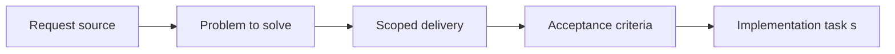

## item_028_replace_hide_used_requests_with_hide_processed_requests_semantics - Replace hide used requests with hide processed requests semantics
> From version: X.X.X
> Status: Ready
> Understanding: ??%
> Confidence: ??%
> Progress: 0%
> Complexity: Medium
> Theme: General
> Reminder: Update status/understanding/confidence/progress and linked task references when you edit this doc.

# Problem
Describe the problem and user impact

# Scope
- In:
- Out:

# Acceptance criteria
- AC1: Define an objective acceptance check

# AC Traceability
- AC1 -> Item scope and delivery path are defined. Proof: add test/commit/file links.

# Decision framing
- Product framing: Consider
- Product signals: navigation and discoverability
- Architecture framing: Consider
- Architecture signals: data model and persistence

# Links
- Product brief(s): (none yet)
- Architecture decision(s): (none yet)
- Request: `req_023_replace_hide_used_requests_with_hide_processed_requests_semantics`
- Primary task(s): `task_XXX_example`

# Priority
- Impact:
- Urgency:

# Notes
- Derived from request `req_023_replace_hide_used_requests_with_hide_processed_requests_semantics`.
- Source file: `logics/request/req_023_replace_hide_used_requests_with_hide_processed_requests_semantics.md`.
