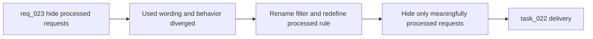

## item_028_replace_hide_used_requests_with_hide_processed_requests_semantics - Replace hide used requests with hide processed requests semantics
> From version: 1.9.1
> Status: Done
> Understanding: 99% (closed)
> Confidence: 98% (validated)
> Progress: 100%
> Complexity: Medium
> Theme: General
> Reminder: Update status/understanding/confidence/progress and linked task references when you edit this doc.

# Problem
- The plugin used a technical `Hide used requests` label that did not match the workflow intent operators actually care about.
- Requests were disappearing based on generic references instead of meaningful delivery progress, which made the board harder to trust.
- Companion-doc links and draft child items were too weak to justify hiding the originating request from the main workflow surfaces.

# Scope
- In:
  - Rename the filter to `Hide processed requests`.
  - Replace the old used-request heuristic with a delivery-oriented processed-request rule.
  - Keep companion-doc-only references and draft child items out of the first processed rule.
  - Cover the renamed semantics in the plugin filtering tests.
- Out:
  - Reworking all workflow completion semantics across the kit.
  - Changing promotion rules outside request visibility.
  - Bundling this behavior change with unrelated companion-doc UX work.

# Acceptance criteria
- AC1: The plugin no longer exposes the wording `Hide used requests` in the UI.
- AC2: The replacement wording remains understandable without knowing the internal Logics data model.
- AC3: The filtering rule is redefined through a dedicated processed-request concept rather than by reusing the old used heuristic.
- AC4: The implementation distinguishes between structural references and requests that have been meaningfully processed in delivery.
- AC5: A request counts as processed only when it is linked to at least one non-draft backlog item or task.
- AC6: A request linked only to a draft backlog item or task remains visible.
- AC7: A request linked only to product or architecture companion docs is not considered processed.
- AC8: The chosen rule is documented clearly enough in code and tests to avoid ambiguity.
- AC9: Board and list visibility behavior remains predictable and regression-tested after the rename.

# AC Traceability
- AC1 -> Plugin labels and control copy. Proof: task `task_022_replace_hide_used_requests_with_hide_processed_requests_semantics` reports the UI rename.
- AC2 -> Operator-facing wording in the plugin filter surface. Proof: task `task_022_replace_hide_used_requests_with_hide_processed_requests_semantics` captures the final wording.
- AC3 -> Dedicated processed-request semantics in code. Proof: task `task_022_replace_hide_used_requests_with_hide_processed_requests_semantics` reports the helper and logic rename.
- AC4 -> Delivery-oriented visibility rule. Proof: task `task_022_replace_hide_used_requests_with_hide_processed_requests_semantics` documents the structural-vs-processed distinction.
- AC5 -> Non-draft backlog/task linkage rule. Proof: task `task_022_replace_hide_used_requests_with_hide_processed_requests_semantics` reports the delivery-status threshold.
- AC6 -> Draft child items do not hide the request. Proof: task `task_022_replace_hide_used_requests_with_hide_processed_requests_semantics` explicitly calls this out in the report.
- AC7 -> Companion-doc-only links do not hide the request. Proof: task `task_022_replace_hide_used_requests_with_hide_processed_requests_semantics` explicitly calls this out in the report.
- AC8 -> Semantics documented for future maintenance. Proof: request `req_023_replace_hide_used_requests_with_hide_processed_requests_semantics`, this backlog item, and task `task_022_replace_hide_used_requests_with_hide_processed_requests_semantics` now align on the rule.
- AC9 -> Regression-tested request visibility behavior. Proof: task `task_022_replace_hide_used_requests_with_hide_processed_requests_semantics` captures compile and test validation.

# Decision framing
- Product framing: Consider
- Product signals: navigation and discoverability
- Architecture framing: Consider
- Architecture signals: data model and persistence

# Links
- Product brief(s): (none yet)
- Architecture decision(s): (none yet)
- Request: `req_023_replace_hide_used_requests_with_hide_processed_requests_semantics`
- Primary task(s): `task_022_replace_hide_used_requests_with_hide_processed_requests_semantics`

# Priority
- Impact:
- Urgency:

# Notes
- Derived from request `req_023_replace_hide_used_requests_with_hide_processed_requests_semantics`.
- Source file: `logics/request/req_023_replace_hide_used_requests_with_hide_processed_requests_semantics.md`.
