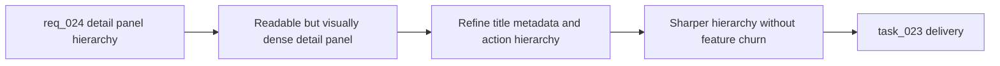

## item_029_refine_plugin_detail_panel_identity_and_action_hierarchy - Refine plugin detail panel identity and action hierarchy
> From version: 1.9.1
> Status: Done
> Understanding: 99% (closed)
> Confidence: 98% (validated)
> Progress: 100%
> Complexity: Medium
> Theme: General
> Reminder: Update status/understanding/confidence/progress and linked task references when you edit this doc.

# Problem
- The detail panel worked functionally, but long titles and ids still produced a visually heavy identity block.
- The footer action bar did not communicate the difference between primary, secondary, and sensitive actions clearly enough.
- The panel needed stronger hierarchy without losing the workflow affordances added by the companion-doc work.

# Scope
- In:
  - Refine the title and metadata hierarchy at the top of the detail panel.
  - Make the title dominant while keeping the internal id visible but quieter.
  - Clarify footer action emphasis across `Edit`, `Read`, `Promote`, `Done`, and `Obsolete`.
  - Preserve current companion-doc and supporting-doc affordances.
- Out:
  - Changing workflow semantics for the existing actions.
  - Redesigning the entire extension UI language.
  - Reworking companion-doc behavior again.

# Acceptance criteria
- AC1: The detail panel title area remains stable and readable with long titles and ids.
- AC2: The item title is visually prioritized over the internal id or filename-like metadata.
- AC3: The `Name` row and related metadata stay visible but less dominant than the main title and workflow sections.
- AC4: The footer distinguishes primary, secondary, and destructive or exceptional actions clearly.
- AC5: `Obsolete` no longer has the same emphasis as safe, high-frequency actions.
- AC6: Disabled actions remain understandable without creating unnecessary visual noise.
- AC7: Companion-doc and supporting-doc affordances remain intact.
- AC8: The intended action hierarchy is explicit in the implementation.
- AC9: Long titles can wrap while remaining reasonably bounded in height.
- AC10: Layout and visible-state behavior are covered by automated tests where reasonable.

# AC Traceability
- AC1 -> Stable title layout under long content. Proof: task `task_023_refine_plugin_detail_panel_identity_and_action_hierarchy` reports the long-title stabilization work.
- AC2 -> Title-first identity hierarchy. Proof: task `task_023_refine_plugin_detail_panel_identity_and_action_hierarchy` reports that the title now dominates and ids behave like quieter metadata.
- AC3 -> Quieter metadata treatment. Proof: request `req_024_refine_plugin_detail_panel_identity_and_action_hierarchy`, this backlog item, and task `task_023_refine_plugin_detail_panel_identity_and_action_hierarchy` align on the `Name` row treatment.
- AC4 -> Footer action hierarchy refinement. Proof: task `task_023_refine_plugin_detail_panel_identity_and_action_hierarchy` reports clearer footer action hierarchy.
- AC5 -> Cautious emphasis for `Obsolete`. Proof: task `task_023_refine_plugin_detail_panel_identity_and_action_hierarchy` reports the refined action hierarchy including sensitive actions.
- AC6 -> Disabled-action readability. Proof: request `req_024_refine_plugin_detail_panel_identity_and_action_hierarchy` and task `task_023_refine_plugin_detail_panel_identity_and_action_hierarchy` keep disabled-action comprehension in scope.
- AC7 -> Companion-doc affordances preserved. Proof: task `task_023_refine_plugin_detail_panel_identity_and_action_hierarchy` reports refinement without feature expansion.
- AC8 -> Explicit button hierarchy in implementation. Proof: task `task_023_refine_plugin_detail_panel_identity_and_action_hierarchy` reports the intended button roles and emphasis.
- AC9 -> Bounded title wrapping. Proof: task `task_023_refine_plugin_detail_panel_identity_and_action_hierarchy` reports stabilized long-title overflow behavior.
- AC10 -> Automated regression coverage. Proof: task `task_023_refine_plugin_detail_panel_identity_and_action_hierarchy` reports related CSS and UI tests.

# Decision framing
- Product framing: Not needed
- Product signals: (none detected)
- Architecture framing: Not needed
- Architecture signals: (none detected)

# Links
- Product brief(s): (none yet)
- Architecture decision(s): (none yet)
- Request: `req_024_refine_plugin_detail_panel_identity_and_action_hierarchy`
- Primary task(s): `task_023_refine_plugin_detail_panel_identity_and_action_hierarchy`

# Priority
- Impact:
- Urgency:

# Notes
- Derived from request `req_024_refine_plugin_detail_panel_identity_and_action_hierarchy`.
- Source file: `logics/request/req_024_refine_plugin_detail_panel_identity_and_action_hierarchy.md`.
