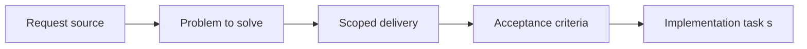

## item_029_refine_plugin_detail_panel_identity_and_action_hierarchy - Refine plugin detail panel identity and action hierarchy
> From version: 1.9.0+
> Status: Done
> Understanding: 98%
> Confidence: 97%
> Progress: 100%
> Complexity: Medium
> Theme: General
> Reminder: Update status/understanding/confidence/progress and linked task references when you edit this doc.

# Problem
Describe the problem and user impact

# Scope
- In:
- Out:

# Acceptance criteria
- AC1: Define an objective acceptance check

# AC Traceability
- AC1 -> Item scope and delivery path are defined. Proof: add test/commit/file links.

# Decision framing
- Product framing: Not needed
- Product signals: (none detected)
- Architecture framing: Not needed
- Architecture signals: (none detected)

# Links
- Product brief(s): (none yet)
- Architecture decision(s): (none yet)
- Request: `req_024_refine_plugin_detail_panel_identity_and_action_hierarchy`
- Primary task(s): `task_023_refine_plugin_detail_panel_identity_and_action_hierarchy`

# Priority
- Impact:
- Urgency:

# Notes
- Derived from request `req_024_refine_plugin_detail_panel_identity_and_action_hierarchy`.
- Source file: `logics/request/req_024_refine_plugin_detail_panel_identity_and_action_hierarchy.md`.
