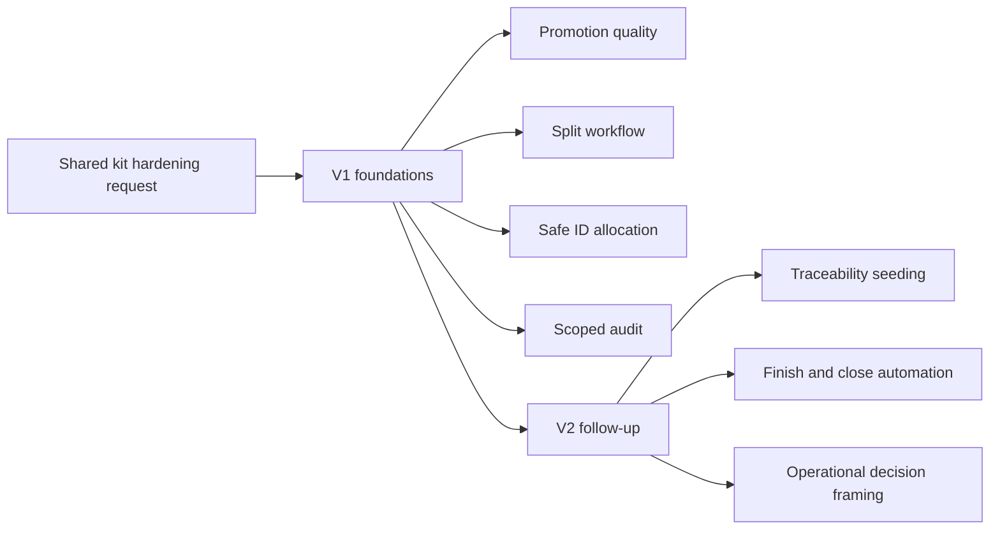

## item_030_harden_logics_kit_workflow_generation_and_governance_from_real_usage - Harden Logics kit workflow generation and governance from real usage
> From version: 1.9.0
> Status: Ready
> Understanding: 98%
> Confidence: 97%
> Progress: 0%
> Complexity: High
> Theme: Shared Logics kit workflow hardening
> Reminder: Update status/understanding/confidence/progress and linked task references when you edit this doc.

# Problem
Real usage of the shared `logics/skills` submodule still exposes several friction points:
- promotion produces docs that are structurally valid but too generic;
- split remains manual;
- id allocation shows collision risk;
- scoped audit is missing;
- traceability and close-out still need too much manual synchronization.

These gaps reduce the value of the kit in two directions:
- downstream projects still need cleanup work after generation;
- the agent itself loses efficiency because the workflow is not yet strong enough to carry more of the repetitive structure automatically.

This backlog item is an umbrella coordination item.
Its role is to turn the broad hardening request into an executable phased delivery for the shared kit, while keeping the implementation generic enough for all consuming repositories.

# Scope
- In:
- Define and coordinate the phased delivery of the shared-kit hardening work described in `req_025`.
- Cover V1 foundations first:
  - richer promotion output
  - first-class split support
  - safer id allocation
  - scoped audit
- Keep V2 follow-up explicit:
  - stronger AC traceability seeding
  - better close/finish synchronization
  - more operational decision-framing follow-up
- Out:
- Implementing all underlying script changes directly inside this umbrella item without further execution structure.
- Repo-specific behavior that only fits `cdx-logics-vscode`.

# Acceptance criteria
- AC1: The hardening request is turned into a clear execution frame that preserves the kit’s role as a shared cross-project submodule.
- AC2: The item defines an explicit phased direction for V1 versus V2 so implementation can start with the highest-value and lowest-risk changes.
- AC3: The linked task is positioned as an orchestration task for shared-kit evolution rather than as a narrow repo-local implementation slice.
- AC4: The delivery plan explicitly protects generic behavior, backward compatibility expectations, and agent productivity concerns.

# AC Traceability
- AC1 -> Item scope and notes define the shared-submodule constraints. Proof: this item and linked task reference `req_025` and its genericity rules.
- AC2 -> Scope and notes separate V1 from V2. Proof: phased execution frame captured here and in `task_024`.
- AC3 -> Primary task points to a kit-level orchestration task. Proof: linked below.
- AC4 -> Notes and priority frame the work around shared-kit safety and operational efficiency. Proof: linked request and task.

# Decision framing
- Product framing: Not needed
- Product signals: (none detected)
- Architecture framing: Required
- Architecture signals: data model and persistence, contracts and integration

# Links
- Product brief(s): (none yet)
- Architecture decision(s): (none yet)
- Request: `req_025_harden_logics_kit_workflow_generation_and_governance_from_real_usage`
- Primary task(s): `task_024_harden_logics_kit_workflow_generation_and_governance_from_real_usage`

# Priority
- Impact: High. This affects the shared kit used across multiple repos and influences every downstream workflow iteration.
- Urgency: High. The friction is already visible in current usage and slows both project work and agent efficiency.

# Notes
- Derived from request `req_025_harden_logics_kit_workflow_generation_and_governance_from_real_usage`.
- Source file: `logics/request/req_025_harden_logics_kit_workflow_generation_and_governance_from_real_usage.md`.
- This item should be treated as an umbrella item, not as a single implementation slice.
- The preferred implementation order is:
  - V1: richer promotion, explicit split, robust id allocation, scoped audit
  - V2: stronger traceability seeding, better finish/close propagation, more actionable decision framing
- The work must remain generic for all repositories consuming `logics/skills`.
- The work should also measurably reduce repetitive cleanup for the agent using Logics as an execution framework.
