## item_031_harden_extension_packaging_agent_loading_and_workspace_runtime_behavior - Harden extension packaging, agent loading, and workspace runtime behavior
> From version: 1.9.1 (refreshed)
> Status: Done
> Understanding: 100% ((closed); refreshed)
> Confidence: 100% (validated)
> Progress: 100% ((audit-aligned); refreshed)
> Complexity: High
> Theme: Extension runtime robustness and release hygiene
> Reminder: Update status/understanding/confidence/progress and linked task references when you edit this doc.

# Problem
The extension is functionally solid, but a project audit still exposed several structural weaknesses that matter in real usage:
- the VSIX package currently includes development-oriented files that should not ship;
- the agent definition loader is too narrow for richer valid YAML agent definitions;
- prompt injection into Codex/chat still relies on brittle clipboard and command timing behavior;
- workspace-root behavior remains ambiguous in multi-root contexts;
- the project still lacks a real extension-host smoke check beyond unit and jsdom coverage.

These weaknesses affect:
- release quality;
- runtime predictability;
- future extensibility of the agent ecosystem;
- and confidence that the extension behaves correctly outside the most common local path.

This backlog item should be treated as an umbrella item.
It coordinates hardening work across packaging, runtime behavior, and integration safety without mixing it with shared-kit evolution or webview-structure refactor work tracked elsewhere.

# Scope
- In:
- Package hygiene for shipped VSIX contents.
- Agent registry parsing and validation hardening.
- Prompt-injection resilience and safer fallback behavior.
- Workspace-root behavior improvements for multi-root setups.
- Integration-level smoke coverage for activation or command/webview readiness.
- Out:
- Shared-kit hardening already tracked in `req_025`.
- Webview frontend refactor already tracked in `req_026`.
- Broad UI redesign or workflow-model changes.

```mermaid
%% logics-kind: backlog
%% logics-signature: backlog|harden-extension-packaging-agent-loading|req-027-harden-extension-packaging-agent|the-extension-is-functionally-solid-but|ac1-the-request-is-turned-into
flowchart LR
    Request[req_027_harden_extension_packaging_agent_l] --> Problem[The extension is functionally solid but]
    Problem --> Scope[Harden extension packaging agent loading a]
    Scope --> Acceptance[AC1: The request is turned into]
    Acceptance --> Tasks[task_025_harden_extension_packaging_agent_]
```

# Acceptance criteria
- AC1: The request is turned into a coherent extension-hardening execution frame rather than left as a loose collection of audit notes.
- AC2: The item explicitly covers the five main hardening areas:
  - packaging
  - agent loading
  - prompt injection
  - workspace behavior
  - integration smoke testing
- AC3: The item stays scoped to the main extension project and does not drift into shared-kit work or webview-front refactor work already tracked elsewhere.
- AC4: The linked implementation path preserves release hygiene, runtime robustness, and maintainability as the main priorities.

# AC Traceability
- AC1 -> Problem, scope, and notes structure the audit findings into one execution frame. Proof: this item and linked request.
- AC2 -> Scope and mermaid identify the five main hardening areas. Proof: listed above.
- AC3 -> Out-of-scope explicitly excludes `req_025` and `req_026`. Proof: scope boundaries above.
- AC4 -> Priority and notes frame the work around robustness and release quality. Proof: sections below.
- AC5 -> covered by linked delivery scope. Proof: covered by linked task completion.
- AC6 -> covered by linked delivery scope. Proof: covered by linked task completion.
- AC7 -> covered by linked delivery scope. Proof: covered by linked task completion.
- AC8 -> covered by linked delivery scope. Proof: covered by linked task completion.
- AC9 -> covered by linked delivery scope. Proof: covered by linked task completion.

# Decision framing
- Product framing: Consider
- Product signals: conversion journey
- Architecture framing: Required
- Architecture signals: data model and persistence, contracts and integration, runtime and boundaries

# Links
- Product brief(s): (none yet)
- Architecture decision(s): `adr_003_harden_extension_runtime_with_explicit_packaging_and_workspace_selection`
- Request: `req_027_harden_extension_packaging_agent_loading_and_workspace_runtime_behavior`
- Primary task(s): `task_025_harden_extension_packaging_agent_loading_and_workspace_runtime_behavior`

# Priority
- Impact: High. These issues affect packaging, runtime behavior, and confidence in the extension across real editor contexts.
- Urgency: Medium-High. Nothing is catastrophically broken, but several weaknesses compound as the project grows and is packaged more often.

# Notes
- Derived from request `req_027_harden_extension_packaging_agent_loading_and_workspace_runtime_behavior`.
- Source file: `logics/request/req_027_harden_extension_packaging_agent_loading_and_workspace_runtime_behavior.md`.
- This should remain an umbrella backlog item.
- A likely next split is:
  - packaging boundaries
  - agent loader hardening
  - prompt injection hardening
  - workspace-root behavior
  - integration smoke coverage
- The work should stay separate from:
  - shared `logics/skills` hardening
  - webview structure refactor

- Derived from `logics/request/req_027_harden_extension_packaging_agent_loading_and_workspace_runtime_behavior.md`.
# Tasks
- `logics/tasks/task_025_harden_extension_packaging_agent_loading_and_workspace_runtime_behavior.md`
