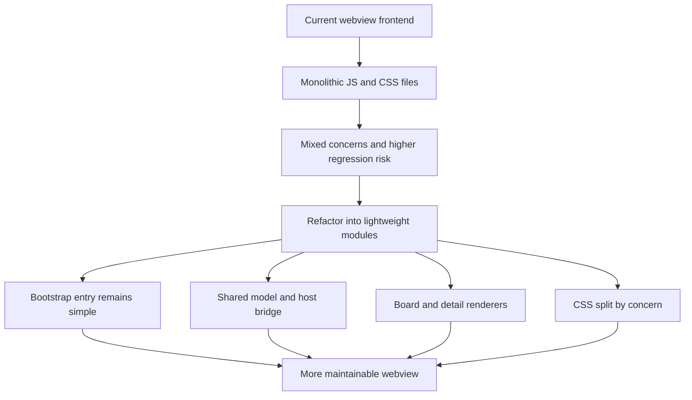

## item_032_refactor_webview_frontend_structure_without_introducing_a_full_framework - Refactor webview frontend structure without introducing a full framework
> From version: 1.9.0
> Status: Done
> Understanding: 99%
> Confidence: 98%
> Progress: 100%
> Complexity: High
> Theme: Webview frontend architecture and maintainability
> Reminder: Update status/understanding/confidence/progress and linked task references when you edit this doc.

# Problem
- The webview frontend has grown beyond the point where [`media/main.js`](/Users/alexandreagostini/Documents/cdx-logics-vscode/media/main.js) and [`media/main.css`](/Users/alexandreagostini/Documents/cdx-logics-vscode/media/main.css) remain easy to evolve safely as monolithic files.
- Rendering, state, host communication, workflow-model helpers, and markdown/detail behavior are concentrated in one JS file, while layout, cards, detail panel, preview, and responsive rules are concentrated in one CSS file.
- This increases regression risk, raises the cost of review and debugging, and makes future plugin work slower than it should be.
- The goal is not to introduce a SPA framework, but to create a lighter modular frontend structure that keeps the current webview pragmatic and easy to ship.

# Scope
- In:
- Splitting the webview frontend into clearer JS modules with explicit responsibilities.
- Extracting shared workflow/model helpers so board and detail rendering reuse the same logic.
- Isolating host-bridge responsibilities away from rendering code.
- Reorganizing CSS by UI concern while preserving current behavior and loading simplicity.
- Updating tests and wiring needed to keep the refactor safe.
- Out:
- Migrating the webview to React, Vue, Svelte, or another full framework.
- Redesigning the plugin’s visual language as part of this structural refactor.
- Reworking unrelated extension-host logic.
- Changing the workflow semantics already handled by the current plugin features.

# Acceptance criteria
- AC1: The backlog item frames the webview refactor as a structural, maintainability-focused umbrella item rather than a feature request to rewrite the UI.
- AC2: The delivery scope explicitly covers JS module decomposition, shared workflow/model helpers, host-bridge isolation, CSS decomposition, and test/wiring updates.
- AC3: The item keeps the architectural direction conservative:
  - vanilla JS/CSS stays the default direction;
  - `main.js` remains a bootstrap entry point;
  - no full frontend framework is introduced as part of this item.
- AC4: The item makes the main risks explicit, especially around boundary quality, CSS ordering, and preserving current webview behavior while refactoring.

# AC Traceability
- AC1 -> Problem statement and notes position this work as a frontend-structure umbrella item. Proof: item problem/scope wording.
- AC2 -> Scope explicitly names module split, shared helpers, host bridge, CSS decomposition, and tests. Proof: scope section.
- AC3 -> Scope and notes explicitly reject a framework migration and preserve a thin bootstrap entry. Proof: scope out + notes.
- AC4 -> Risks capture poor boundaries, excess tooling, workflow/helper duplication, and CSS ordering regressions. Proof: notes section and request alignment.

# Decision framing
- Product framing: Not needed
- Product signals: (none detected)
- Architecture framing: Required
- Architecture signals: data model and persistence, contracts and integration, runtime and boundaries, delivery and operations

# Links
- Product brief(s): (none yet)
- Architecture decision(s): `adr_002_keep_the_plugin_webview_as_a_modular_vanilla_frontend`
- Request: `req_026_refactor_webview_frontend_structure_without_introducing_a_full_framework`
- Primary task(s): `task_026_refactor_webview_frontend_structure_without_introducing_a_full_framework`

# Priority
- Impact: High
- Urgency: Medium

# Notes
- Derived from request `req_026_refactor_webview_frontend_structure_without_introducing_a_full_framework`.
- Source file: `logics/request/req_026_refactor_webview_frontend_structure_without_introducing_a_full_framework.md`.
- This item should likely split into focused implementation tasks once the execution order is chosen.
- Expected extraction order remains:
  - shared workflow/model helpers
  - host API bridge
  - detail renderer
  - board/list renderer
  - CSS decomposition
- Current progress:
  - shared model, host bridge, renderers, markdown preview, status UI, harness behavior, and layout control are now extracted into dedicated files;
  - CSS concern files and packaged asset checks are in place;
  - the refactor is complete for this iteration with the accepted direction captured in `adr_002`.
- A companion architecture decision is still expected because the refactor changes frontend structure and runtime boundaries inside the webview.
