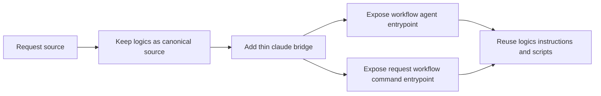

## item_064_add_a_minimal_claude_code_bridge_for_logics_agents - Add a minimal Claude Code bridge for Logics agents
> From version: 1.10.3
> Status: Ready
> Understanding: 96%
> Confidence: 93%
> Progress: 0%
> Complexity: Medium
> Theme: Agent orchestration and Claude Code compatibility
> Reminder: Update status/understanding/confidence/progress and linked task references when you edit this doc.

# Problem
The Logics kit is already usable by Claude Code at the document and script level, but it still lacks a native project-level bridge for Claude-specific agent and command entrypoints.

Today the real source of truth already lives in:
- `logics/instructions.md`
- `logics/skills/*/SKILL.md`
- `logics/skills/*/agents/openai.yaml`
- the workflow scripts under `logics/skills/*/scripts/`

The missing piece is a thin Claude-facing adapter that makes this workflow discoverable from Claude Code without creating a second configuration system beside `logics/`.

The main constraint is architectural cleanliness:
- `logics/` must remain the canonical workflow and agent knowledge base;
- `.claude/` must stay intentionally small and derivative;
- the bridge must not duplicate detailed prompts and conventions across `openai.yaml`, `SKILL.md`, and Claude files.

# Scope
- In:
  - Define the minimal `.claude/agents` structure needed to expose the Logics workflow to Claude Code.
  - Define the minimal `.claude/commands` structure needed for request-authoring and workflow entrypoints when useful.
  - Keep Claude bridge files thin and explicit about their canonical sources in `logics/`.
  - Cover the first workflow-oriented bridge around the Logics flow manager and request-authoring path.
  - Document the maintenance rule for future Claude bridge files so the repo does not drift into duplicate prompt systems.
- Out:
  - Reworking the VS Code plugin to inject prompts into Claude-native chat surfaces.
  - Replacing the existing `openai.yaml` manifest contract used by the plugin.
  - Wrapping every existing Logics skill in a first pass.
  - Broad connector or MCP setup beyond the minimum bridge needed for Claude Code entrypoints.

# Acceptance criteria
- AC1: The solution defines a minimal Claude Code integration layout rooted at `.claude/` without relocating Logics workflow sources out of `logics/`.
- AC2: Claude-facing agent files are intentionally thin and direct Claude Code toward canonical project sources such as `logics/instructions.md`, `logics/skills/*/SKILL.md`, and existing workflow scripts.
- AC3: The bridge does not introduce a second detailed prompt corpus that must be maintained manually in parallel with `logics/skills/*/agents/openai.yaml` and `SKILL.md`.
- AC4: The initial integration covers at least the core Logics workflow entrypoint needed to create and manage request/backlog/task flows from Claude Code.
- AC5: The repository documents the contract clearly:
- `logics/` remains the canonical workflow and agent knowledge base;
- `.claude/` is only a Claude Code adapter layer;
- future agent additions should follow the same thin-wrapper rule.
- AC6: The proposal keeps existing Codex-oriented plugin behavior intact and does not require replacing current `openai.yaml` agent support.
- AC7: The defined approach is clean enough that a future implementation can either:
  - maintain a very small number of `.claude/*` files manually; or
  - generate/sync them from existing Logics sources without changing the conceptual ownership model.

# Priority
- Impact:
  - Medium to high: this improves Logics portability across assistants and makes Claude Code adoption substantially cleaner.
- Urgency:
  - Medium: the bridge is valuable now, but it should be implemented deliberately because it defines future ownership boundaries between `logics/` and `.claude/`.

# Notes
- Derived from `logics/request/req_055_add_a_minimal_claude_code_bridge_for_logics_agents.md`.
- Architecture follow-up is expected before irreversible implementation because the bridge defines repo-level contracts and integration boundaries.
- Preferred implementation direction:
  - keep Claude files as thin adapters;
  - point them back to `logics/instructions.md` and the relevant `SKILL.md`;
  - avoid copying detailed workflow rules into `.claude/*`.

# Tasks
- `logics/tasks/task_069_add_a_minimal_claude_code_bridge_for_logics_agents.md`

# AC Traceability
 - AC1 -> Define a minimal `.claude/` layout without moving the real workflow source out of `logics/`. Proof: TODO.
 - AC2 -> Keep Claude bridge files thin and explicitly anchored to `logics/instructions.md`, `SKILL.md`, and scripts. Proof: TODO.
 - AC3 -> Avoid duplicating detailed prompts and conventions across Claude files, `openai.yaml`, and `SKILL.md`. Proof: TODO.
 - AC4 -> Cover at least the first workflow-oriented Claude entrypoint around request and flow management. Proof: TODO.
 - AC5 -> Document the source-of-truth contract between `logics/` and `.claude/`. Proof: TODO.
 - AC6 -> Preserve current Codex-oriented plugin behavior and manifest contracts. Proof: TODO.
 - AC7 -> Leave the bridge small enough to stay maintainable manually or to be generated later without changing ownership. Proof: TODO.

# Decision framing
- Product framing: Not needed
- Product signals: (none detected)
- Product follow-up: No product brief follow-up is expected based on current signals.
- Architecture framing: Required
- Architecture signals: data model and persistence, contracts and integration, state and sync
- Architecture follow-up: Create or link an architecture decision before irreversible implementation work starts.

# Links
- Product brief(s): (none yet)
- Architecture decision(s): (none yet)
- Request: `req_055_add_a_minimal_claude_code_bridge_for_logics_agents`
- Primary task(s): `task_069_add_a_minimal_claude_code_bridge_for_logics_agents`
