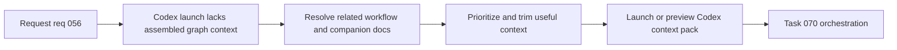

## item_065_build_codex_context_pack_for_related_logics_docs - Build Codex context pack for related Logics docs
> From version: 1.10.5
> Status: Ready
> Understanding: 98%
> Confidence: 95%
> Progress: 0% planned
> Complexity: Medium
> Theme: AI workflow context and dependency visibility
> Reminder: Update status/understanding/confidence/progress and linked task references when you edit this doc.

# Problem
The plugin can already inject an agent prompt into Codex, but it still leaves users to reconstruct the working context manually.

When a user wants to work on a request, backlog item, task, or companion doc, the extension already knows much of the surrounding graph:
- upstream workflow parents;
- downstream delivery children;
- related specs, product briefs, and architecture docs;
- useful reverse links via `Used by`.

The missing capability is a compact, deliberate `Context Pack for Codex` that turns those relationships into a launchable AI context instead of making the user gather paths and summarize the graph by hand.

# Scope
- In:
  - Define which related Logics docs should be included by default when building a context pack from a selected item.
  - Define ordering and trimming rules so the pack stays useful instead of becoming a token-heavy dump.
  - Define the launch surface in the plugin, including preview-first behavior before optional Codex injection.
  - Reuse the existing indexed relationship model rather than introducing a second ad hoc resolver for AI context assembly.
- Out:
  - Full autonomous prompt generation beyond the context bundle itself.
  - Sending large raw document bodies without prioritization or size control.
  - Replacing the current agent-selection flow.

# Acceptance criteria
- AC1: The plugin can assemble a context pack from a selected item using the existing Logics relationship graph.
- AC2: The default pack includes the current item plus parent direct, children directs, linked companion docs, and linked specs, with explicit inclusion rules.
- AC3: The pack is emitted in a structured format with explicit sections such as current item, upstream, downstream, companion docs, and open questions.
- AC4: The pack applies prioritization or trimming rules so the output remains compact and predictable.
- AC5: Users can launch or preview the context pack from an explicit button in the selected item detail panel, with preview first and optional `Inject into Codex` after review.
- AC5: The feature behaves safely when related docs are missing, sparse, or inconsistent.
- AC6: Tests cover the core relationship-selection and pack-construction behavior where practical.

# Priority
- Impact:
  - High: this directly strengthens the core Codex workflow and reduces repeated manual context gathering.
- Urgency:
  - Medium-High: valuable now that agent selection and prompt bootstrapping already exist.

# Notes
- Derived from `logics/request/req_056_add_codex_context_pack_attention_explain_and_dependency_map.md`.
- This slice should stay focused on context assembly and launch behavior, not absorb the dependency-map UI or the full attention-explain taxonomy.
- Default decisions for v1:
  - launch from the selected item detail panel, not the global `Tools` menu;
  - default scope is current item plus direct parent, direct children, linked companion docs, and linked specs;
  - output is a structured pack, not a flat concatenated text dump;
  - preview comes first, with explicit user-triggered injection into Codex afterward.

# Tasks
- `logics/tasks/task_070_orchestration_delivery_for_req_056_context_pack_attention_explain_and_dependency_map.md`

# AC Traceability
- AC1 -> Shared graph reasoning resolves the selected item and related docs into a reusable pack model. Proof: TODO.
- AC2 -> Inclusion rules cover parent, child, and companion docs explicitly. Proof: TODO.
- AC3 -> The pack renderer emits structured sections for the selected item and related docs. Proof: TODO.
- AC4 -> Pack ordering and trimming rules are documented and implemented. Proof: TODO.
- AC5 -> A visible detail-panel launch and preview flow is added before Codex injection. Proof: TODO.
- AC5 -> Empty or inconsistent graph cases degrade gracefully with explicit fallback behavior. Proof: TODO.
- AC6 -> Automated coverage exercises pack selection and output shaping. Proof: TODO.

# Decision framing
- Product framing: Consider
- Product signals: navigation and discoverability
- Product follow-up: Review whether a product brief is needed before scope becomes harder to change.
- Architecture framing: Required
- Architecture signals: data model and persistence, contracts and integration
- Architecture follow-up: Create or link an architecture decision before irreversible implementation work starts.

# Links
- Product brief(s): (none yet)
- Architecture decision(s): `adr_007_centralize_plugin_relationship_reasoning_for_context_packs_attention_explain_and_dependency_map`
- Request: `req_056_add_codex_context_pack_attention_explain_and_dependency_map`
- Primary task(s): `task_070_orchestration_delivery_for_req_056_context_pack_attention_explain_and_dependency_map`
