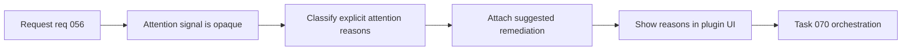

## item_066_explain_attention_reasons_and_suggested_remediation - Explain attention reasons and suggested remediation
> From version: 1.10.5
> Status: Done
> Understanding: 98%
> Confidence: 95%
> Progress: 100%
> Complexity: Medium
> Theme: AI workflow context and dependency visibility
> Reminder: Update status/understanding/confidence/progress and linked task references when you edit this doc.

# Problem
The plugin already exposes an `Attention` filter, but the signal is still too opaque.

Users can see that an item is in attention scope without clearly seeing:
- why it was flagged;
- whether the issue is blocked, orphaned, inconsistent, or incomplete;
- which next action is recommended.

That limits trust in the feature and forces users back into manual inspection. The next step is to make attention explainable, not just visible.

# Scope
- In:
  - Define a first explicit taxonomy of attention reasons grounded in current plugin heuristics.
  - Surface the reason text in a user-visible place close to the item, with primary emphasis in the details panel.
  - Pair each reason with a recommended remediation or next action where possible.
  - Keep the system explainable and low-noise rather than introducing opaque scoring.
- Out:
  - Broad predictive risk scoring.
  - Full workflow automation that resolves attention states automatically.
  - Replacing the existing attention filter with a separate dashboard.

# Acceptance criteria
- AC1: Every attention state shown by the plugin can expose at least one explicit human-readable reason.
- AC2: The first shipped reason taxonomy covers the main high-confidence cases already implied by plugin behavior: blocked items, orphaned items, inconsistent workflow state, and missing supporting docs.
- AC3: Attention reasons are shown in the details panel for the selected item, with a short reason label available in card or attention-focused surfaces where useful.
- AC4: Each reason includes a suggested remediation or next action when one is available, and actions are clickable only when the plugin can actually execute them.
- AC5: The explain layer composes cleanly with current filtering, details, and health-signal behavior.
- AC6: When multiple reasons apply, the UI shows one primary reason first and secondary reasons in expanded detail.
- AC7: Tests cover the core reason-classification logic where practical.

# Priority
- Impact:
  - High: this turns a useful but opaque filter into a more trusted triage workflow.
- Urgency:
  - Medium-High: worth doing soon because the plugin already leans on attention and health signals.

# Notes
- Derived from `logics/request/req_056_add_codex_context_pack_attention_explain_and_dependency_map.md`.
- The preferred first version is a small set of explicit reasons with strong confidence, not a wide heuristic matrix.
- Default decisions for v1:
  - reason taxonomy starts with `Blocked`, `Orphaned`, `Workflow inconsistent`, and `Missing supporting doc`;
  - details panel is the canonical place for the explanation;
  - short labels may appear on cards or in the attention view, but full explanation lives in details;
  - one primary reason is shown first when multiple reasons apply;
  - remediation is clickable only when the plugin has a real corresponding action, otherwise it stays textual.
- Task `task_070_orchestration_delivery_for_req_056_context_pack_attention_explain_and_dependency_map` was finished via `logics_flow.py finish task` on 2026-03-17.

# Tasks
- `logics/tasks/task_070_orchestration_delivery_for_req_056_context_pack_attention_explain_and_dependency_map.md`

# AC Traceability
- AC1 -> Attention classification emits explicit user-readable reasons instead of a silent aggregate flag. Proof: `media/logicsModel.js` now returns structured attention reasons with labels, descriptions, and remediation metadata.
- AC2 -> The first reason set covers high-confidence cases already present in the plugin. Proof: the shipped taxonomy includes `Blocked`, `Workflow inconsistent`, `Orphaned`, and `Missing supporting doc`.
- AC3 -> Details-panel explanations and compact surface labels are rendered close to current item context. Proof: `renderDetails.js` now renders an `Attention explain` section, and `renderBoard.js` uses the primary short labels as health badges on cards.
- AC4 -> Suggested remediation copy or action is attached to each explainable reason where possible. Proof: reason cards now wire concrete actions only when the plugin can execute them (`Promote request`, `Link to primary flow`, `Create companion doc`) and otherwise keep remediation textual.
- AC5 -> The new explanation layer composes with existing filters and health signaling. Proof: `webviewSelectors.js` now derives `needsAttention()` and health badges from the shared reason model, so filtering and badges stay aligned.
- AC6 -> Primary and secondary reason ordering stays explicit when multiple reasons apply. Proof: the shared model sorts reasons by priority and the details panel renders one primary card followed by secondary cards.
- AC7 -> Automated coverage exercises reason classification and rendering behavior. Proof: `tests/webview.harness-details-and-filters.test.ts` now checks primary-reason ordering and remediation action posting for an attention-triggering request.

# Decision framing
- Product framing: Consider
- Product signals: navigation and discoverability
- Product follow-up: Review whether a product brief is needed before scope becomes harder to change.
- Architecture framing: Required
- Architecture signals: data model and persistence, contracts and integration
- Architecture follow-up: Create or link an architecture decision before irreversible implementation work starts.

# Links
- Product brief(s): (none yet)
- Architecture decision(s): `adr_007_centralize_plugin_relationship_reasoning_for_context_packs_attention_explain_and_dependency_map`
- Request: `req_056_add_codex_context_pack_attention_explain_and_dependency_map`
- Primary task(s): `task_070_orchestration_delivery_for_req_056_context_pack_attention_explain_and_dependency_map`
