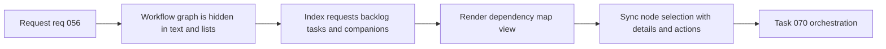

## item_067_add_dependency_map_for_logics_workflow_relationships - Add dependency map for Logics workflow relationships
> From version: 1.10.5
> Status: Done
> Understanding: 98%
> Confidence: 95%
> Progress: 100%
> Complexity: Medium
> Theme: AI workflow context and dependency visibility
> Reminder: Update status/understanding/confidence/progress and linked task references when you edit this doc.

# Problem
The extension already computes a useful relationship graph across requests, backlog items, tasks, specs, product briefs, and architecture docs, but that graph is only exposed indirectly through board cards and detail sections.

Users still lack a visual way to answer questions like:
- what depends on this item;
- which docs sit upstream or downstream;
- where companion docs connect into the delivery chain.

A first `Dependency Map` should turn the existing indexed graph into a navigable visual surface without changing the underlying Markdown-backed model.

# Scope
- In:
  - Define a first graph view built from the current indexed Logics relationships and centered on the selected item.
  - Cover at least requests, backlog items, tasks, and companion docs already modeled by the extension.
  - Define node-selection behavior that synchronizes with existing details or document actions.
  - Keep the first version read-oriented and navigational rather than editing-oriented.
- Out:
  - A full visual graph editor.
  - Arbitrary custom node layout persistence in the first pass.
  - Replacing the current board and list as the primary workflow surface.

# Acceptance criteria
- AC1: The plugin exposes a dependency map built from the existing Logics relationship graph.
- AC2: The first map includes at least requests, backlog items, tasks, and indexed companion docs.
- AC3: The first map is a bounded subgraph centered on the selected item rather than a whole-workspace graph.
- AC4: The first map supports at most one or two relationship levels around the selected item so the surface remains understandable on realistic projects.
- AC5: Selecting a node in the map synchronizes with the current item context, such as details selection or document actions.
- AC6: The map reuses existing relationship/index data instead of duplicating graph-building logic.
- AC7: Tests cover the core graph-shaping or interaction behavior where practical.

# Priority
- Impact:
  - Medium-High: this improves planning, navigation, and graph comprehension across the workflow.
- Urgency:
  - Medium: important, but it should land on top of shared relationship reasoning instead of as an isolated UI experiment.

# Notes
- Derived from `logics/request/req_056_add_codex_context_pack_attention_explain_and_dependency_map.md`.
- The first release should optimize for clarity and navigation, not for exhaustive graph features.
- Default decisions for v1:
  - the map is tied to the selected item, not the whole workspace;
  - it is introduced as a `Map` mode or toggle in the selected-item flow, not as a separate global view;
  - it is navigable first, with no heavy filter system in the first pass;
  - graph depth is bounded to one or two levels around the current item.
- Task `task_070_orchestration_delivery_for_req_056_context_pack_attention_explain_and_dependency_map` was finished via `logics_flow.py finish task` on 2026-03-17.

# Tasks
- `logics/tasks/task_070_orchestration_delivery_for_req_056_context_pack_attention_explain_and_dependency_map.md`

# AC Traceability
- AC1 -> A dedicated dependency-map surface is built from the managed Logics graph. Proof: `renderDetails.js` now renders a `Dependency map` section for the selected item.
- AC2 -> The graph covers the indexed workflow and companion stages already modeled by the extension. Proof: the shared graph model includes requests, backlog items, tasks, companion docs, and specs in the bounded map groups.
- AC3 -> The map is rendered as a bounded subgraph centered on the selected item. Proof: `buildDependencyMap()` builds groups around the current item only and never expands to a whole-workspace view.
- AC4 -> Readability is preserved through one or two levels of graph depth and a non-global first surface. Proof: the v1 map is limited to direct grouped neighbors (`Upstream`, `Downstream`, `Linked workflow`, `Supporting docs`) and remains inside the selected-item details flow.
- AC5 -> Node selection synchronizes with the existing item-detail workflow. Proof: map nodes now call the shared `selectItem()` callback and immediately rerender the details panel for the clicked item.
- AC6 -> The map reuses the current index instead of introducing duplicate graph resolution logic. Proof: `buildDependencyMap()` is computed from the same shared relationship insights used by context packs and attention explanations.
- AC7 -> Automated coverage exercises graph data shaping or map interaction behavior. Proof: `tests/webview.harness-details-and-filters.test.ts` now clicks a dependency-map node and asserts that the details panel synchronizes to the newly selected task.

# Decision framing
- Product framing: Consider
- Product signals: navigation and discoverability
- Product follow-up: Review whether a product brief is needed before scope becomes harder to change.
- Architecture framing: Required
- Architecture signals: data model and persistence, contracts and integration
- Architecture follow-up: Create or link an architecture decision before irreversible implementation work starts.

# Links
- Product brief(s): (none yet)
- Architecture decision(s): `adr_007_centralize_plugin_relationship_reasoning_for_context_packs_attention_explain_and_dependency_map`
- Request: `req_056_add_codex_context_pack_attention_explain_and_dependency_map`
- Primary task(s): `task_070_orchestration_delivery_for_req_056_context_pack_attention_explain_and_dependency_map`
