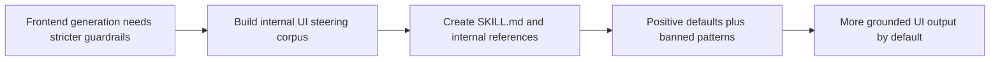

## item_068_create_an_internal_ui_steering_skill_corpus_and_reference_pack - Create an internal UI steering skill corpus and reference pack
> From version: 1.10.4
> Status: Ready
> Understanding: 99%
> Confidence: 96%
> Progress: 0%
> Complexity: Medium
> Theme: Internal skill design and frontend guardrails
> Reminder: Update status/understanding/confidence/progress and linked task references when you edit this doc.

# Problem
The repository needs a dedicated internal skill that constrains frontend generation away from repetitive AI-looking UI patterns and toward stricter, product-native interfaces.

The current `logics-uiux-designer` skill is useful for UX analysis, redesign framing, and Logics handoff work, but it does not provide a dense implementation-time rule corpus for actual UI code generation. That gap leaves coding agents free to fall back to the same predictable habits:
- detached floating panels and shell-on-shell layout composition;
- radii that are too large across cards, buttons, sidebars, and badges;
- decorative labels, helper copy, and fake product voice inside internal tools;
- gradient-heavy dark dashboards with fake metrics, quota widgets, or non-functional charts;
- hierarchy expressed through glow, blur, and animation instead of spacing, alignment, and contrast.

This backlog item owns the internalized guidance corpus itself. The implementation should not produce a short summary or a loose aesthetic note. It should produce a reusable skill package, preferably under `logics/skills/logics-ui-steering/`, that captures a broad rule set in repository-native wording without any external naming or attribution.

# Scope
- In:
  - Create a dedicated internal skill folder for UI steering, preferably `logics/skills/logics-ui-steering/`.
  - Write a substantial `SKILL.md` that acts as an execution-time UI guardrail for frontend generation and refinement.
  - Add internal reference files if needed to keep `SKILL.md` readable while preserving the full rule corpus.
  - Encode both positive defaults and negative bans across common UI primitives and layout patterns.
  - Include a practical color policy with project-first palette reuse and curated internal fallback palettes.
  - Clarify the relationship to `logics-uiux-designer` so the two skills do not overlap ambiguously.
- Out:
  - Adding the paired agent manifest itself.
  - Reworking the VS Code extension agent registry.
  - Building a component library or full design system for the project.
  - Redesigning the existing plugin UI as part of this backlog slice.

# Acceptance criteria
- AC1: A new internal skill exists under `logics/skills/`, preferably `logics/skills/logics-ui-steering/`, with `SKILL.md` as the canonical entrypoint.
- AC2: The skill trigger/description clearly states that it should be used whenever generating or refining HTML, CSS, React, Vue, Svelte, or other frontend UI code.
- AC2b: The `SKILL.md` frontmatter is written to maximize reliable auto-triggering:
  - the `name` is stable, internal, and aligned with the skill folder identity;
  - the `description` explicitly names the frontend technologies and UI-generation scenarios the skill should match;
  - the `description` explicitly signals the behavioral goal of avoiding generic AI-looking UI and preserving project-native design language.
- AC3: The `SKILL.md` corpus explains the governing intent clearly:
  - avoid generic AI-looking UI defaults;
  - prefer grounded, product-native interfaces;
  - prioritize function, hierarchy, and clarity over decorative effect.
- AC4: The skill defines a positive baseline for common primitives, including at least:
  - sidebars, headers, sections, navigation, buttons, cards, forms, inputs, modals, dropdowns, tables, lists, tabs, badges, avatars, icons, toolbars, containers, panels, and footers;
  - standard spacing, alignment, radius, border, shadow, and transition expectations for those primitives.
- AC5: The skill explicitly bans or strongly discourages the default pattern families most likely to make generated UI feel synthetic, including at least:
  - oversized radii and pill-overuse;
  - detached floating shells and glassmorphism-first composition;
  - decorative gradients, glows, blur haze, and frosted surfaces used as taste substitutes;
  - generic dark SaaS dashboard tropes, fake charts, quota widgets, and filler KPI grids;
  - ornamental micro-headings, eyebrow labels, uppercase helper labels, and decorative internal copy;
  - transform-heavy hover motion, dramatic shadows, and space-wasting premium cosplay layouts.
- AC6: The skill includes a more concrete repeated-mistakes inventory so implementation guidance is not only principle-based. That inventory should cover at least:
  - repeated rounded-rectangle treatment across every component class;
  - sidebar brand blocks, nav badges, right-rail filler panels, and status-dot ornamentation without product need;
  - hero strips inside dashboards, faux trend indicators, decorative schedule panels, and progress-bar theater;
  - muted gray-blue low-contrast typography, mixed alignment logic, and hover transforms used for false affordance.
- AC7: The skill contains copy and content guardrails, including at least:
  - avoid filler marketing-style phrases inside application UI;
  - avoid decorative labels that invent product voice;
  - avoid explanatory note cards that describe what the interface already shows;
  - keep labels functional and specific to the product context.
- AC8: The skill defines a color-selection rule order:
  - first inspect the target project for existing tokens, CSS variables, theme files, or component styles and reuse them;
  - only if those are absent, draw from a curated internal fallback palette set;
  - do not invent arbitrary color systems by default.
- AC9: The implementation includes a curated internal fallback palette set with both dark and light options. The set should be calm, practical, and suitable for product UI rather than showcase aesthetics.
- AC10: The skill includes explicit usage guidance for implementation-time work:
  - when to use the skill;
  - what to inspect in the codebase before choosing colors or layout language;
  - how to behave when an existing design system already exists;
  - how to reconcile the guardrails with user-requested exceptions.
- AC10b: The usage guidance explicitly separates automatic triggering from explicit invocation:
  - the skill should auto-trigger for matching frontend requests through its metadata and trigger wording;
  - the skill should still be safe and coherent when invoked explicitly by a paired agent or `$logics-...` prompt.
- AC11: The skill explicitly positions itself as complementary to `logics-uiux-designer`:
  - `logics-uiux-designer` remains the broader UX analysis and handoff skill;
  - the new skill is the narrow frontend generation and refinement guardrail.
- AC12: No file in the skill package mentions external repository names, external skill names, or source attribution.
- AC13: If the rule corpus is split into references, the combination of `SKILL.md` plus references still preserves the practical breadth of the guidance rather than reducing it to high-level slogans.
- AC14: The Logics kit documentation is updated so the new skill is discoverable in `logics/skills/README.md` with a concise explanation of when to use it.

# Required guidance inventory
- Philosophy and trigger:
  - explain that the model’s easiest visual choices are often the least believable;
  - instruct the agent to reject its first decorative instinct and choose the cleaner implementation.
  - include direct trigger wording such as “use this skill whenever generating or refining frontend UI code” so the activation signal is not implicit.
- Positive defaults:
  - sidebars should use fixed, practical widths with solid surfaces and simple separators;
  - headers should rely on normal text hierarchy rather than ornamental framing;
  - sections should use ordinary spacing and avoid dashboard hero theatrics;
  - cards and panels should be simple containers with restrained radius and low-drama shadow;
  - forms should use standard labels-above-input patterns and predictable focus states;
  - tables and lists should be plain, readable, and left-aligned unless product context says otherwise;
  - tabs, badges, toolbars, dropdowns, and modals should feel functional rather than branded for spectacle.
- Negative defaults:
  - do not turn every element into a rounded badge-like shape;
  - do not build shell-inside-shell layouts with detached floating sidebars;
  - do not create a control-room dashboard unless the product explicitly needs one;
  - do not insert fake charts, fake percentages, or filler metrics to make the screen look complete;
  - do not use decorative helper cards, focus cards, trend chips, or callout strips to narrate obvious content;
  - do not rely on blue-black gradients and cyan accents as a shortcut for “premium dark mode”.
- Motion and interaction:
  - prefer color, opacity, and border changes over transform motion;
  - keep hover states subtle and direct;
  - avoid bounce, slide, and drift effects as default interaction language.
- Mobile behavior:
  - do not simply stack every desktop block into a long undifferentiated column;
  - preserve hierarchy and grouping in smaller layouts rather than collapsing everything into repetitive cards.
- Copy discipline:
  - avoid uppercase micro-headings, decorative `small` labels, and fake operational language;
  - prefer concrete titles, concise labels, and product-specific wording only when warranted.

# Priority
- Impact:
  - High: this item determines whether the future skill is a real implementation aid or only a vague design preference note.
- Urgency:
  - Medium: the need is real now, but the corpus should be encoded carefully because it becomes a durable repository capability.

# Notes
- Derived from `logics/request/req_057_add_an_internal_ui_steering_skill_and_agent_for_grounded_interface_generation.md`.
- Preferred implementation direction:
  - use `logics-ui-steering` as the internal skill identity unless a stronger repository-native name emerges during implementation;
  - keep `SKILL.md` concise enough to trigger cleanly, but move detailed rule matrices and fallback palettes into internal references if the document becomes too dense;
  - preserve strong wording where the guardrail must be decisive, especially around banned patterns and fake product theatrics.
- Suggested internal references if needed:
  - `references/primitives.md` for positive defaults by component type;
  - `references/banned_patterns.md` for repeated anti-patterns and failure modes;
  - `references/palettes.md` for fallback light and dark palettes.

# AC Traceability
- AC1 -> Create the new internal skill package and establish `SKILL.md` as the canonical entrypoint. Proof: TODO.
- AC2 -> Define the frontend-generation trigger conditions in the skill metadata and body. Proof: TODO.
- AC2b -> Write the frontmatter name/description to maximize reliable auto-triggering for frontend work. Proof: TODO.
- AC3 -> Encode the guiding philosophy around rejecting generic AI-looking defaults. Proof: TODO.
- AC4 -> Cover the positive baseline across common UI primitives and layout expectations. Proof: TODO.
- AC5 -> Encode the banned pattern families strongly enough to change generation behavior. Proof: TODO.
- AC6 -> Add a concrete repeated-mistakes inventory instead of only abstract principles. Proof: TODO.
- AC7 -> Add content and copy guardrails for labels, helper text, and filler UI narration. Proof: TODO.
- AC8 -> Define project-first color selection and token reuse rules. Proof: TODO.
- AC9 -> Provide curated internal fallback palettes for cases without project tokens. Proof: TODO.
- AC10 -> Add implementation-time usage guidance and exception handling. Proof: TODO.
- AC10b -> Document how auto-trigger behavior and explicit invocation should coexist. Proof: TODO.
- AC11 -> Clarify the division of responsibility with `logics-uiux-designer`. Proof: TODO.
- AC12 -> Ensure the package stays fully internal with no external naming or attribution. Proof: TODO.
- AC13 -> Preserve full practical breadth even if the corpus is split across references. Proof: TODO.
- AC14 -> Update `logics/skills/README.md` to document the new skill and its purpose. Proof: TODO.

# Decision framing
- Product framing: Consider
- Product signals: navigation and discoverability
- Product follow-up: Review whether a product brief is needed only if this capability grows beyond an internal agent-oriented workflow aid.
- Architecture framing: Consider
- Architecture signals: contracts and integration
- Architecture follow-up: Review whether an architecture decision is needed if the skill package starts to affect broader agent conventions.

# Links
- Product brief(s): (none yet)
- Architecture decision(s): (none yet)
- Request: `req_057_add_an_internal_ui_steering_skill_and_agent_for_grounded_interface_generation`
- Primary task(s): `task_071_orchestration_delivery_for_internal_ui_steering_skill_and_agent`
