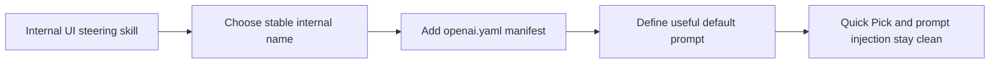

## item_069_add_an_internal_ui_steering_agent_manifest_and_usage_contract - Add an internal UI steering agent manifest and usage contract
> From version: 1.10.4
> Status: Ready
> Understanding: 99%
> Confidence: 96%
> Progress: 0%
> Complexity: Medium
> Theme: Agent manifest design and frontend invocation UX
> Reminder: Update status/understanding/confidence/progress and linked task references when you edit this doc.

# Problem
Creating the internal UI steering skill corpus is not sufficient on its own. The capability also needs a clean agent surface so users can invoke it consistently through the existing Logics agent-selection flow instead of manually remembering prompt phrasing.

The repository already discovers agent manifests from `logics/skills/*/agents/openai.yaml`, derives the invocation id from the skill folder name, and injects `default_prompt` into the Codex chat flow. That means the internal UI steering capability should be packaged deliberately around those existing contracts rather than treated as an informal skill hidden in the tree.

This backlog item owns the user-facing entrypoint and naming contract:
- choose and stabilize the internal skill folder name;
- define the agent manifest fields and wording;
- make the default prompt useful for generation, refinement, and review tasks;
- keep all wording internal, with no trace of external naming or source attribution.

# Scope
- In:
  - Finalize the internal skill identity, preferably `logics-ui-steering`, so the derived invocation id becomes `$logics-ui-steering`.
  - Add `agents/openai.yaml` for the skill package.
  - Define `display_name`, `short_description`, and `default_prompt` in a way that is useful in the existing Quick Pick and prompt-injection flows.
  - Document how the agent should be used beside `logics-uiux-designer`.
  - Keep the wording compatible with the current registry and explicit invocation behavior already implemented by the extension.
- Out:
  - Changing how the extension derives invocation ids from skill folder names.
  - Adding a new manifest schema beyond the current `openai.yaml` contract.
  - Building Claude-specific wrappers in this slice.
  - Implementing the broader rule corpus owned by `item_068`.

# Acceptance criteria
- AC1: The skill package has a stable internal folder name, preferably `logics-ui-steering`, and the resulting derived invocation id is valid under the current registry rules.
- AC2: The skill package contains `agents/openai.yaml` with all required `interface` fields:
  - `display_name`;
  - `short_description`;
  - `default_prompt`.
- AC2b: The skill package naming is coordinated across both trigger paths:
  - the folder name supports a predictable derived invocation id for explicit `$logics-...` use;
  - the `SKILL.md` `name` and `description` remain semantically aligned with the same identity so explicit activation and auto-trigger feel like the same capability.
- AC3: The manifest wording is fully internal:
  - no external repository names;
  - no external skill names;
  - no “adapted from” or attribution phrasing.
- AC4: `display_name` is short and clear enough to scan in the Quick Pick without requiring prior context.
- AC5: `short_description` explains the operational purpose concisely: grounded frontend generation and refinement with stricter UI guardrails.
- AC6: `default_prompt` is useful for at least these situations:
  - generating new frontend UI;
  - refining an existing UI implementation;
  - reviewing UI output that looks too generic or decorative.
- AC7: The default prompt explicitly tells the agent to inspect existing project styles, tokens, or component conventions before choosing colors or layout language.
- AC8: The default prompt explicitly tells the agent to preserve an established design system when one already exists.
- AC9: The default prompt explicitly frames the skill as a guardrail against generic AI UI defaults rather than as a broad UX strategy replacement.
- AC10: The naming and prompt wording are consistent with `logics-uiux-designer`:
  - the new agent is the focused implementation-time UI steering agent;
  - the existing designer skill remains the broader UX and handoff skill.
- AC11: The new agent manifest loads cleanly under the existing registry behavior in `src/agentRegistry.ts` without requiring schema changes.
- AC12: Any supporting documentation added around the agent keeps the same internal-only naming rule and does not leak source provenance.
- AC13: The manifest and surrounding docs explicitly describe the two activation paths:
  - explicit activation through `Logics: Select Agent` and `$logics-ui-steering`;
  - automatic triggering through the skill metadata when the user request matches frontend UI generation or refinement work.

# Preferred manifest direction
- Skill folder:
  - `logics/skills/logics-ui-steering/`
- Derived invocation id:
  - `$logics-ui-steering`
- Display name direction:
  - `UI Steering`
- Short description direction:
  - concise wording centered on grounded frontend generation and refinement
- Default prompt direction:
  - tell the agent to use the internal UI steering skill;
  - inspect project-native styles first;
  - avoid generic AI-looking UI habits;
  - prefer normal, structured, believable interfaces;
  - preserve existing design language when the project already has one.

# Usage contract
- Use this agent when the user is asking for frontend implementation or visual refinement and the main risk is generic generated UI.
- Prefer this agent over `logics-uiux-designer` when the immediate task is code generation or polishing, not UX strategy or artifact creation.
- If the project already has strong visual conventions, the agent should follow them first and treat its fallback rules as guardrails, not a replacement brand.
- If the user explicitly requests a stylistic exception that conflicts with the default guardrails, the agent may comply, but it should do so deliberately rather than by falling back to lazy defaults.
- Activation paths:
  - explicit: select the agent from the Quick Pick or use `$logics-ui-steering` in the prompt;
  - automatic: rely on the skill’s `SKILL.md` metadata and trigger wording to match frontend-generation requests without manual selection.

# Priority
- Impact:
  - Medium to high: without a clean agent surface, the skill corpus will be harder to discover and much less likely to be used consistently.
- Urgency:
  - Medium: the registry contract already exists, so the work is straightforward, but it should be done in lockstep with the skill corpus to avoid a half-packaged capability.

# Notes
- Derived from `logics/request/req_057_add_an_internal_ui_steering_skill_and_agent_for_grounded_interface_generation.md`.
- This item depends logically on the corpus defined in `item_068`, even if both can be prepared in parallel.
- Preferred implementation direction:
  - keep the manifest short and stable;
  - put the nuanced behavioral detail in `SKILL.md` and references;
  - use the manifest prompt to route users into that richer internal guidance.

# AC Traceability
- AC1 -> Stabilize the internal skill folder name and derived invocation id. Proof: TODO.
- AC2 -> Add a valid `agents/openai.yaml` manifest with the required interface fields. Proof: TODO.
- AC2b -> Keep folder naming and `SKILL.md` identity aligned across explicit activation and auto-triggering. Proof: TODO.
- AC3 -> Keep all manifest wording fully internal and attribution-free. Proof: TODO.
- AC4 -> Choose a Quick Pick display name that is short and clear. Proof: TODO.
- AC5 -> Write a concise short description centered on grounded frontend generation and refinement. Proof: TODO.
- AC6 -> Make the default prompt usable for generation, refinement, and review cases. Proof: TODO.
- AC7 -> Instruct the agent to inspect existing project styles and tokens first. Proof: TODO.
- AC8 -> Instruct the agent to preserve existing design systems when present. Proof: TODO.
- AC9 -> Frame the agent as a focused guardrail rather than a UX-strategy replacement. Proof: TODO.
- AC10 -> Keep the role split with `logics-uiux-designer` explicit. Proof: TODO.
- AC11 -> Preserve compatibility with the existing agent registry contract. Proof: TODO.
- AC12 -> Keep any surrounding documentation internal-only. Proof: TODO.
- AC13 -> Document both explicit activation and auto-trigger behavior around the same capability. Proof: TODO.
- req057-AC8B -> Preserve explicit activation through `agents/openai.yaml`, Quick Pick selection, and `$logics-ui-steering`. Proof: this backlog item defines the manifest contract, derived invocation id, and explicit activation path.
- req057-AC14 -> Align explicit activation with strong `SKILL.md` identity so auto-trigger and manual invocation describe the same capability. Proof: this backlog item requires the manifest wording and `SKILL.md` identity to stay coordinated.

# Decision framing
- Product framing: Consider
- Product signals: navigation and discoverability
- Product follow-up: No product brief is required unless the agent surface expands into a larger multi-agent UI workflow.
- Architecture framing: Consider
- Architecture signals: contracts and integration
- Architecture follow-up: Review whether an architecture decision is needed only if implementation needs to formalize naming or manifest conventions beyond the current pattern.

# Links
- Product brief(s): (none yet)
- Architecture decision(s): (none yet)
- Request: `req_057_add_an_internal_ui_steering_skill_and_agent_for_grounded_interface_generation`
- Related backlog: `item_068_create_an_internal_ui_steering_skill_corpus_and_reference_pack`
- Primary task(s): `task_071_orchestration_delivery_for_internal_ui_steering_skill_and_agent`
