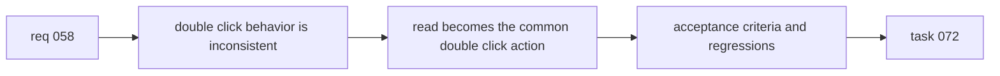

## item_070_double_click_should_read_items_from_list_board_and_activity - Double click should read items from list board and activity
> From version: 1.10.5
> Status: Done
> Understanding: 99%
> Confidence: 97%
> Progress: 100%
> Complexity: Medium
> Theme: UX workflow
> Reminder: Update status/understanding/confidence/progress and linked task references when you edit this doc.

# Problem
The plugin already exposes both `Open/Edit` and `Read`, but double-click behavior was inconsistent with the desired inspection-first workflow:
- board and list cards routed double-click to `Open/Edit`;
- the recent activity panel only supported click-to-select;
- the single-click selection path still had to remain unchanged.

This slice standardizes double-click on `Read` across board, list, and activity surfaces while preserving explicit `Open/Edit` as a separate action.

# Scope
- In:
  - Route board-card double-click to `Read`.
  - Keep the same `Read` routing when those same cards are rendered in list mode.
  - Add double-click-to-read on recent activity entries.
  - Preserve single-click selection and details refresh behavior.
  - Add focused regression tests for board, list, and activity.
- Out:
  - Changing keyboard shortcuts.
  - Removing or redesigning the existing `Open/Edit` action.
  - Broad IA or visual redesign of board, list, or activity surfaces.

# Acceptance criteria
- AC1: Double-click on an item card in `board` mode triggers the same item target as the explicit `Read` action.
- AC2: Double-click on an item row/card in `list` mode triggers the same `Read` behavior.
- AC3: Double-click on an entry in the `Recent activity` panel triggers `Read` for that item.
- AC4: Single click still only updates selection/details without triggering `Read`.
- AC5: Regression tests cover at least board/list card double-click and activity double-click behavior.

# AC Traceability
- AC1 -> Board cards now route `dblclick` to `openSelectedItem("read")`. Proof: `media/renderBoard.js`.
- AC2 -> List mode reuses the same card renderer and has an explicit non-harness regression. Proof: `media/renderBoard.js`, `tests/webview.harness-details-and-filters.test.ts`.
- AC3 -> Activity entries keep click-to-select and add double-click-to-read through a shared helper. Proof: `media/webviewChrome.js`, `media/main.js`, `tests/webview.harness-core.test.ts`.
- AC4 -> Single click remains selection-only on cards and activity entries. Proof: `media/renderBoard.js`, `media/webviewChrome.js`, `tests/webview.harness-core.test.ts`.
- AC5 -> Focused regressions cover board, list, and activity surfaces. Proof: `tests/webview.harness-details-and-filters.test.ts`, `tests/webview.harness-core.test.ts`.

# Decision framing
- Product framing: Not needed
- Product signals: narrow UX consistency change inside an existing workflow
- Product follow-up: none
- Architecture framing: Not needed
- Architecture signals: (none detected)
- Architecture follow-up: none

# Links
- Product brief(s): (none yet)
- Architecture decision(s): (none yet)
- Request: `logics/request/req_058_double_click_should_read_items_from_list_board_and_activity.md`
- Primary task(s): `logics/tasks/task_072_double_click_should_read_items_from_list_board_and_activity.md`

# Priority
- Impact:
  - Medium: the gesture is used on every primary item surface.
- Urgency:
  - Medium: it removes an avoidable inconsistency in day-to-day navigation.

# Notes
- Derived from request `req_058_double_click_should_read_items_from_list_board_and_activity`.
- Source file: `logics/request/req_058_double_click_should_read_items_from_list_board_and_activity.md`.
- Request context seeded into this backlog item from `logics/request/req_058_double_click_should_read_items_from_list_board_and_activity.md`.

# Delivery
- Implemented in:
  - `media/renderBoard.js`
  - `media/webviewChrome.js`
  - `media/main.js`
- Verified by:
  - `npx vitest run tests/webview.harness-details-and-filters.test.ts tests/webview.harness-core.test.ts`
