## item_071_guide_frontend_work_toward_the_ui_steering_skill_in_the_logics_kit - Guide frontend work toward the UI steering skill in the Logics kit
> From version: 1.10.5 (refreshed)
> Status: Done
> Understanding: 98%
> Confidence: 96%
> Progress: 100% (refreshed)
> Complexity: Medium
> Theme: Logics kit skill orchestration and frontend guidance
> Reminder: Update status/understanding/confidence/progress and linked task references when you edit this doc.

# Problem
The Logics kit already contains `logics-ui-steering`, but frontend-oriented workflow docs still do too little to surface it at the right time. When a request clearly targets UI, frontend, React, webview, or interface implementation work, the specialized internal guidance should be discoverable from the normal Logics flow instead of depending on memory.

This backlog slice turns that request into an actionable delivery target:
- detect frontend-oriented scope through deterministic signals plus limited context;
- surface `logics-ui-steering` in operational workflow outputs;
- keep the recommendation advisory so non-frontend work stays clean and other relevant framings can still coexist.

# Scope
- In:
  - Define the detection perimeter for frontend-oriented Logics work.
  - Surface `logics-ui-steering` in flow-manager guidance, generated output, promotion output, or equivalent decision framing.
  - Preserve advisory behavior and support multiple compatible recommendations.
  - Keep the behavior generic for the shared Logics kit.
- Out:
  - Rewriting the `logics-ui-steering` skill corpus itself.
  - Forcing the skill into all user-facing workflow docs.
  - Solving unrelated frontend-quality issues outside skill orchestration.

```mermaid
%% logics-kind: backlog
%% logics-signature: backlog|guide-frontend-work-toward-the-ui-steeri|req-059-guide-frontend-work-toward-the-u|the-logics-kit-already-contains-logics-u|ac1-frontend-oriented-logics-workflows-e
flowchart LR
    Request[req_059_guide_frontend_work_toward_the_ui_] --> Problem[The Logics kit already contains logics-ui]
    Problem --> Scope[Guide frontend work toward the UI]
    Scope --> Acceptance[AC1: Frontend-oriented Logics workflows ex]
    Acceptance --> Tasks[task_073_orchestration_delivery_for_req_05]
```

# Acceptance criteria
- AC1: Frontend-oriented Logics workflows explicitly surface `logics-ui-steering` when deterministic frontend signals are present.
- AC2: The trigger perimeter covers at least UI, frontend, interface, webview, React, component, layout, or equivalent user-facing implementation scopes.
- AC3: The recommendation appears in at least one operational surface used by the normal flow:
  - flow-manager guidance;
  - generated or promoted docs;
  - decision framing;
  - reference sections.
- AC4: The recommendation remains advisory, does not pollute non-frontend work, and may coexist with product or architecture guidance when relevant.
- AC5: The delivery remains generic for the shared Logics kit and is backed by tests and documentation updates.

# AC Traceability
- AC1 -> Detection and surfaced guidance in workflow outputs. Proof: covered by linked task completion.
- AC2 -> Trigger vocabulary and limited-context rules are documented and testable. Proof: covered by linked task completion.
- AC3 -> Flow-manager output exposes the recommendation in the chosen insertion points. Proof: covered by linked task completion.
- AC4 -> Non-frontend flows remain clean and multi-skill recommendations stay possible. Proof: covered by linked task completion.
- AC5 -> Tests and kit docs cover the new orchestration behavior. Proof: covered by linked task completion.
- AC3B -> covered by linked delivery scope. Proof: covered by linked task completion.
- AC4B -> covered by linked delivery scope. Proof: covered by linked task completion.
- AC6 -> covered by linked delivery scope. Proof: covered by linked task completion.
- AC6B -> covered by linked delivery scope. Proof: covered by linked task completion.
- AC6C -> covered by linked delivery scope. Proof: covered by linked task completion.
- AC7 -> covered by linked delivery scope. Proof: covered by linked task completion.

# Decision framing
- Product framing: Not needed
- Product signals: (none detected)
- Product follow-up: No product brief follow-up is expected based on current signals.
- Architecture framing: Not needed
- Architecture signals: (none detected)
- Architecture follow-up: No architecture decision follow-up is expected based on current signals.

# Links
- Product brief(s): (none yet)
- Architecture decision(s): (none yet)
- Request: `logics/request/req_059_guide_frontend_work_toward_the_ui_steering_skill_in_the_logics_kit.md`
- Primary task(s): `logics/tasks/task_073_orchestration_delivery_for_req_059_ui_steering_guidance_in_logics_kit.md`

# Priority
- Impact:
  - Medium: this improves how the kit routes frontend work to the right internal capability.
- Urgency:
  - Medium: the capability exists already, but the orchestration remains too implicit.

# Notes
- Derived from request `req_059_guide_frontend_work_toward_the_ui_steering_skill_in_the_logics_kit`.
- Source file: `logics/request/req_059_guide_frontend_work_toward_the_ui_steering_skill_in_the_logics_kit.md`.
- Request context seeded into this backlog item from `logics/request/req_059_guide_frontend_work_toward_the_ui_steering_skill_in_the_logics_kit.md`.
- Task `task_073_orchestration_delivery_for_req_059_ui_steering_guidance_in_logics_kit` was finished via `logics_flow.py finish task` on 2026-03-18.

- Derived from `logics/request/req_059_guide_frontend_work_toward_the_ui_steering_skill_in_the_logics_kit.md`.
# Tasks
- `logics/tasks/task_073_orchestration_delivery_for_req_059_ui_steering_guidance_in_logics_kit.md`
