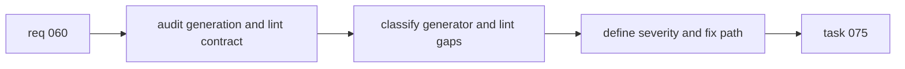

## item_072_audit_flow_manager_doc_generation_and_adjust_doc_linter_strictness - Audit flow manager doc generation and adjust doc linter strictness
> From version: 1.10.5
> Status: Done
> Understanding: 98%
> Confidence: 95%
> Progress: 100%
> Complexity: Medium
> Theme: Logics kit generation quality and governance calibration
> Reminder: Update status/understanding/confidence/progress and linked task references when you edit this doc.

# Problem
The flow manager and the doc linter should express one coherent contract, but current usage still produces recurring friction: normal generation or promotion can leave docs that look valid yet still trigger lint in predictable ways. This points to a mismatch between what the kit emits and what the kit expects.

This backlog slice turns that diagnosis into delivery scope:
- audit the mismatch before changing behavior;
- fix generation first when the generator can satisfy the contract;
- recalibrate lint severity when a rule is still too blunt;
- keep blocking enforcement for structural failures and critical placeholders.

# Scope
- In:
  - Audit recurring mismatches between flow-manager output and doc-linter enforcement.
  - Classify failures into generator defects, lint severity issues, lint rule issues, or mixed cases.
  - Calibrate templates, promotion output, lint wording, severity, or remediation guidance where justified.
  - Focus first on `request`, `backlog`, and `task` docs.
- Out:
  - Removing Logics governance.
  - Downgrading all lint issues to warnings.
  - Cleaning the entire historical corpus in one pass.

# Acceptance criteria
- AC1: Delivery starts with an explicit audit that classifies recurring mismatches between flow-manager output and doc-linter enforcement.
- AC2: The implementation can distinguish at least:
  - generator defects or missing structure;
  - lint rules that are substantively right but too severe;
  - lint rules that are misaligned with authoring intent;
  - mixed cases that require changes on both sides.
- AC3: Freshly generated or promoted `request`, `backlog`, and `task` docs no longer fail lint for predictable recurring reasons unless a real unresolved issue remains.
- AC4: Severity stays strict for structural failures and critical placeholders, with warning-level treatment available for weaker editorial or proportionality issues.
- AC5: The result remains generic for the shared Logics kit and is backed by tests and documentation updates.

# AC Traceability
- AC1 -> Audit path and failure taxonomy are defined before behavior changes. Proof: TODO.
- AC2 -> Findings can be assigned to generator, linter, or mixed ownership. Proof: TODO.
- AC3 -> Fresh workflow docs stop failing for known repeat mismatches. Proof: TODO.
- AC4 -> Severity model distinguishes blocking structural failures from non-blocking warnings. Proof: TODO.
- AC5 -> Tests and kit docs reflect the calibrated contract. Proof: TODO.
- AC3B -> TODO: map this acceptance criterion to scope. Proof: TODO.
- AC6 -> TODO: map this acceptance criterion to scope. Proof: TODO.
- AC6B -> TODO: map this acceptance criterion to scope. Proof: TODO.
- AC6C -> TODO: map this acceptance criterion to scope. Proof: TODO.
- AC7 -> TODO: map this acceptance criterion to scope. Proof: TODO.
- AC8 -> TODO: map this acceptance criterion to scope. Proof: TODO.
- AC8B -> TODO: map this acceptance criterion to scope. Proof: TODO.
- AC8C -> TODO: map this acceptance criterion to scope. Proof: TODO.

# Decision framing
- Product framing: Not needed
- Product signals: (none detected)
- Product follow-up: No product brief follow-up is expected based on current signals.
- Architecture framing: Consider
- Architecture signals: contracts and integration
- Architecture follow-up: Review whether an architecture decision is needed before implementation becomes harder to reverse.

# Links
- Product brief(s): (none yet)
- Architecture decision(s): (none yet)
- Request: `logics/request/req_060_audit_flow_manager_doc_generation_and_adjust_doc_linter_strictness.md`
- Primary task(s): `logics/tasks/task_075_orchestration_delivery_for_req_060_flow_manager_generation_and_doc_linter_calibration.md`

# Priority
- Impact:
  - High: this changes the quality contract of the core Logics workflow.
- Urgency:
  - High: the current mismatch causes repeated cleanup and weakens trust in the kit.

# Notes
- Derived from request `req_060_audit_flow_manager_doc_generation_and_adjust_doc_linter_strictness`.
- Source file: `logics/request/req_060_audit_flow_manager_doc_generation_and_adjust_doc_linter_strictness.md`.
- Request context seeded into this backlog item from `logics/request/req_060_audit_flow_manager_doc_generation_and_adjust_doc_linter_strictness.md`.
- Task `task_075_orchestration_delivery_for_req_060_flow_manager_generation_and_doc_linter_calibration` was finished via `logics_flow.py finish task` on 2026-03-18.

# Tasks
- `logics/tasks/task_075_orchestration_delivery_for_req_060_flow_manager_generation_and_doc_linter_calibration.md`
