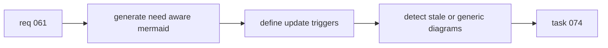

## item_073_generate_context_aware_mermaid_diagrams_and_keep_them_updated_in_logics_docs - Generate context aware Mermaid diagrams and keep them updated in Logics docs
> From version: 1.10.5
> Status: Done
> Understanding: 97%
> Confidence: 94%
> Progress: 100%
> Complexity: Medium
> Theme: Logics doc quality and Mermaid relevance
> Reminder: Update status/understanding/confidence/progress and linked task references when you edit this doc.

# Problem
Mermaid is already part of the Logics workflow, but it still drifts too easily into generic filler or stale summary. A doc can evolve meaningfully while its diagram stays behind, which weakens the value of the visual layer.

This backlog slice turns the request into an actionable delivery target:
- generate Mermaid from the real doc context during creation and promotion;
- define when Mermaid must be refreshed as the doc changes;
- keep diagrams compact, render-safe, and business-readable;
- allow stale or generic Mermaid detection without overreacting on day one.

# Scope
- In:
  - Improve contextual Mermaid generation for request, backlog, and task docs.
  - Define update triggers when problem, scope, ACs, plan, or execution path change.
  - Preserve current safety rules and compact diagram style.
  - Allow warning-level stale or generic Mermaid detection as part of quality controls.
- Out:
  - Replacing Mermaid with another diagram system.
  - Making diagrams visually complex for their own sake.
  - Rewriting the full historical repository in one slice.

# Acceptance criteria
- AC1: Request, backlog, and task Mermaid blocks are generated from the actual document context instead of a generic scaffold.
- AC2: Mermaid update triggers include at least problem, scope, acceptance-criteria, plan, or execution-path changes.
- AC3: Diagrams remain compact, business-readable, and compliant with current safety rules.
- AC4: The workflow can detect stale or generic Mermaid, initially with warning-level feedback before stronger blocking.
- AC5: The result remains generic for the shared Logics kit and is backed by tests and documentation updates.

# AC Traceability
- AC1 -> Generation paths use current doc context for request, backlog, and task Mermaid. Proof: TODO.
- AC2 -> Update triggers are explicit and testable. Proof: TODO.
- AC3 -> Mermaid stays compact and render-safe under current constraints. Proof: TODO.
- AC4 -> Stale or generic Mermaid detection exists with warning-first behavior. Proof: TODO.
- AC5 -> Tests and docs cover the improved Mermaid contract. Proof: TODO.
- AC3B -> TODO: map this acceptance criterion to scope. Proof: TODO.
- AC3C -> TODO: map this acceptance criterion to scope. Proof: TODO.
- AC6 -> TODO: map this acceptance criterion to scope. Proof: TODO.
- AC6B -> TODO: map this acceptance criterion to scope. Proof: TODO.
- AC7 -> TODO: map this acceptance criterion to scope. Proof: TODO.
- AC7B -> TODO: map this acceptance criterion to scope. Proof: TODO.
- AC7C -> TODO: map this acceptance criterion to scope. Proof: TODO.

# Decision framing
- Product framing: Not needed
- Product signals: (none detected)
- Product follow-up: No product brief follow-up is expected based on current signals.
- Architecture framing: Not needed
- Architecture signals: (none detected)
- Architecture follow-up: No architecture decision follow-up is expected based on current signals.

# Links
- Product brief(s): (none yet)
- Architecture decision(s): (none yet)
- Request: `logics/request/req_061_generate_context_aware_mermaid_diagrams_and_keep_them_updated_in_logics_docs.md`
- Primary task(s): `logics/tasks/task_074_orchestration_delivery_for_req_061_context_aware_mermaid_in_logics_docs.md`

# Priority
- Impact:
  - Medium: Mermaid quality affects comprehension across the whole Logics workflow.
- Urgency:
  - Medium: generic or stale diagrams reduce trust in generated docs even when prose improves.

# Notes
- Derived from request `req_061_generate_context_aware_mermaid_diagrams_and_keep_them_updated_in_logics_docs`.
- Source file: `logics/request/req_061_generate_context_aware_mermaid_diagrams_and_keep_them_updated_in_logics_docs.md`.
- Request context seeded into this backlog item from `logics/request/req_061_generate_context_aware_mermaid_diagrams_and_keep_them_updated_in_logics_docs.md`.
- Task `task_074_orchestration_delivery_for_req_061_context_aware_mermaid_in_logics_docs` was finished via `logics_flow.py finish task` on 2026-03-18.

# Tasks
- `logics/tasks/task_074_orchestration_delivery_for_req_061_context_aware_mermaid_in_logics_docs.md`
