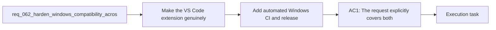

## item_077_add_automated_windows_ci_and_release_gating_for_supported_workflows - Add automated Windows CI and release gating for supported workflows
> From version: 1.10.8
> Status: Done
> Understanding: 96%
> Confidence: 93%
> Progress: 100%
> Complexity: High
> Theme: Cross-platform runtime, tooling, and release reliability
> Reminder: Update status/understanding/confidence/progress and linked task references when you edit this doc.

# Problem
- Make the VS Code extension genuinely usable on Windows across the full supported workflow, not only in the narrow happy path where the UI can already find a Python interpreter.
- Remove Unix-only assumptions from the main project scripts that users and maintainers are expected to run locally for build, package, install, lint, audit, and release validation.
- Align the shared Logics kit documentation and CLI guidance with a cross-platform contract so Windows users are not told to use commands that fail by default.
- Add explicit Windows-oriented validation so cross-platform regressions are detected before release instead of after user reports.
- Keep Linux and macOS behavior stable while tightening the Windows contract.
- The recent `1.10.7` work improved one important part of Windows support:
- - the extension runtime no longer assumes `python3` only;

# Scope
- In:
- Out:

# Acceptance criteria
- AC1: The request explicitly covers both scopes:
- the VS Code extension repository;
- the bundled or imported Logics kit workflows that users are expected to run directly.
- AC2: The supported Windows contract is clarified for extension-driven Logics actions such as create, promote, bootstrap, fix, and related script-backed flows.
- AC3: Main project npm scripts that are part of normal development, smoke, packaging, installation, or release validation no longer rely on avoidable Unix-only constructs such as:
- hardcoded `python3` where a Windows-compatible launcher path is required;
- `/tmp` output paths;
- shell command substitution patterns such as `$(...)`.
- AC4: The repository documentation is updated so Windows users are not told to run commands that fail under the default Windows environment when an officially supported alternative exists.
- AC5: The Logics kit documentation and skill examples are calibrated so the documented operator path is Windows-compatible, or clearly marked as Unix-specific when a script is intentionally platform-scoped.
- AC5b: Windows-oriented hardening explicitly covers command-surface issues that are common in this repository, including:
- quoting differences between POSIX shells, `cmd`, and PowerShell for supported CLI examples;
- line-ending normalization expectations for text assets edited on Windows;
- path-handling assumptions that can break under Windows path semantics.
- AC6: Windows support is validated through at least one meaningful automated path beyond unit-level string or candidate-list assertions.
- AC7: CI gains an explicit Windows validation lane for the supported workflow surface, or an equivalent automated Windows check with comparable confidence.
- AC8: Release preparation no longer depends solely on Ubuntu-only validation for workflows that are claimed to support Windows users or maintainers.
- AC9: The implementation distinguishes between:
- intentional platform-specific helpers;
- and unintended cross-platform breakpoints in supported workflows.
- AC10: Linux and macOS behavior remain supported, with changes designed as cross-platform hardening rather than Windows-only special cases where a generic solution is possible.
- AC11: The resulting guidance is concrete enough that a backlog item can split the work into:
- extension runtime and command surface hardening;
- npm script and packaging normalization;
- kit README and skill documentation cleanup;
- Windows CI or smoke validation;
- release-process alignment.
- AC12: Windows validation explicitly exercises or accounts for edge cases already known to be relevant in this repository, including:
- VSIX smoke packaging paths and Windows command resolution;
- environments where directory symlinks are unavailable and copy fallbacks are required;
- case-insensitive path handling expectations in the extension runtime;
- shell quoting behavior for supported CLI install or MCP-registration flows;
- line-ending behavior for generated or maintained text artifacts.

# AC Traceability
- AC1 -> Scope: The request explicitly covers both scopes:. Proof: TODO.
- AC2 -> Scope: the VS Code extension repository;. Proof: TODO.
- AC3 -> Scope: the bundled or imported Logics kit workflows that users are expected to run directly.. Proof: TODO.
- AC2 -> Scope: The supported Windows contract is clarified for extension-driven Logics actions such as create, promote, bootstrap, fix, and related script-backed flows.. Proof: TODO.
- AC3 -> Scope: Main project npm scripts that are part of normal development, smoke, packaging, installation, or release validation no longer rely on avoidable Unix-only constructs such as:. Proof: TODO.
- AC4 -> Scope: hardcoded `python3` where a Windows-compatible launcher path is required;. Proof: TODO.
- AC5 -> Scope: `/tmp` output paths;. Proof: TODO.
- AC6 -> Scope: shell command substitution patterns such as `$(...)`.. Proof: TODO.
- AC4 -> Scope: The repository documentation is updated so Windows users are not told to run commands that fail under the default Windows environment when an officially supported alternative exists.. Proof: TODO.
- AC5 -> Scope: The Logics kit documentation and skill examples are calibrated so the documented operator path is Windows-compatible, or clearly marked as Unix-specific when a script is intentionally platform-scoped.. Proof: TODO.
- AC5B -> Scope: Windows-oriented hardening explicitly covers command-surface issues that are common in this repository, including:. Proof: TODO.
- AC7 -> Scope: quoting differences between POSIX shells, `cmd`, and PowerShell for supported CLI examples;. Proof: TODO.
- AC8 -> Scope: line-ending normalization expectations for text assets edited on Windows;. Proof: TODO.
- AC9 -> Scope: path-handling assumptions that can break under Windows path semantics.. Proof: TODO.
- AC6 -> Scope: Windows support is validated through at least one meaningful automated path beyond unit-level string or candidate-list assertions.. Proof: TODO.
- AC7 -> Scope: CI gains an explicit Windows validation lane for the supported workflow surface, or an equivalent automated Windows check with comparable confidence.. Proof: TODO.
- AC8 -> Scope: Release preparation no longer depends solely on Ubuntu-only validation for workflows that are claimed to support Windows users or maintainers.. Proof: TODO.
- AC9 -> Scope: The implementation distinguishes between:. Proof: TODO.
- AC10 -> Scope: intentional platform-specific helpers;. Proof: TODO.
- AC11 -> Scope: and unintended cross-platform breakpoints in supported workflows.. Proof: TODO.
- AC10 -> Scope: Linux and macOS behavior remain supported, with changes designed as cross-platform hardening rather than Windows-only special cases where a generic solution is possible.. Proof: TODO.
- AC11 -> Scope: The resulting guidance is concrete enough that a backlog item can split the work into:. Proof: TODO.
- AC12 -> Scope: extension runtime and command surface hardening;. Proof: TODO.
- AC13 -> Scope: npm script and packaging normalization;. Proof: TODO.
- AC14 -> Scope: kit README and skill documentation cleanup;. Proof: TODO.
- AC15 -> Scope: Windows CI or smoke validation;. Proof: TODO.
- AC16 -> Scope: release-process alignment.. Proof: TODO.
- AC12 -> Scope: Windows validation explicitly exercises or accounts for edge cases already known to be relevant in this repository, including:. Proof: TODO.
- AC17 -> Scope: VSIX smoke packaging paths and Windows command resolution;. Proof: TODO.
- AC18 -> Scope: environments where directory symlinks are unavailable and copy fallbacks are required;. Proof: TODO.
- AC19 -> Scope: case-insensitive path handling expectations in the extension runtime;. Proof: TODO.
- AC20 -> Scope: shell quoting behavior for supported CLI install or MCP-registration flows;. Proof: TODO.
- AC21 -> Scope: line-ending behavior for generated or maintained text artifacts.. Proof: TODO.

# Decision framing
- Product framing: Not needed
- Product signals: (none detected)
- Product follow-up: No product brief follow-up is expected based on current signals.
- Architecture framing: Consider
- Architecture signals: contracts and integration, runtime and boundaries, security and identity
- Architecture follow-up: Review whether an architecture decision is needed before implementation becomes harder to reverse.

# Links
- Product brief(s): (none yet)
- Architecture decision(s): (none yet)
- Request: `req_062_harden_windows_compatibility_across_the_vs_code_plugin_and_logics_kit`
- Primary task(s): `task_078_add_automated_windows_ci_and_release_gating_for_supported_workflows`

# References
- `Related request(s): `logics/request/req_025_harden_logics_kit_workflow_generation_and_governance_from_real_usage.md``
- `Related request(s): `logics/request/req_027_harden_extension_packaging_agent_loading_and_workspace_runtime_behavior.md``
- `Reference: `package.json``
- `Reference: `README.md``
- `Reference: `logics/instructions.md``
- `Reference: `logics/skills/README.md``
- `Reference: `src/pythonRuntime.ts``
- `Reference: `src/logicsProviderUtils.ts``
- `Reference: `tests/run_extension_smoke_checks.mjs``
- `Reference: `logics/skills/tests/run_cli_smoke_checks.py``
- `Reference: `.github/workflows/ci.yml``
- `Reference: `.github/workflows/release.yml``
- `logics/skills/logics-ui-steering/SKILL.md`

# Priority
- Impact: High. Without Windows gating, the repo can keep claiming support without any automated proof.
- Urgency: High. This is the main regression-prevention mechanism once the first Windows fixes start landing.

# Notes
- Derived from request `req_062_harden_windows_compatibility_across_the_vs_code_plugin_and_logics_kit`.
- Source file: `logics/request/req_062_harden_windows_compatibility_across_the_vs_code_plugin_and_logics_kit.md`.
- Request context seeded into this backlog item from `logics/request/req_062_harden_windows_compatibility_across_the_vs_code_plugin_and_logics_kit.md`.
- Completed on 2026-03-19 via `task_078_add_automated_windows_ci_and_release_gating_for_supported_workflows`.
