## item_078_clarify_windows_install_and_cli_guidance_in_the_main_plugin_readme - Clarify Windows install and CLI guidance in the main plugin README
> From version: 1.10.7
> Status: Done
> Understanding: 95%
> Confidence: 92%
> Progress: 100%
> Complexity: Medium
> Theme: Documentation quality, operator ergonomics, and platform clarity
> Reminder: Update status/understanding/confidence/progress and linked task references when you edit this doc.

# Problem
- Clarify the documented Windows operator path for the VS Code plugin and the Logics kit so users are not left guessing which commands are actually supported on Windows.
- Remove copy-paste-hostile command examples that are syntactically valid only in POSIX shells when the surrounding documentation is meant to describe general usage.
- Make the maintainer and release guidance less Unix-assumptive where cross-platform equivalents are expected.
- Mark platform-specific helpers explicitly so OS-bound scripts are not mistaken for general-purpose workflow entrypoints.
- The broader Windows compatibility review identified a second class of issues beyond runtime execution bugs.
- These issues are not always hard failures in application code.

# Scope
- In:
- Out:

```mermaid
%% logics-kind: backlog
%% logics-signature: backlog|clarify-windows-install-and-cli-guidance|req-062-harden-windows-compatibility-acr|clarify-the-documented-windows-operator-|ac1-the-request-explicitly-covers-docume
flowchart LR
    Request[req_062_harden_windows_compatibility_acros] --> Problem[Clarify the documented Windows operator pa]
    Problem --> Scope[Clarify Windows install and CLI guidance]
    Scope --> Acceptance[AC1: The request explicitly covers documen]
    Acceptance --> Tasks[task_083_clarify_windows_install_and_cli_g]
```

# Acceptance criteria
- AC1: The request explicitly covers documentation and examples for both:
- the main VS Code plugin repository;
- the imported or bundled Logics kit documentation surface.
- AC2: Installation and operator guidance for Windows users is explicit where the current wording is macOS/Linux-centric or ambiguous.
- AC3: General-purpose command examples that are meant to be copy-pasteable by users or maintainers are rewritten to avoid avoidable POSIX-only syntax, or are paired with a Windows-compatible variant.
- AC4: Maintainer and release guidance no longer presents Unix-only temp paths or shell idioms as the default generic workflow when a cross-platform alternative is expected.
- AC4b: Documentation cleanup explicitly covers Windows friction points that are easy to miss in code review, including:
- shell quoting differences for `code` CLI or MCP-related commands;
- `CRLF` versus `LF` expectations where contributors edit repo-managed text files on Windows;
- submodule installation guidance that should prefer the least-friction Windows-compatible operator path when no SSH-specific requirement exists.
- AC5: Platform-specific helper scripts remain allowed, but their documentation clearly labels them as platform-scoped instead of implying that they are general workflow entrypoints.
- AC6: The resulting docs distinguish clearly between:
- supported cross-platform workflows;
- supported Windows alternatives;
- and intentionally OS-specific helpers.
- AC7: The documentation cleanup remains aligned with the actual code and script behavior rather than promising unsupported execution paths.
- AC8: The request is specific enough that a future backlog item can split the work into:
- plugin install and usage docs;
- kit README and `SKILL.md` example cleanup;
- contributor and release guidance cleanup;
- helper labeling and platform notes.
- AC9: The highest-traffic Windows friction points are addressed explicitly, including:
- `code` CLI expectations for plugin install and dev workflows;
- POSIX-only shell examples such as `mkdir -p` and trailing `\` continuations;
- Unix temp-path examples such as `/tmp` in maintainer flows.

# AC Traceability
- AC1 -> Scope: The request explicitly covers documentation and examples for both:. Proof: TODO.
- AC2 -> Scope: the main VS Code plugin repository;. Proof: TODO.
- AC3 -> Scope: the imported or bundled Logics kit documentation surface.. Proof: TODO.
- AC2 -> Scope: Installation and operator guidance for Windows users is explicit where the current wording is macOS/Linux-centric or ambiguous.. Proof: TODO.
- AC3 -> Scope: General-purpose command examples that are meant to be copy-pasteable by users or maintainers are rewritten to avoid avoidable POSIX-only syntax, or are paired with a Windows-compatible variant.. Proof: TODO.
- AC4 -> Scope: Maintainer and release guidance no longer presents Unix-only temp paths or shell idioms as the default generic workflow when a cross-platform alternative is expected.. Proof: TODO.
- AC4B -> Scope: Documentation cleanup explicitly covers Windows friction points that are easy to miss in code review, including:. Proof: TODO.
- AC5 -> Scope: shell quoting differences for `code` CLI or MCP-related commands;. Proof: TODO.
- AC6 -> Scope: `CRLF` versus `LF` expectations where contributors edit repo-managed text files on Windows;. Proof: TODO.
- AC7 -> Scope: submodule installation guidance that should prefer the least-friction Windows-compatible operator path when no SSH-specific requirement exists.. Proof: TODO.
- AC5 -> Scope: Platform-specific helper scripts remain allowed, but their documentation clearly labels them as platform-scoped instead of implying that they are general workflow entrypoints.. Proof: TODO.
- AC6 -> Scope: The resulting docs distinguish clearly between:. Proof: TODO.
- AC8 -> Scope: supported cross-platform workflows;. Proof: TODO.
- AC9 -> Scope: supported Windows alternatives;. Proof: TODO.
- AC10 -> Scope: and intentionally OS-specific helpers.. Proof: TODO.
- AC7 -> Scope: The documentation cleanup remains aligned with the actual code and script behavior rather than promising unsupported execution paths.. Proof: TODO.
- AC8 -> Scope: The request is specific enough that a future backlog item can split the work into:. Proof: TODO.
- AC11 -> Scope: plugin install and usage docs;. Proof: TODO.
- AC12 -> Scope: kit README and `SKILL.md` example cleanup;. Proof: TODO.
- AC13 -> Scope: contributor and release guidance cleanup;. Proof: TODO.
- AC14 -> Scope: helper labeling and platform notes.. Proof: TODO.
- AC9 -> Scope: The highest-traffic Windows friction points are addressed explicitly, including:. Proof: TODO.
- AC15 -> Scope: `code` CLI expectations for plugin install and dev workflows;. Proof: TODO.
- AC16 -> Scope: POSIX-only shell examples such as `mkdir -p` and trailing `\` continuations;. Proof: TODO.
- AC17 -> Scope: Unix temp-path examples such as `/tmp` in maintainer flows.. Proof: TODO.

# Decision framing
- Product framing: Not needed
- Product signals: (none detected)
- Product follow-up: No product brief follow-up is expected based on current signals.
- Architecture framing: Not needed
- Architecture signals: (none detected)
- Architecture follow-up: No architecture decision follow-up is expected based on current signals.

# Links
- Product brief(s): (none yet)
- Architecture decision(s): (none yet)
- Request: `req_063_clarify_windows_operator_guidance_and_platform_specific_helper_boundaries_in_the_logics_docs`
- Primary task(s): `task_083_clarify_windows_install_and_cli_guidance_in_the_main_plugin_readme`

# References
- `Related request(s): `logics/request/req_062_harden_windows_compatibility_across_the_vs_code_plugin_and_logics_kit.md``
- `Reference: `README.md``
- `Reference: `logics/skills/README.md``
- `Reference: `logics/skills/CONTRIBUTING.md``
- `Reference: `logics/instructions.md``
- `Reference: `logics/skills/logics-ollama-specialist/scripts/ollama_check.sh``
- `Reference: `logics/skills/logics-ollama-specialist/scripts/ollama_install_macos.sh``

# Priority
- Impact: Medium. The main plugin README is the first operator entrypoint and strongly shapes user expectations.
- Urgency: Medium. It should be updated once the supported Windows contract is explicit enough to document honestly.

# Notes
- Derived from request `req_063_clarify_windows_operator_guidance_and_platform_specific_helper_boundaries_in_the_logics_docs`.
- Source file: `logics/request/req_063_clarify_windows_operator_guidance_and_platform_specific_helper_boundaries_in_the_logics_docs.md`.
- Request context seeded into this backlog item from `logics/request/req_063_clarify_windows_operator_guidance_and_platform_specific_helper_boundaries_in_the_logics_docs.md`.
- Completed on 2026-03-19 via `task_083_clarify_windows_install_and_cli_guidance_in_the_main_plugin_readme`.
