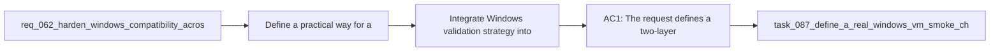

## item_084_integrate_windows_validation_strategy_into_release_preparation_and_debugging_workflows - Integrate Windows validation strategy into release preparation and debugging workflows
> From version: 1.10.8
> Status: Done
> Understanding: 97%
> Confidence: 95%
> Progress: 100%
> Complexity: Medium
> Theme: Cross-platform validation strategy and test environment realism
> Reminder: Update status/understanding/confidence/progress and linked task references when you edit this doc.

# Problem
- Define a practical way for a maintainer working on macOS to validate Windows behavior for the VS Code plugin and the Logics kit without relying on false confidence from incomplete local simulation.
- Separate what can be validated reliably through automation from what needs a real Windows runtime.
- Add a repeatable Windows validation path that is realistic enough to catch shell, CLI, filesystem, and extension-host issues before release.
- Keep the validation strategy lightweight enough to use regularly during development and release preparation.
- The current project already has a growing Windows compatibility surface:
- - extension runtime fallback for Python launcher resolution;

# Scope
- In:
- Out:

# Acceptance criteria
- AC1: The request defines a two-layer Windows validation strategy that explicitly distinguishes:
- automated validation suitable for CI;
- and manual or semi-manual smoke validation that requires a real Windows environment.
- AC2: The request makes clear that macOS-only local simulation is insufficient for certain Windows-specific behaviors and must not be treated as a complete validation substitute.
- AC3: The strategy includes an automated Windows lane capable of exercising the supported workflow surface that is most likely to regress, such as build, tests, packaging, and selected script-backed flows.
- AC4: The strategy includes a real-Windows smoke path, such as a VM-based workflow, for operator paths that cannot be trusted through indirect simulation alone.
- AC5: The request identifies which classes of problems should be validated only in real Windows, including at least:
- shell and CLI behavior;
- Python launcher behavior;
- VS Code extension-host runtime behavior;
- filesystem permission or symlink restrictions;
- case-insensitive path assumptions where relevant.
- AC6: The resulting workflow is pragmatic enough for a maintainer using macOS to run regularly during release preparation and targeted debugging.
- AC7: The request is specific enough that future backlog work can split the implementation into:
- Windows CI setup;
- Windows smoke-check definition;
- VM or local real-Windows workflow guidance;
- release-process integration.
- AC8: The validation strategy is aligned with the broader Windows hardening work and does not pretend to solve compatibility through documentation alone.

# AC Traceability
- AC1 -> Scope: The request defines a two-layer Windows validation strategy that explicitly distinguishes:. Proof: TODO.
- AC2 -> Scope: automated validation suitable for CI;. Proof: TODO.
- AC3 -> Scope: and manual or semi-manual smoke validation that requires a real Windows environment.. Proof: TODO.
- AC2 -> Scope: The request makes clear that macOS-only local simulation is insufficient for certain Windows-specific behaviors and must not be treated as a complete validation substitute.. Proof: TODO.
- AC3 -> Scope: The strategy includes an automated Windows lane capable of exercising the supported workflow surface that is most likely to regress, such as build, tests, packaging, and selected script-backed flows.. Proof: TODO.
- AC4 -> Scope: The strategy includes a real-Windows smoke path, such as a VM-based workflow, for operator paths that cannot be trusted through indirect simulation alone.. Proof: TODO.
- AC5 -> Scope: The request identifies which classes of problems should be validated only in real Windows, including at least:. Proof: TODO.
- AC6 -> Scope: shell and CLI behavior;. Proof: TODO.
- AC7 -> Scope: Python launcher behavior;. Proof: TODO.
- AC8 -> Scope: VS Code extension-host runtime behavior;. Proof: TODO.
- AC9 -> Scope: filesystem permission or symlink restrictions;. Proof: TODO.
- AC10 -> Scope: case-insensitive path assumptions where relevant.. Proof: TODO.
- AC6 -> Scope: The resulting workflow is pragmatic enough for a maintainer using macOS to run regularly during release preparation and targeted debugging.. Proof: TODO.
- AC7 -> Scope: The request is specific enough that future backlog work can split the implementation into:. Proof: TODO.
- AC11 -> Scope: Windows CI setup;. Proof: TODO.
- AC12 -> Scope: Windows smoke-check definition;. Proof: TODO.
- AC13 -> Scope: VM or local real-Windows workflow guidance;. Proof: TODO.
- AC14 -> Scope: release-process integration.. Proof: TODO.
- AC8 -> Scope: The validation strategy is aligned with the broader Windows hardening work and does not pretend to solve compatibility through documentation alone.. Proof: TODO.

# Decision framing
- Product framing: Not needed
- Product signals: (none detected)
- Product follow-up: No product brief follow-up is expected based on current signals.
- Architecture framing: Consider
- Architecture signals: contracts and integration, security and identity
- Architecture follow-up: Review whether an architecture decision is needed before implementation becomes harder to reverse.

# Links
- Product brief(s): (none yet)
- Architecture decision(s): (none yet)
- Request: `req_064_add_a_practical_windows_validation_strategy_from_macos_for_the_vs_code_plugin_and_logics_kit`
- Primary task(s): `task_087_define_a_real_windows_vm_smoke_checklist_for_macos_maintainers`

# References
- `Related request(s): `logics/request/req_062_harden_windows_compatibility_across_the_vs_code_plugin_and_logics_kit.md``
- `Related request(s): `logics/request/req_063_clarify_windows_operator_guidance_and_platform_specific_helper_boundaries_in_the_logics_docs.md``
- `Reference: `tests/run_extension_smoke_checks.mjs``
- `Reference: `logics/skills/tests/run_cli_smoke_checks.py``
- `Reference: `.github/workflows/ci.yml``
- `Reference: `.github/workflows/release.yml``
- `Reference: `README.md``

# Priority
- Impact: Medium. This turns validation strategy into repeatable release and debugging discipline instead of tribal knowledge.
- Urgency: Medium. It should follow the creation of the actual CI lane and VM smoke checklist.

# Notes
- Derived from request `req_064_add_a_practical_windows_validation_strategy_from_macos_for_the_vs_code_plugin_and_logics_kit`.
- Source file: `logics/request/req_064_add_a_practical_windows_validation_strategy_from_macos_for_the_vs_code_plugin_and_logics_kit.md`.
- Request context seeded into this backlog item from `logics/request/req_064_add_a_practical_windows_validation_strategy_from_macos_for_the_vs_code_plugin_and_logics_kit.md`.
- Completed on 2026-03-19 via `task_087_define_a_real_windows_vm_smoke_checklist_for_macos_maintainers`.
