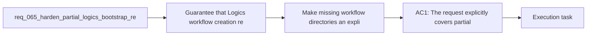

## item_085_make_missing_workflow_directories_an_explicit_self_healing_logics_contract - Make missing workflow directories an explicit self-healing Logics contract
> From version: 1.10.8
> Status: Done
> Understanding: 96%
> Confidence: 94%
> Progress: 100%
> Complexity: Medium
> Theme: Bootstrap resilience and workflow directory recovery
> Reminder: Update status/understanding/confidence/progress and linked task references when you edit this doc.

# Problem
- Guarantee that Logics workflow creation remains recoverable when the kit is present but one or more workflow directories such as `logics/request`, `logics/backlog`, or `logics/tasks` are missing.
- Make the expected behavior for partially bootstrapped repositories explicit instead of leaving it as an accidental side effect of current script behavior.
- Add regression coverage for missing-directory cases so future refactors do not break this recovery path.
- Clarify which partial-bootstrap states are expected to self-heal and which should still surface actionable errors.
- The current system already behaves reasonably well in one important partial-bootstrap case:
- - when the Logics kit and flow manager are present;

# Scope
- In:
- Out:

# Acceptance criteria
- AC1: The request explicitly covers partial-bootstrap states where the Logics kit is present but one or more workflow directories are missing.
- AC2: The request makes clear that missing `logics/request`, `logics/backlog`, and `logics/tasks` directories are expected recovery cases for the supported create flows.
- AC3: The request allows the implementation to treat these missing-directory cases as self-healing by recreating the target directory automatically before document generation.
- AC4: Targeted regression tests are added for at least:
- missing request directory then `new request`;
- missing backlog directory then `new backlog`;
- missing task directory then `new task`.
- AC5: The request distinguishes missing workflow directories from broader broken-kit states such as:
- missing `logics/skills`;
- missing flow-manager scripts;
- incompatible or incomplete kit installations.
- AC6: The resulting behavior is documented or otherwise made explicit enough that maintainers understand this recovery path is intentional rather than accidental.
- AC7: The request is specific enough that a backlog item can split the work into:
- contract clarification;
- flow-manager regression tests;
- optional extension-level messaging or smoke coverage if needed.

# AC Traceability
- AC1 -> Scope: The request explicitly covers partial-bootstrap states where the Logics kit is present but one or more workflow directories are missing.. Proof: TODO.
- AC2 -> Scope: The request makes clear that missing `logics/request`, `logics/backlog`, and `logics/tasks` directories are expected recovery cases for the supported create flows.. Proof: TODO.
- AC3 -> Scope: The request allows the implementation to treat these missing-directory cases as self-healing by recreating the target directory automatically before document generation.. Proof: TODO.
- AC4 -> Scope: Targeted regression tests are added for at least:. Proof: TODO.
- AC5 -> Scope: missing request directory then `new request`;. Proof: TODO.
- AC6 -> Scope: missing backlog directory then `new backlog`;. Proof: TODO.
- AC7 -> Scope: missing task directory then `new task`.. Proof: TODO.
- AC5 -> Scope: The request distinguishes missing workflow directories from broader broken-kit states such as:. Proof: TODO.
- AC8 -> Scope: missing `logics/skills`;. Proof: TODO.
- AC9 -> Scope: missing flow-manager scripts;. Proof: TODO.
- AC10 -> Scope: incompatible or incomplete kit installations.. Proof: TODO.
- AC6 -> Scope: The resulting behavior is documented or otherwise made explicit enough that maintainers understand this recovery path is intentional rather than accidental.. Proof: TODO.
- AC7 -> Scope: The request is specific enough that a backlog item can split the work into:. Proof: TODO.
- AC11 -> Scope: contract clarification;. Proof: TODO.
- AC12 -> Scope: flow-manager regression tests;. Proof: TODO.
- AC13 -> Scope: optional extension-level messaging or smoke coverage if needed.. Proof: TODO.

# Decision framing
- Product framing: Not needed
- Product signals: (none detected)
- Product follow-up: No product brief follow-up is expected based on current signals.
- Architecture framing: Consider
- Architecture signals: contracts and integration
- Architecture follow-up: Review whether an architecture decision is needed before implementation becomes harder to reverse.

# Links
- Product brief(s): (none yet)
- Architecture decision(s): (none yet)
- Request: `req_065_harden_partial_logics_bootstrap_recovery_when_workflow_directories_are_missing`
- Primary task(s): `task_079_make_missing_workflow_directories_an_explicit_self_healing_logics_contract`

# References
- `Related request(s): `logics/request/req_062_harden_windows_compatibility_across_the_vs_code_plugin_and_logics_kit.md``
- `Reference: `src/logicsViewDocumentController.ts``
- `Reference: `src/logicsViewProvider.ts``
- `Reference: `logics/skills/logics-flow-manager/scripts/logics_flow.py``
- `Reference: `logics/skills/logics-flow-manager/scripts/logics_flow_support.py``
- `Reference: `logics/skills/tests/test_logics_flow.py``
- `logics/skills/logics-ui-steering/SKILL.md`

# Priority
- Impact: Medium. This codifies an existing recovery behavior that protects users from unnecessary bootstrap failures.
- Urgency: High. The contract is already relied upon implicitly and should be made explicit before later refactors regress it.

# Notes
- Derived from request `req_065_harden_partial_logics_bootstrap_recovery_when_workflow_directories_are_missing`.
- Source file: `logics/request/req_065_harden_partial_logics_bootstrap_recovery_when_workflow_directories_are_missing.md`.
- Request context seeded into this backlog item from `logics/request/req_065_harden_partial_logics_bootstrap_recovery_when_workflow_directories_are_missing.md`.
- Completed on 2026-03-19 via `task_079_make_missing_workflow_directories_an_explicit_self_healing_logics_contract`.
