## item_087_add_environment_capability_detection_for_read_only_workflow_and_bootstrap_modes - Add environment capability detection for read-only workflow and bootstrap modes
> From version: 1.10.8
> Status: Done
> Understanding: 97%
> Confidence: 95%
> Progress: 100%
> Complexity: Medium
> Theme: Environment detection, onboarding, and guarded recovery UX
> Reminder: Update status/understanding/confidence/progress and linked task references when you edit this doc.

# Problem
- Add an explicit environment preflight so users can understand which prerequisites are needed for read-only usage, workflow actions, and bootstrap before they hit opaque failures.
- Detect missing machine prerequisites such as `git` and `python` early enough to guide the user toward the right next step.
- Keep the plugin usable in read-only mode even when workflow prerequisites are missing.
- Provide a guided onboarding and recovery path for missing prerequisites, missing kit state, and partially configured repositories without pretending the extension can install system tools automatically.
- The current plugin already has several useful recovery behaviors:
- - it can offer `Bootstrap Logics` when Logics is missing;

# Scope
- In:
- Out:

```mermaid
%% logics-kind: backlog
%% logics-signature: backlog|add-environment-capability-detection-for|req-062-harden-windows-compatibility-acr|add-an-explicit-environment-preflight-so|ac1-the-request-defines-an-explicit
flowchart LR
    Request[req_062_harden_windows_compatibility_acros] --> Problem[Add an explicit environment preflight so]
    Problem --> Scope[Add environment capability detection for r]
    Scope --> Acceptance[AC1: The request defines an explicit]
    Acceptance --> Tasks[task_081_add_environment_capability_detect]
```

# Acceptance criteria
- AC1: The request defines an explicit environment capability model that distinguishes at least:
- read-only browsing capabilities;
- workflow mutation capabilities such as create, promote, and fix;
- bootstrap or repair capabilities.
- AC2: Missing prerequisites for supported flows are detected before or at action entry with actionable feedback rather than only after deep execution failure.
- AC3: The request explicitly covers machine prerequisites relevant to the current plugin behavior, including:
- `git` for bootstrap and submodule-related flows;
- `python` for script-backed workflow actions;
- optional tooling such as the `code` CLI only where relevant to install or developer workflows.
- AC4: The plugin remains usable in read-only mode when repository mutation prerequisites are missing, instead of treating the entire environment as unusable.
- AC5: The onboarding and recovery UX makes clear that the extension can recover repository state but does not promise to install system-level tools automatically.
- AC6: The request allows a dedicated environment check or diagnostic entrypoint, such as a command or panel action, that summarizes prerequisite status and explains impact.
- AC7: The resulting UX distinguishes clearly between:
- missing kit state;
- missing scripts;
- missing machine prerequisites;
- and partial repository bootstrap states.
- AC8: The request is specific enough that a backlog item can split the work into:
- capability model and prerequisite detection;
- guarded action gating;
- onboarding and recovery messaging;
- optional diagnostic command or status surface.

# AC Traceability
- AC1 -> Scope: The request defines an explicit environment capability model that distinguishes at least:. Proof: TODO.
- AC2 -> Scope: read-only browsing capabilities;. Proof: TODO.
- AC3 -> Scope: workflow mutation capabilities such as create, promote, and fix;. Proof: TODO.
- AC4 -> Scope: bootstrap or repair capabilities.. Proof: TODO.
- AC2 -> Scope: Missing prerequisites for supported flows are detected before or at action entry with actionable feedback rather than only after deep execution failure.. Proof: TODO.
- AC3 -> Scope: The request explicitly covers machine prerequisites relevant to the current plugin behavior, including:. Proof: TODO.
- AC5 -> Scope: `git` for bootstrap and submodule-related flows;. Proof: TODO.
- AC6 -> Scope: `python` for script-backed workflow actions;. Proof: TODO.
- AC7 -> Scope: optional tooling such as the `code` CLI only where relevant to install or developer workflows.. Proof: TODO.
- AC4 -> Scope: The plugin remains usable in read-only mode when repository mutation prerequisites are missing, instead of treating the entire environment as unusable.. Proof: TODO.
- AC5 -> Scope: The onboarding and recovery UX makes clear that the extension can recover repository state but does not promise to install system-level tools automatically.. Proof: TODO.
- AC6 -> Scope: The request allows a dedicated environment check or diagnostic entrypoint, such as a command or panel action, that summarizes prerequisite status and explains impact.. Proof: TODO.
- AC7 -> Scope: The resulting UX distinguishes clearly between:. Proof: TODO.
- AC8 -> Scope: missing kit state;. Proof: TODO.
- AC9 -> Scope: missing scripts;. Proof: TODO.
- AC10 -> Scope: missing machine prerequisites;. Proof: TODO.
- AC11 -> Scope: and partial repository bootstrap states.. Proof: TODO.
- AC8 -> Scope: The request is specific enough that a backlog item can split the work into:. Proof: TODO.
- AC12 -> Scope: capability model and prerequisite detection;. Proof: TODO.
- AC13 -> Scope: guarded action gating;. Proof: TODO.
- AC14 -> Scope: onboarding and recovery messaging;. Proof: TODO.
- AC15 -> Scope: optional diagnostic command or status surface.. Proof: TODO.

# Decision framing
- Product framing: Consider
- Product signals: conversion journey, navigation and discoverability
- Product follow-up: Review whether a product brief is needed before implementation becomes harder to reverse.
- Architecture framing: Consider
- Architecture signals: contracts and integration
- Architecture follow-up: Review whether an architecture decision is needed before implementation becomes harder to reverse.

# Links
- Product brief(s): (none yet)
- Architecture decision(s): (none yet)
- Request: `req_066_add_guarded_environment_preflight_and_onboarding_for_logics_bootstrap_and_workflow_actions`
- Primary task(s): `task_081_add_environment_capability_detection_for_read_only_workflow_and_bootstrap_modes`

# References
- `Related request(s): `logics/request/req_062_harden_windows_compatibility_across_the_vs_code_plugin_and_logics_kit.md``
- `Related request(s): `logics/request/req_065_harden_partial_logics_bootstrap_recovery_when_workflow_directories_are_missing.md``
- `Reference: `README.md``
- `Reference: `src/logicsViewProvider.ts``
- `Reference: `src/logicsViewDocumentController.ts``
- `Reference: `src/pythonRuntime.ts``
- `Reference: `src/logicsProviderUtils.ts``

# Priority
- Impact: High. This defines the user-visible capability model that separates read-only use from mutation and bootstrap flows.
- Urgency: Medium. It should begin once the underlying Windows/runtime contract is clearer, so detection maps to real supported behavior.

# Notes
- Derived from request `req_066_add_guarded_environment_preflight_and_onboarding_for_logics_bootstrap_and_workflow_actions`.
- Source file: `logics/request/req_066_add_guarded_environment_preflight_and_onboarding_for_logics_bootstrap_and_workflow_actions.md`.
- Request context seeded into this backlog item from `logics/request/req_066_add_guarded_environment_preflight_and_onboarding_for_logics_bootstrap_and_workflow_actions.md`.
- Completed on 2026-03-19 via `task_081_add_environment_capability_detection_for_read_only_workflow_and_bootstrap_modes`.
