## item_090_add_multi_project_codex_workspace_overlays_for_logics_skills - Add multi-project Codex workspace overlays for Logics skills
> From version: 1.10.8 (refreshed)
> Status: Done
> Understanding: 96%
> Confidence: 94%
> Progress: 100% (refreshed)
> Complexity: High
> Theme: Agent orchestration and Codex workspace isolation
> Reminder: Update status/understanding/confidence/progress and linked task references when you edit this doc.

# Problem
- Make Logics skills usable from Codex without moving or duplicating the canonical skill sources out of `logics/skills/`.
- Support several repositories that each import the Logics kit while keeping their repo-local skill versions isolated from one another.
- Allow several Codex sessions for different projects to stay active at the same time without collisions in `~/.codex/skills`.
- The current Codex skill installation model is global:
- - skills are installed under `~/.codex/skills`;

# Scope
- In:
- Out:

```mermaid
%% logics-kind: backlog
%% logics-signature: backlog|add-multi-project-codex-workspace-overla|req-055-add-a-minimal-claude-code-bridge|make-logics-skills-usable-from-codex|ac1-the-solution-defines-a-per-workspace
flowchart LR
    Request[req_055_add_a_minimal_claude_code_bridge_f] --> Problem[Make Logics skills usable from Codex]
    Problem --> Scope[Add multi-project Codex workspace overlays]
    Scope --> Acceptance[AC1: The solution defines a per-workspace]
    Acceptance --> Tasks[task_088_orchestration_delivery_for_req_06]
```

# Acceptance criteria
- AC1: The solution defines a per-workspace Codex overlay model in which each repository can materialize its own `CODEX_HOME` workspace root instead of publishing all Logics skills into the single global `~/.codex/skills` pool.
- AC2: The design keeps `logics/skills/` as the canonical source of truth inside each repository and does not require moving the Logics kit into `~/.codex`.
- AC3: The design supports multiple active projects concurrently, with separate Codex processes able to run against separate workspace overlays at the same time.
- AC4: The overlay model explicitly prevents cross-project collisions for same-named skills and avoids silently mixing different kit versions from different repositories.
- AC5: The solution defines how shared user-level Codex assets are handled, including which parts stay global and can be referenced from overlays, such as authentication, stable config, and preinstalled system skills.
- AC6: The solution defines a synchronization contract for repo-local skills into the overlay, including add, update, and remove behavior when `logics/skills/*` changes.
- AC7: The supported platform contract is explicit for link materialization:
- symlink where available;
- Windows-friendly junction or equivalent where required;
- copy fallback only when link-based publication is unavailable.
- AC8: The design is concrete enough that a follow-up backlog item can implement a small operator-facing command surface such as register, sync, run, status, or equivalent commands without re-deciding the underlying architecture.
- AC9: The resulting approach preserves the thin-adapter principle already used for Claude integration:
- adapter state may exist outside `logics/`;
- the detailed workflow and skill logic remain owned by `logics/skills/`.

# AC Traceability
- AC1 -> Scope: The solution defines a per-workspace Codex overlay model in which each repository can materialize its own `CODEX_HOME` workspace root instead of publishing all Logics skills into the single global `~/.codex/skills` pool.. Proof: covered by linked task completion.
- AC2 -> Scope: The design keeps `logics/skills/` as the canonical source of truth inside each repository and does not require moving the Logics kit into `~/.codex`.. Proof: covered by linked task completion.
- AC3 -> Scope: The design supports multiple active projects concurrently, with separate Codex processes able to run against separate workspace overlays at the same time.. Proof: covered by linked task completion.
- AC4 -> Scope: The overlay model explicitly prevents cross-project collisions for same-named skills and avoids silently mixing different kit versions from different repositories.. Proof: covered by linked task completion.
- AC5 -> Scope: The solution defines how shared user-level Codex assets are handled, including which parts stay global and can be referenced from overlays, such as authentication, stable config, and preinstalled system skills.. Proof: covered by linked task completion.
- AC6 -> Scope: The solution defines a synchronization contract for repo-local skills into the overlay, including add, update, and remove behavior when `logics/skills/*` changes.. Proof: covered by linked task completion.
- AC7 -> Scope: The supported platform contract is explicit for link materialization:. Proof: covered by linked task completion.
- AC8 -> Scope: symlink where available;. Proof: covered by linked task completion.
- AC9 -> Scope: Windows-friendly junction or equivalent where required;. Proof: covered by linked task completion.
- AC10 -> Scope: copy fallback only when link-based publication is unavailable.. Proof: covered by linked task completion.
- AC8 -> Scope: The design is concrete enough that a follow-up backlog item can implement a small operator-facing command surface such as register, sync, run, status, or equivalent commands without re-deciding the underlying architecture.. Proof: covered by linked task completion.
- AC9 -> Scope: The resulting approach preserves the thin-adapter principle already used for Claude integration:. Proof: covered by linked task completion.
- AC11 -> Scope: adapter state may exist outside `logics/`;. Proof: covered by linked task completion.
- AC12 -> Scope: the detailed workflow and skill logic remain owned by `logics/skills/`.. Proof: covered by linked task completion.

# Decision framing
- Product framing: Not needed
- Product signals: (none detected)
- Product follow-up: No product brief follow-up is expected based on current signals.
- Architecture framing: Required
- Architecture signals: contracts and integration, state and sync, security and identity
- Architecture follow-up: Create or link an architecture decision before irreversible implementation work starts.

# Links
- Product brief(s): (none yet)
- Architecture decision(s): `adr_008_keep_codex_workspace_overlays_repo_local_isolated_and_composable`
- Request: `req_067_add_multi_project_codex_workspace_overlays_for_logics_skills`
- Primary task(s): `task_088_orchestration_delivery_for_req_067_to_req_075_codex_overlays_and_workflow_maintenance`

# References
- `Related request(s): `logics/request/req_055_add_a_minimal_claude_code_bridge_for_logics_agents.md``
- `Reference: `.claude/agents/logics-flow-manager.md``
- `Reference: `.claude/commands/logics-flow.md``
- `Reference: `logics/skills/README.md``
- `Reference: `logics/instructions.md``
- `Reference: `logics/backlog/item_076_make_supported_logics_kit_command_entrypoints_cross_platform.md``

# Priority
- Impact:
- Urgency:

# Notes
- Derived from request `req_067_add_multi_project_codex_workspace_overlays_for_logics_skills`.
- Source file: `logics/request/req_067_add_multi_project_codex_workspace_overlays_for_logics_skills.md`.
- Request context seeded into this backlog item from `logics/request/req_067_add_multi_project_codex_workspace_overlays_for_logics_skills.md`.
- Derived from `logics/request/req_067_add_multi_project_codex_workspace_overlays_for_logics_skills.md`.
