## item_091_auto_refresh_stale_mermaid_signatures_in_logics_workflow_docs - Auto-refresh stale Mermaid signatures in Logics workflow docs
> From version: 1.10.8 (refreshed)
> Status: Done
> Understanding: 97%
> Confidence: 95%
> Progress: 100% (refreshed)
> Complexity: Medium
> Theme: Logics doc maintenance and Mermaid signature integrity
> Reminder: Update status/understanding/confidence/progress and linked task references when you edit this doc.

# Problem
- Reduce friction when workflow docs are edited manually after generation and only the Mermaid signature becomes stale.
- Keep `%% logics-signature` comments synchronized with the current document context so lint output reflects real issues instead of avoidable bookkeeping drift.
- Preserve the current Mermaid metadata contract while making normal document editing less brittle for operators and maintainers.
- The Logics kit already generates context-aware Mermaid signatures when request, backlog, and task docs are created. The linter also checks whether the `%% logics-signature` inside the Mermaid block still matches the current document context.
- That behavior is useful, but there is still an operator gap:

# Scope
- In:
- Out:

```mermaid
%% logics-kind: backlog
%% logics-signature: backlog|auto-refresh-stale-mermaid-signatures-in|req-061-generate-context-aware-mermaid-d|reduce-friction-when-workflow-docs-are|ac1-the-request-defines-a-supported
flowchart LR
    Request[req_061_generate_context_aware_mermaid_dia] --> Problem[Reduce friction when workflow docs are]
    Problem --> Scope[Auto-refresh stale Mermaid signatures in L]
    Scope --> Acceptance[AC1: The request defines a supported]
    Acceptance --> Tasks[task_088_orchestration_delivery_for_req_06]
```

# Acceptance criteria
- AC1: The request defines a supported maintenance path for stale Mermaid signatures so operators do not need to hand-edit `%% logics-signature` comments during normal Logics doc maintenance.
- AC2: The request explicitly covers request, backlog, and task workflow docs that use the current generated Mermaid metadata contract.
- AC3: The request preserves the existing signature mechanism and validation intent:
- stale signatures should still be detectable;
- the solution should improve refresh behavior rather than removing the signature check.
- AC4: The request allows the future implementation to choose one or more safe remediation paths, such as:
- auto-refresh during managed flow operations;
- a dedicated fixer command;
- lint or audit autofix support for signature-only drift.
- AC5: The request distinguishes signature-only drift from broader Mermaid quality issues:
- this work targets stale metadata synchronization;
- broader diagram relevance or redesign concerns may stay in separate backlog slices.
- AC6: The request defines that signature refresh must be derived from the current document content using the same or equivalent logic already used by generation or lint validation, so the system has one canonical way to compute the expected signature.
- AC7: The request is concrete enough that a follow-up backlog item can decide where the refresh belongs operationally:
- flow manager generation/update path;
- doc fixer or linter autofix path;
- audit or maintenance command path.
- AC8: The request keeps operator expectations explicit:
- manual content edits are normal;
- the tooling should absorb safe signature maintenance where possible;
- lint output should stay focused on meaningful document problems.

# AC Traceability
- AC1 -> Scope: The request defines a supported maintenance path for stale Mermaid signatures so operators do not need to hand-edit `%% logics-signature` comments during normal Logics doc maintenance.. Proof: covered by linked task completion.
- AC2 -> Scope: The request explicitly covers request, backlog, and task workflow docs that use the current generated Mermaid metadata contract.. Proof: covered by linked task completion.
- AC3 -> Scope: The request preserves the existing signature mechanism and validation intent:. Proof: covered by linked task completion.
- AC4 -> Scope: stale signatures should still be detectable;. Proof: covered by linked task completion.
- AC5 -> Scope: the solution should improve refresh behavior rather than removing the signature check.. Proof: covered by linked task completion.
- AC4 -> Scope: The request allows the future implementation to choose one or more safe remediation paths, such as:. Proof: covered by linked task completion.
- AC6 -> Scope: auto-refresh during managed flow operations;. Proof: covered by linked task completion.
- AC7 -> Scope: a dedicated fixer command;. Proof: covered by linked task completion.
- AC8 -> Scope: lint or audit autofix support for signature-only drift.. Proof: covered by linked task completion.
- AC5 -> Scope: The request distinguishes signature-only drift from broader Mermaid quality issues:. Proof: covered by linked task completion.
- AC9 -> Scope: this work targets stale metadata synchronization;. Proof: covered by linked task completion.
- AC10 -> Scope: broader diagram relevance or redesign concerns may stay in separate backlog slices.. Proof: covered by linked task completion.
- AC6 -> Scope: The request defines that signature refresh must be derived from the current document content using the same or equivalent logic already used by generation or lint validation, so the system has one canonical way to compute the expected signature.. Proof: covered by linked task completion.
- AC7 -> Scope: The request is concrete enough that a follow-up backlog item can decide where the refresh belongs operationally:. Proof: covered by linked task completion.
- AC11 -> Scope: flow manager generation/update path;. Proof: covered by linked task completion.
- AC12 -> Scope: doc fixer or linter autofix path;. Proof: covered by linked task completion.
- AC13 -> Scope: audit or maintenance command path.. Proof: covered by linked task completion.
- AC8 -> Scope: The request keeps operator expectations explicit:. Proof: covered by linked task completion.
- AC14 -> Scope: manual content edits are normal;. Proof: covered by linked task completion.
- AC15 -> Scope: the tooling should absorb safe signature maintenance where possible;. Proof: covered by linked task completion.
- AC16 -> Scope: lint output should stay focused on meaningful document problems.. Proof: covered by linked task completion.

# Decision framing
- Product framing: Not needed
- Product signals: (none detected)
- Product follow-up: No product brief follow-up is expected based on current signals.
- Architecture framing: Consider
- Architecture signals: contracts and integration
- Architecture follow-up: Review whether an architecture decision is needed before implementation becomes harder to reverse.

# Links
- Product brief(s): (none yet)
- Architecture decision(s): (none yet)
- Request: `req_068_auto_refresh_stale_mermaid_signatures_in_logics_workflow_docs`
- Primary task(s): `task_088_orchestration_delivery_for_req_067_to_req_075_codex_overlays_and_workflow_maintenance`

# References
- `Related request(s): `logics/request/req_061_generate_context_aware_mermaid_diagrams_and_keep_them_updated_in_logics_docs.md``
- `Reference: `logics/skills/logics-flow-manager/scripts/logics_flow_support.py``
- `Reference: `logics/skills/logics-doc-linter/scripts/logics_lint.py``
- `Reference: `logics/skills/logics-flow-manager/SKILL.md``

# Priority
- Impact:
- Urgency:

# Notes
- Derived from request `req_068_auto_refresh_stale_mermaid_signatures_in_logics_workflow_docs`.
- Source file: `logics/request/req_068_auto_refresh_stale_mermaid_signatures_in_logics_workflow_docs.md`.
- Request context seeded into this backlog item from `logics/request/req_068_auto_refresh_stale_mermaid_signatures_in_logics_workflow_docs.md`.
- Derived from `logics/request/req_068_auto_refresh_stale_mermaid_signatures_in_logics_workflow_docs.md`.
