## item_092_add_an_operator_facing_logics_codex_workspace_manager_cli - Add an operator-facing Logics Codex workspace manager CLI
> From version: 1.10.8 (refreshed)
> Status: Done
> Understanding: 96%
> Confidence: 94%
> Progress: 100% (refreshed)
> Complexity: Medium
> Theme: Codex operator workflow and workspace tooling
> Reminder: Update status/understanding/confidence/progress and linked task references when you edit this doc.

# Problem
- Provide a small operator-facing command surface for managing Codex workspace overlays for Logics-enabled repositories.
- Make the overlay architecture from `req_067` usable in day-to-day workflows without requiring manual directory surgery or environment-variable bookkeeping.
- Standardize how operators create, synchronize, inspect, and launch workspace-specific Codex homes.
- `req_067` defines the architectural direction: each repository should be able to project its own Logics skills into a per-workspace `CODEX_HOME` overlay instead of publishing everything into the shared global `~/.codex/skills` pool.
- That architecture is not sufficient on its own for real usage. Operators still need a reliable way to:

# Scope
- In:
- Out:

```mermaid
%% logics-kind: backlog
%% logics-signature: backlog|add-an-operator-facing-logics-codex-work|req-067-add-multi-project-codex-workspac|provide-a-small-operator-facing-command-|ac1-the-request-defines-a-minimal
flowchart LR
    Request[req_067_add_multi_project_codex_workspace_] --> Problem[Provide a small operator-facing command su]
    Problem --> Scope[Add an operator-facing Logics Codex worksp]
    Scope --> Acceptance[AC1: The request defines a minimal]
    Acceptance --> Tasks[task_088_orchestration_delivery_for_req_06]
```

# Acceptance criteria
- AC1: The request defines a minimal operator-facing command surface for workspace overlays, covering creation or registration, synchronization, execution against the workspace overlay, and state inspection.
- AC2: The request explicitly ties that command surface to the architecture in `req_067` rather than redefining overlay ownership or source-of-truth rules.
- AC3: The request allows the final command names to vary, but requires the implementation to cover the operator intents of:
- register or discover workspace state;
- sync overlay content from repo-local Logics skills;
- run Codex against the correct workspace `CODEX_HOME`;
- inspect status;
- clean or remove managed overlay state.
- AC4: The request defines that the operator workflow should avoid requiring users to handcraft overlay directories or manually export environment variables for the normal happy path.
- AC5: The request is concrete enough that diagnostics, validation, and lifecycle work can build on the same command surface later instead of inventing parallel entrypoints.
- AC6: The request keeps the command surface intentionally small and scriptable so it can be used from both terminals and higher-level integrations.

# AC Traceability
- AC1 -> Scope: The request defines a minimal operator-facing command surface for workspace overlays, covering creation or registration, synchronization, execution against the workspace overlay, and state inspection.. Proof: covered by linked task completion.
- AC2 -> Scope: The request explicitly ties that command surface to the architecture in `req_067` rather than redefining overlay ownership or source-of-truth rules.. Proof: covered by linked task completion.
- AC3 -> Scope: The request allows the final command names to vary, but requires the implementation to cover the operator intents of:. Proof: covered by linked task completion.
- AC4 -> Scope: register or discover workspace state;. Proof: covered by linked task completion.
- AC5 -> Scope: sync overlay content from repo-local Logics skills;. Proof: covered by linked task completion.
- AC6 -> Scope: run Codex against the correct workspace `CODEX_HOME`;. Proof: covered by linked task completion.
- AC7 -> Scope: inspect status;. Proof: covered by linked task completion.
- AC8 -> Scope: clean or remove managed overlay state.. Proof: covered by linked task completion.
- AC4 -> Scope: The request defines that the operator workflow should avoid requiring users to handcraft overlay directories or manually export environment variables for the normal happy path.. Proof: covered by linked task completion.
- AC5 -> Scope: The request is concrete enough that diagnostics, validation, and lifecycle work can build on the same command surface later instead of inventing parallel entrypoints.. Proof: covered by linked task completion.
- AC6 -> Scope: The request keeps the command surface intentionally small and scriptable so it can be used from both terminals and higher-level integrations.. Proof: covered by linked task completion.

# Decision framing
- Product framing: Consider
- Product signals: navigation and discoverability
- Product follow-up: Review whether a product brief is needed before scope becomes harder to change.
- Architecture framing: Required
- Architecture signals: contracts and integration, state and sync
- Architecture follow-up: Create or link an architecture decision before irreversible implementation work starts.

# Links
- Product brief(s): (none yet)
- Architecture decision(s): `adr_008_keep_codex_workspace_overlays_repo_local_isolated_and_composable`
- Request: `req_069_add_an_operator_facing_logics_codex_workspace_manager_cli`
- Primary task(s): `task_088_orchestration_delivery_for_req_067_to_req_075_codex_overlays_and_workflow_maintenance`

# References
- `Related request(s): `logics/request/req_067_add_multi_project_codex_workspace_overlays_for_logics_skills.md``
- `Reference: `logics/skills/logics-flow-manager/SKILL.md``
- `Reference: `logics/instructions.md``
- `logics/skills/logics-ui-steering/SKILL.md`

# Priority
- Impact:
- Urgency:

# Notes
- Derived from request `req_069_add_an_operator_facing_logics_codex_workspace_manager_cli`.
- Source file: `logics/request/req_069_add_an_operator_facing_logics_codex_workspace_manager_cli.md`.
- Request context seeded into this backlog item from `logics/request/req_069_add_an_operator_facing_logics_codex_workspace_manager_cli.md`.
- Derived from `logics/request/req_069_add_an_operator_facing_logics_codex_workspace_manager_cli.md`.
