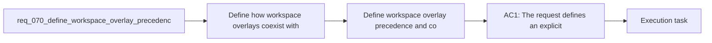

## item_093_define_workspace_overlay_precedence_and_coexistence_with_global_codex_skills - Define workspace overlay precedence and coexistence with global Codex skills
> From version: 1.10.8
> Status: Ready
> Understanding: 95%
> Confidence: 92%
> Progress: 0%
> Complexity: Medium
> Theme: Skill resolution policy and overlay coexistence
> Reminder: Update status/understanding/confidence/progress and linked task references when you edit this doc.

# Problem
- Define how workspace overlays coexist with global Codex state so skill resolution is deterministic instead of accidental.
- Clarify which skill sources are visible inside a workspace overlay and what happens when names overlap across repo-local, user-global, and system-provided skills.
- Prevent ambiguous behavior before implementation work begins.
- `req_067` defines that repository-local Logics skills should be projected into a per-workspace overlay instead of being merged permanently into the single global `~/.codex/skills` pool.
- That still leaves an important open question: once a workspace overlay exists, what exactly should Codex see inside it?

# Scope
- In:
- Out:

# Acceptance criteria
- AC1: The request defines an explicit precedence model for at least these skill categories:
- repo-local Logics skills;
- user-global skills;
- system-provided skills.
- AC2: The request defines how overlays should behave when same-named skills exist in more than one source.
- AC3: The request makes visible-vs-hidden behavior explicit for user-global skills inside workspace overlays rather than leaving it to implementation accident.
- AC4: The request is concrete enough that a future implementation can build overlay contents and diagnostics against a single deterministic resolution policy.
- AC5: The request keeps this policy work separate from cross-platform publication mechanics and from operator CLI design, even if those later features depend on the result.
- AC6: The request preserves the `logics/skills` source-of-truth contract from `req_067` while still defining how non-Logics skills coexist beside it.

# AC Traceability
- AC1 -> Scope: The request defines an explicit precedence model for at least these skill categories:. Proof: TODO.
- AC2 -> Scope: repo-local Logics skills;. Proof: TODO.
- AC3 -> Scope: user-global skills;. Proof: TODO.
- AC4 -> Scope: system-provided skills.. Proof: TODO.
- AC2 -> Scope: The request defines how overlays should behave when same-named skills exist in more than one source.. Proof: TODO.
- AC3 -> Scope: The request makes visible-vs-hidden behavior explicit for user-global skills inside workspace overlays rather than leaving it to implementation accident.. Proof: TODO.
- AC4 -> Scope: The request is concrete enough that a future implementation can build overlay contents and diagnostics against a single deterministic resolution policy.. Proof: TODO.
- AC5 -> Scope: The request keeps this policy work separate from cross-platform publication mechanics and from operator CLI design, even if those later features depend on the result.. Proof: TODO.
- AC6 -> Scope: The request preserves the `logics/skills` source-of-truth contract from `req_067` while still defining how non-Logics skills coexist beside it.. Proof: TODO.

# Decision framing
- Product framing: Not needed
- Product signals: (none detected)
- Product follow-up: No product brief follow-up is expected based on current signals.
- Architecture framing: Consider
- Architecture signals: contracts and integration
- Architecture follow-up: Review whether an architecture decision is needed before implementation becomes harder to reverse.

# Links
- Product brief(s): (none yet)
- Architecture decision(s): `adr_008_keep_codex_workspace_overlays_repo_local_isolated_and_composable`
- Request: `req_070_define_workspace_overlay_precedence_and_coexistence_with_global_codex_skills`
- Primary task(s): `task_088_orchestration_delivery_for_req_067_to_req_075_codex_overlays_and_workflow_maintenance`

# References
- `Related request(s): `logics/request/req_067_add_multi_project_codex_workspace_overlays_for_logics_skills.md``
- `Reference: `/Users/alexandreagostini/.codex/skills/.system/skill-installer/SKILL.md``

# Priority
- Impact:
- Urgency:

# Notes
- Derived from request `req_070_define_workspace_overlay_precedence_and_coexistence_with_global_codex_skills`.
- Source file: `logics/request/req_070_define_workspace_overlay_precedence_and_coexistence_with_global_codex_skills.md`.
- Request context seeded into this backlog item from `logics/request/req_070_define_workspace_overlay_precedence_and_coexistence_with_global_codex_skills.md`.
