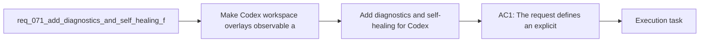

## item_094_add_diagnostics_and_self_healing_for_codex_workspace_overlays - Add diagnostics and self-healing for Codex workspace overlays
> From version: 1.10.8
> Status: Done
> Understanding: 95%
> Confidence: 92%
> Progress: 100%
> Complexity: Medium
> Theme: Overlay diagnostics and recovery workflow
> Reminder: Update status/understanding/confidence/progress and linked task references when you edit this doc.

# Problem
- Make Codex workspace overlays observable and supportable when they drift, break, or become outdated.
- Give operators a supported path to detect and repair common overlay problems instead of deleting directories blindly.
- Ensure the overlay model from `req_067` can be operated safely over time, not only created once.
- Per-workspace overlays introduce a useful isolation boundary, but they also introduce a new class of runtime state outside the repository:
- - overlay directories can be missing or partially created;

# Scope
- In:
- Out:

# Acceptance criteria
- AC1: The request defines an explicit diagnostic surface for workspace overlays that can report overlay health, source binding, and common failure states.
- AC2: The request explicitly covers recovery for at least these failure categories:
- missing overlay structure;
- stale or broken skill links;
- missing shared global references;
- overlay content drift after repo changes.
- AC3: The request allows safe self-healing or guided repair for issues that can be fixed deterministically without redefining overlay policy.
- AC4: The request is concrete enough that future CLI or extension integrations can surface the same diagnostic model instead of inventing separate checks.
- AC5: The request distinguishes diagnosis from precedence policy and from cross-platform publication mechanics, even if it depends on both.
- AC6: The request keeps operator output actionable by requiring problem descriptions to map to a clear remediation path where possible.

# AC Traceability
- AC1 -> Scope: The request defines an explicit diagnostic surface for workspace overlays that can report overlay health, source binding, and common failure states.. Proof: TODO.
- AC2 -> Scope: The request explicitly covers recovery for at least these failure categories:. Proof: TODO.
- AC3 -> Scope: missing overlay structure;. Proof: TODO.
- AC4 -> Scope: stale or broken skill links;. Proof: TODO.
- AC5 -> Scope: missing shared global references;. Proof: TODO.
- AC6 -> Scope: overlay content drift after repo changes.. Proof: TODO.
- AC3 -> Scope: The request allows safe self-healing or guided repair for issues that can be fixed deterministically without redefining overlay policy.. Proof: TODO.
- AC4 -> Scope: The request is concrete enough that future CLI or extension integrations can surface the same diagnostic model instead of inventing separate checks.. Proof: TODO.
- AC5 -> Scope: The request distinguishes diagnosis from precedence policy and from cross-platform publication mechanics, even if it depends on both.. Proof: TODO.
- AC6 -> Scope: The request keeps operator output actionable by requiring problem descriptions to map to a clear remediation path where possible.. Proof: TODO.

# Decision framing
- Product framing: Not needed
- Product signals: (none detected)
- Product follow-up: No product brief follow-up is expected based on current signals.
- Architecture framing: Required
- Architecture signals: contracts and integration, runtime and boundaries, security and identity, delivery and operations
- Architecture follow-up: Create or link an architecture decision before irreversible implementation work starts.

# Links
- Product brief(s): (none yet)
- Architecture decision(s): `adr_008_keep_codex_workspace_overlays_repo_local_isolated_and_composable`
- Request: `req_071_add_diagnostics_and_self_healing_for_codex_workspace_overlays`
- Primary task(s): `task_088_orchestration_delivery_for_req_067_to_req_075_codex_overlays_and_workflow_maintenance`

# References
- `Related request(s): `logics/request/req_067_add_multi_project_codex_workspace_overlays_for_logics_skills.md``
- `Related request(s): `logics/request/req_069_add_an_operator_facing_logics_codex_workspace_manager_cli.md``
- `logics/skills/logics-ui-steering/SKILL.md`

# Priority
- Impact:
- Urgency:

# Notes
- Derived from request `req_071_add_diagnostics_and_self_healing_for_codex_workspace_overlays`.
- Source file: `logics/request/req_071_add_diagnostics_and_self_healing_for_codex_workspace_overlays.md`.
- Request context seeded into this backlog item from `logics/request/req_071_add_diagnostics_and_self_healing_for_codex_workspace_overlays.md`.
