## item_095_harden_cross_platform_overlay_publication_for_symlink_junction_and_copy_fallback - Harden cross-platform overlay publication for symlink junction and copy fallback
> From version: 1.10.8 (refreshed)
> Status: Done
> Understanding: 97%
> Confidence: 94%
> Progress: 100% (refreshed)
> Complexity: Medium
> Theme: Cross-platform overlay publication and filesystem compatibility
> Reminder: Update status/understanding/confidence/progress and linked task references when you edit this doc.

# Problem
- Define a supported cross-platform publication strategy for workspace overlays that works across Unix-like systems and Windows.
- Prevent the overlay architecture from implicitly depending on symlink behavior that is unavailable or restricted in some environments.
- Make fallback behavior explicit so operators and tests know when the system is linking, when it is using junctions, and when it is copying.
- `req_067` already calls out a high-level publication contract:
- - prefer links where possible;

# Scope
- In:
- Out:

```mermaid
%% logics-kind: backlog
%% logics-signature: backlog|harden-cross-platform-overlay-publicatio|req-067-add-multi-project-codex-workspac|define-a-supported-cross-platform-public|ac1-the-request-defines-an-explicit
flowchart LR
    Request[req_067_add_multi_project_codex_workspace_] --> Problem[Define a supported cross-platform publicat]
    Problem --> Scope[Harden cross-platform overlay publication]
    Scope --> Acceptance[AC1: The request defines an explicit]
    Acceptance --> Tasks[task_088_orchestration_delivery_for_req_06]
```

# Acceptance criteria
- AC1: The request defines an explicit publication contract for at least these modes:
- symlink when supported;
- Windows-friendly junction or equivalent when required;
- copy fallback when link-based publication is unavailable.
- AC2: The request defines how the chosen publication mode is surfaced to operators or diagnostics rather than remaining implicit.
- AC3: The request explicitly covers cleanup and refresh semantics for each publication mode, especially the higher drift risk of copy fallback.
- AC4: The request is concrete enough that a future implementation can validate behavior on Windows without treating symlink support as guaranteed.
- AC5: The request keeps publication mechanics separate from precedence policy and overlay identity policy, even if they interact operationally.
- AC6: The request preserves the repo-local `logics/skills` source-of-truth model regardless of publication mode.

# AC Traceability
- AC1 -> Scope: The request defines an explicit publication contract for at least these modes:. Proof: covered by linked task completion.
- AC2 -> Scope: symlink when supported;. Proof: covered by linked task completion.
- AC3 -> Scope: Windows-friendly junction or equivalent when required;. Proof: covered by linked task completion.
- AC4 -> Scope: copy fallback when link-based publication is unavailable.. Proof: covered by linked task completion.
- AC2 -> Scope: The request defines how the chosen publication mode is surfaced to operators or diagnostics rather than remaining implicit.. Proof: covered by linked task completion.
- AC3 -> Scope: The request explicitly covers cleanup and refresh semantics for each publication mode, especially the higher drift risk of copy fallback.. Proof: covered by linked task completion.
- AC4 -> Scope: The request is concrete enough that a future implementation can validate behavior on Windows without treating symlink support as guaranteed.. Proof: covered by linked task completion.
- AC5 -> Scope: The request keeps publication mechanics separate from precedence policy and overlay identity policy, even if they interact operationally.. Proof: covered by linked task completion.
- AC6 -> Scope: The request preserves the repo-local `logics/skills` source-of-truth model regardless of publication mode.. Proof: covered by linked task completion.

# Decision framing
- Product framing: Not needed
- Product signals: (none detected)
- Product follow-up: No product brief follow-up is expected based on current signals.
- Architecture framing: Consider
- Architecture signals: contracts and integration
- Architecture follow-up: Review whether an architecture decision is needed before implementation becomes harder to reverse.

# Links
- Product brief(s): (none yet)
- Architecture decision(s): `adr_008_keep_codex_workspace_overlays_repo_local_isolated_and_composable`
- Request: `req_072_harden_cross_platform_overlay_publication_for_symlink_junction_and_copy_fallback`
- Primary task(s): `task_088_orchestration_delivery_for_req_067_to_req_075_codex_overlays_and_workflow_maintenance`

# References
- `Related request(s): `logics/request/req_067_add_multi_project_codex_workspace_overlays_for_logics_skills.md``
- `Related request(s): `logics/request/req_071_add_diagnostics_and_self_healing_for_codex_workspace_overlays.md``

# Priority
- Impact:
- Urgency:

# Notes
- Derived from request `req_072_harden_cross_platform_overlay_publication_for_symlink_junction_and_copy_fallback`.
- Source file: `logics/request/req_072_harden_cross_platform_overlay_publication_for_symlink_junction_and_copy_fallback.md`.
- Request context seeded into this backlog item from `logics/request/req_072_harden_cross_platform_overlay_publication_for_symlink_junction_and_copy_fallback.md`.
- Derived from `logics/request/req_072_harden_cross_platform_overlay_publication_for_symlink_junction_and_copy_fallback.md`.
