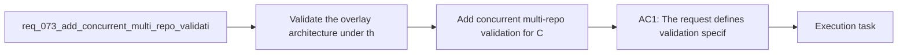

## item_096_add_concurrent_multi_repo_validation_for_codex_workspace_overlays - Add concurrent multi-repo validation for Codex workspace overlays
> From version: 1.10.8
> Status: Done
> Understanding: 95%
> Confidence: 92%
> Progress: 100%
> Complexity: Medium
> Theme: Overlay validation and concurrent repository isolation
> Reminder: Update status/understanding/confidence/progress and linked task references when you edit this doc.

# Problem
- Validate the overlay architecture under the actual concurrency condition it is meant to solve: several repositories active at the same time.
- Prove that same-named skills from different repositories do not leak across active Codex sessions.
- Prevent the multi-project promise in `req_067` from remaining only an architectural assumption.
- The central promise of the workspace overlay design is concurrent isolation:
- - repo A should be able to run Codex with its own projected skill set;

# Scope
- In:
- Out:

# Acceptance criteria
- AC1: The request defines validation specifically for concurrent or effectively parallel multi-repo usage, not just single-workspace smoke checks.
- AC2: The validation scope explicitly covers same-named skills coming from different repositories with different projected content or versions.
- AC3: The request defines success in terms of isolation outcomes:
- each workspace sees its own repo-local skills;
- foreign repo-local skills do not leak across sessions;
- the global Codex home is not corrupted by concurrent workspace usage.
- AC4: The request is concrete enough that a future implementation can choose automated, fixture-based, or wrapper-level tests while still validating the real isolation claim.
- AC5: The request keeps validation separate from the underlying overlay architecture and precedence policy, while still depending on both.
- AC6: The request makes clear that multi-project support is not considered complete without this validation surface.

# AC Traceability
- AC1 -> Scope: The request defines validation specifically for concurrent or effectively parallel multi-repo usage, not just single-workspace smoke checks.. Proof: TODO.
- AC2 -> Scope: The validation scope explicitly covers same-named skills coming from different repositories with different projected content or versions.. Proof: TODO.
- AC3 -> Scope: The request defines success in terms of isolation outcomes:. Proof: TODO.
- AC4 -> Scope: each workspace sees its own repo-local skills;. Proof: TODO.
- AC5 -> Scope: foreign repo-local skills do not leak across sessions;. Proof: TODO.
- AC6 -> Scope: the global Codex home is not corrupted by concurrent workspace usage.. Proof: TODO.
- AC4 -> Scope: The request is concrete enough that a future implementation can choose automated, fixture-based, or wrapper-level tests while still validating the real isolation claim.. Proof: TODO.
- AC5 -> Scope: The request keeps validation separate from the underlying overlay architecture and precedence policy, while still depending on both.. Proof: TODO.
- AC6 -> Scope: The request makes clear that multi-project support is not considered complete without this validation surface.. Proof: TODO.

# Decision framing
- Product framing: Not needed
- Product signals: (none detected)
- Product follow-up: No product brief follow-up is expected based on current signals.
- Architecture framing: Not needed
- Architecture signals: (none detected)
- Architecture follow-up: No architecture decision follow-up is expected based on current signals.

# Links
- Product brief(s): (none yet)
- Architecture decision(s): `adr_008_keep_codex_workspace_overlays_repo_local_isolated_and_composable`
- Request: `req_073_add_concurrent_multi_repo_validation_for_codex_workspace_overlays`
- Primary task(s): `task_088_orchestration_delivery_for_req_067_to_req_075_codex_overlays_and_workflow_maintenance`

# References
- `Related request(s): `logics/request/req_067_add_multi_project_codex_workspace_overlays_for_logics_skills.md``
- `Related request(s): `logics/request/req_070_define_workspace_overlay_precedence_and_coexistence_with_global_codex_skills.md``
- `logics/skills/logics-ui-steering/SKILL.md`

# Priority
- Impact:
- Urgency:

# Notes
- Derived from request `req_073_add_concurrent_multi_repo_validation_for_codex_workspace_overlays`.
- Source file: `logics/request/req_073_add_concurrent_multi_repo_validation_for_codex_workspace_overlays.md`.
- Request context seeded into this backlog item from `logics/request/req_073_add_concurrent_multi_repo_validation_for_codex_workspace_overlays.md`.
