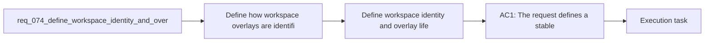

## item_097_define_workspace_identity_and_overlay_lifecycle_for_moved_or_renamed_repositories - Define workspace identity and overlay lifecycle for moved or renamed repositories
> From version: 1.10.8
> Status: Ready
> Understanding: 95%
> Confidence: 91%
> Progress: 0%
> Complexity: Medium
> Theme: Workspace identity, overlay lifecycle, and repository movement
> Reminder: Update status/understanding/confidence/progress and linked task references when you edit this doc.

# Problem
- Define how workspace overlays are identified and how they should behave when repositories move, are renamed, are recloned, or become obsolete.
- Prevent overlay state from becoming orphaned, duplicated, or silently rebound to the wrong repository over time.
- Give the overlay system a durable lifecycle model instead of assuming repository paths never change.
- Workspace overlays are expected to live outside the repository, likely under a path such as `~/.codex-workspaces/<repo-id>/`. That immediately raises lifecycle questions:
- - How is `<repo-id>` derived?

# Scope
- In:
- Out:

# Acceptance criteria
- AC1: The request defines a stable workspace identity model for overlays that is explicit enough to support creation, lookup, and cleanup.
- AC2: The request explicitly covers at least these lifecycle situations:
- repository moved or renamed;
- same repository cloned more than once;
- overlay no longer used and eligible for cleanup;
- stale binding between overlay and source repository.
- AC3: The request defines how identity and lifecycle policy should interact with diagnostics and operator tooling instead of leaving those integrations implicit.
- AC4: The request is concrete enough that a future implementation can decide whether the identity key should be path-based, git-based, or hybrid, while still meeting the lifecycle requirements.
- AC5: The request keeps identity and lifecycle concerns separate from precedence policy and cross-platform publication mechanics.
- AC6: The request makes clear that overlay cleanup and rebinding must be conservative enough to avoid data loss or accidental reassignment.

# AC Traceability
- AC1 -> Scope: The request defines a stable workspace identity model for overlays that is explicit enough to support creation, lookup, and cleanup.. Proof: TODO.
- AC2 -> Scope: The request explicitly covers at least these lifecycle situations:. Proof: TODO.
- AC3 -> Scope: repository moved or renamed;. Proof: TODO.
- AC4 -> Scope: same repository cloned more than once;. Proof: TODO.
- AC5 -> Scope: overlay no longer used and eligible for cleanup;. Proof: TODO.
- AC6 -> Scope: stale binding between overlay and source repository.. Proof: TODO.
- AC3 -> Scope: The request defines how identity and lifecycle policy should interact with diagnostics and operator tooling instead of leaving those integrations implicit.. Proof: TODO.
- AC4 -> Scope: The request is concrete enough that a future implementation can decide whether the identity key should be path-based, git-based, or hybrid, while still meeting the lifecycle requirements.. Proof: TODO.
- AC5 -> Scope: The request keeps identity and lifecycle concerns separate from precedence policy and cross-platform publication mechanics.. Proof: TODO.
- AC6 -> Scope: The request makes clear that overlay cleanup and rebinding must be conservative enough to avoid data loss or accidental reassignment.. Proof: TODO.

# Decision framing
- Product framing: Not needed
- Product signals: (none detected)
- Product follow-up: No product brief follow-up is expected based on current signals.
- Architecture framing: Consider
- Architecture signals: contracts and integration
- Architecture follow-up: Review whether an architecture decision is needed before implementation becomes harder to reverse.

# Links
- Product brief(s): (none yet)
- Architecture decision(s): `adr_008_keep_codex_workspace_overlays_repo_local_isolated_and_composable`
- Request: `req_074_define_workspace_identity_and_overlay_lifecycle_for_moved_or_renamed_repositories`
- Primary task(s): `task_088_orchestration_delivery_for_req_067_to_req_075_codex_overlays_and_workflow_maintenance`

# References
- `Related request(s): `logics/request/req_067_add_multi_project_codex_workspace_overlays_for_logics_skills.md``
- `Related request(s): `logics/request/req_071_add_diagnostics_and_self_healing_for_codex_workspace_overlays.md``

# Priority
- Impact:
- Urgency:

# Notes
- Derived from request `req_074_define_workspace_identity_and_overlay_lifecycle_for_moved_or_renamed_repositories`.
- Source file: `logics/request/req_074_define_workspace_identity_and_overlay_lifecycle_for_moved_or_renamed_repositories.md`.
- Request context seeded into this backlog item from `logics/request/req_074_define_workspace_identity_and_overlay_lifecycle_for_moved_or_renamed_repositories.md`.
