## item_098_strengthen_logics_task_waves_with_commit_and_documentation_update_checkpoints - Strengthen Logics task waves with commit and documentation update checkpoints
> From version: 1.10.8 (refreshed)
> Status: Done
> Understanding: 97%
> Confidence: 95%
> Progress: 100% (refreshed)
> Complexity: Medium
> Theme: Task execution hygiene and delivery checkpoints
> Reminder: Update status/understanding/confidence/progress and linked task references when you edit this doc.

# Problem
- Make Logics tasks encourage coherent implementation waves that leave the repository in a checkpointed and documented state as work progresses.
- Clarify that task execution should include documentation updates as part of the delivery flow, not only as a final cleanup activity.
- Encourage commit hygiene at meaningful wave boundaries without forcing a commit after every micro-step.
- The current task model already pushes part of this behavior:
- - generated task plans end with "Validate the result and update the linked Logics docs";

# Scope
- In:
- Out:

```mermaid
%% logics-kind: backlog
%% logics-signature: backlog|strengthen-logics-task-waves-with-commit|req-021-propose-commit-after-bootstrap-w|make-logics-tasks-encourage-coherent-imp|ac1-the-request-defines-wave-level-expec
flowchart LR
    Request[req_021_propose_commit_after_bootstrap_wit] --> Problem[Make Logics tasks encourage coherent imple]
    Problem --> Scope[Strengthen Logics task waves with commit]
    Scope --> Acceptance[AC1: The request defines wave-level expect]
    Acceptance --> Tasks[task_088_orchestration_delivery_for_req_06]
```

# Acceptance criteria
- AC1: The request defines wave-level expectations for task execution so meaningful implementation checkpoints include both code state and documentation state.
- AC2: The request explicitly requires documentation updates to be part of the normal task delivery flow and not only a deferred final cleanup step.
- AC3: The request defines that meaningful task waves should ideally end in a commit checkpoint or equivalent clean git checkpoint, while avoiding a rigid requirement to commit after every tiny plan bullet.
- AC4: The request allows the final implementation to express this guidance through one or more of:
- task template wording;
- generated plan wording;
- `Definition of Done` updates;
- warning-level lint or audit checks.
- AC5: The request is concrete enough that a follow-up backlog item can choose whether to encode waves explicitly in task structure, or to strengthen checkpoint guidance within the current task structure.
- AC6: The request keeps the policy generic for the shared Logics kit rather than binding it to one repository's local branching or commit-message conventions.
- AC7: The request keeps commit guidance safe by framing it as a meaningful checkpoint habit and not as permission to auto-commit arbitrary changes without operator review.

# AC Traceability
- AC1 -> Scope: The request defines wave-level expectations for task execution so meaningful implementation checkpoints include both code state and documentation state.. Proof: covered by linked task completion.
- AC2 -> Scope: The request explicitly requires documentation updates to be part of the normal task delivery flow and not only a deferred final cleanup step.. Proof: covered by linked task completion.
- AC3 -> Scope: The request defines that meaningful task waves should ideally end in a commit checkpoint or equivalent clean git checkpoint, while avoiding a rigid requirement to commit after every tiny plan bullet.. Proof: covered by linked task completion.
- AC4 -> Scope: The request allows the final implementation to express this guidance through one or more of:. Proof: covered by linked task completion.
- AC5 -> Scope: task template wording;. Proof: covered by linked task completion.
- AC6 -> Scope: generated plan wording;. Proof: covered by linked task completion.
- AC7 -> Scope: `Definition of Done` updates;. Proof: covered by linked task completion.
- AC8 -> Scope: warning-level lint or audit checks.. Proof: covered by linked task completion.
- AC5 -> Scope: The request is concrete enough that a follow-up backlog item can choose whether to encode waves explicitly in task structure, or to strengthen checkpoint guidance within the current task structure.. Proof: covered by linked task completion.
- AC6 -> Scope: The request keeps the policy generic for the shared Logics kit rather than binding it to one repository's local branching or commit-message conventions.. Proof: covered by linked task completion.
- AC7 -> Scope: The request keeps commit guidance safe by framing it as a meaningful checkpoint habit and not as permission to auto-commit arbitrary changes without operator review.. Proof: covered by linked task completion.

# Decision framing
- Product framing: Consider
- Product signals: pricing and packaging
- Product follow-up: Review whether a product brief is needed before scope becomes harder to change.
- Architecture framing: Required
- Architecture signals: contracts and integration, security and identity
- Architecture follow-up: Create or link an architecture decision before irreversible implementation work starts.

# Links
- Product brief(s): (none yet)
- Architecture decision(s): `adr_009_treat_logics_task_waves_as_coherent_documented_commit_checkpoints`
- Request: `req_075_strengthen_logics_task_waves_with_commit_and_documentation_update_checkpoints`
- Primary task(s): `task_088_orchestration_delivery_for_req_067_to_req_075_codex_overlays_and_workflow_maintenance`

# References
- `Related request(s): `logics/request/req_021_propose_commit_after_bootstrap_with_generated_message.md``
- `Reference: `logics/skills/logics-flow-manager/assets/templates/task.md``
- `Reference: `logics/skills/logics-flow-manager/scripts/logics_flow_support.py``
- `Reference: `logics/skills/logics-flow-manager/scripts/workflow_audit.py``
- `Reference: `logics/skills/logics-doc-linter/scripts/logics_lint.py``

# Priority
- Impact:
- Urgency:

# Notes
- Derived from request `req_075_strengthen_logics_task_waves_with_commit_and_documentation_update_checkpoints`.
- Source file: `logics/request/req_075_strengthen_logics_task_waves_with_commit_and_documentation_update_checkpoints.md`.
- Request context seeded into this backlog item from `logics/request/req_075_strengthen_logics_task_waves_with_commit_and_documentation_update_checkpoints.md`.
- Derived from `logics/request/req_075_strengthen_logics_task_waves_with_commit_and_documentation_update_checkpoints.md`.
