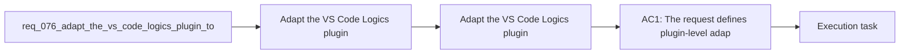

## item_099_adapt_the_vs_code_logics_plugin_to_codex_workspace_overlays - Adapt the VS Code Logics plugin to Codex workspace overlays
> From version: 1.10.8
> Status: Done
> Understanding: 95%
> Confidence: 92%
> Progress: 100%
> Complexity: Medium
> Theme: VS Code plugin integration and Codex overlay awareness
> Reminder: Update status/understanding/confidence/progress and linked task references when you edit this doc.

# Problem
- Adapt the VS Code Logics plugin so it understands and supports the future Codex workspace-overlay model instead of assuming only the current global Codex behavior.
- Preserve the plugin's existing repo-local `logics/skills` workflow while adding visibility and operator support for overlay-backed Codex sessions.
- Prevent the plugin UX from drifting behind the new Codex runtime model once overlays become the supported path.
- The current plugin already has a strong Logics workflow model, but it is still aligned to the pre-overlay world:
- - it assumes the Logics kit lives under `logics/skills/` in the repository;

# Scope
- In:
- Out:

# Acceptance criteria
- AC1: The request defines plugin-level adaptation for the Codex workspace-overlay model without redefining the underlying overlay architecture itself.
- AC2: The request explicitly preserves the current plugin responsibility for repo-local Logics workflow browsing and script-backed actions under `logics/skills/`.
- AC3: The request defines which overlay-aware plugin surfaces need to exist, covering at least:
- environment or status visibility;
- Codex launch or handoff guidance;
- operator-facing recovery messaging when overlay state is missing or unhealthy.
- AC4: The request makes clear that the plugin should be able to distinguish between:
- healthy repo-local Logics state;
- and unhealthy overlay-backed Codex runtime state.
- AC5: The request is concrete enough that future implementation can decide whether overlay actions are invoked through a CLI or wrapper layer while still giving the plugin a coherent integration path.
- AC6: The request keeps bootstrap and repo-local kit checks compatible with existing repositories even before overlays are fully adopted everywhere.
- AC7: The request defines the plugin adaptation as additive and backward-aware rather than as a breaking replacement of current Logics browsing and workflow actions.
- AC8: The request is implementation-ready enough that a follow-up backlog item can choose whether the first plugin pass should include:
- read-only overlay diagnostics first;
- guided launch integration;
- or fuller overlay action surfaces in the tools menu.

# AC Traceability
- AC1 -> Scope: The request defines plugin-level adaptation for the Codex workspace-overlay model without redefining the underlying overlay architecture itself.. Proof: TODO.
- AC2 -> Scope: The request explicitly preserves the current plugin responsibility for repo-local Logics workflow browsing and script-backed actions under `logics/skills/`.. Proof: TODO.
- AC3 -> Scope: The request defines which overlay-aware plugin surfaces need to exist, covering at least:. Proof: TODO.
- AC4 -> Scope: environment or status visibility;. Proof: TODO.
- AC5 -> Scope: Codex launch or handoff guidance;. Proof: TODO.
- AC6 -> Scope: operator-facing recovery messaging when overlay state is missing or unhealthy.. Proof: TODO.
- AC4 -> Scope: The request makes clear that the plugin should be able to distinguish between:. Proof: TODO.
- AC7 -> Scope: healthy repo-local Logics state;. Proof: TODO.
- AC8 -> Scope: and unhealthy overlay-backed Codex runtime state.. Proof: TODO.
- AC5 -> Scope: The request is concrete enough that future implementation can decide whether overlay actions are invoked through a CLI or wrapper layer while still giving the plugin a coherent integration path.. Proof: TODO.
- AC6 -> Scope: The request keeps bootstrap and repo-local kit checks compatible with existing repositories even before overlays are fully adopted everywhere.. Proof: TODO.
- AC7 -> Scope: The request defines the plugin adaptation as additive and backward-aware rather than as a breaking replacement of current Logics browsing and workflow actions.. Proof: TODO.
- AC8 -> Scope: The request is implementation-ready enough that a follow-up backlog item can choose whether the first plugin pass should include:. Proof: TODO.
- AC9 -> Scope: read-only overlay diagnostics first;. Proof: TODO.
- AC10 -> Scope: guided launch integration;. Proof: TODO.
- AC11 -> Scope: or fuller overlay action surfaces in the tools menu.. Proof: TODO.

# Decision framing
- Product framing: Consider
- Product signals: navigation and discoverability
- Product follow-up: Review whether a product brief is needed before scope becomes harder to change.
- Architecture framing: Required
- Architecture signals: contracts and integration, state and sync
- Architecture follow-up: Create or link an architecture decision before irreversible implementation work starts.

# Links
- Product brief(s): (none yet)
- Architecture decision(s): `adr_008_keep_codex_workspace_overlays_repo_local_isolated_and_composable`
- Request: `req_076_adapt_the_vs_code_logics_plugin_to_codex_workspace_overlays`
- Primary task(s): `task_089_orchestration_delivery_for_req_076_and_req_077_plugin_overlay_awareness_and_bootstrap_readiness`

# References
- `Related request(s): `logics/request/req_067_add_multi_project_codex_workspace_overlays_for_logics_skills.md``
- `Related request(s): `logics/request/req_069_add_an_operator_facing_logics_codex_workspace_manager_cli.md``
- `Related request(s): `logics/request/req_071_add_diagnostics_and_self_healing_for_codex_workspace_overlays.md``
- `Reference: `src/logicsViewProvider.ts``
- `Reference: `src/logicsViewDocumentController.ts``
- `Reference: `src/logicsEnvironment.ts``
- `Reference: `README.md``

# Priority
- Impact:
- Urgency:

# Notes
- Derived from request `req_076_adapt_the_vs_code_logics_plugin_to_codex_workspace_overlays`.
- Source file: `logics/request/req_076_adapt_the_vs_code_logics_plugin_to_codex_workspace_overlays.md`.
- Request context seeded into this backlog item from `logics/request/req_076_adapt_the_vs_code_logics_plugin_to_codex_workspace_overlays.md`.
