## item_100_adapt_logics_bootstrap_and_environment_checks_to_codex_workspace_overlays - Adapt Logics bootstrap and environment checks to Codex workspace overlays
> From version: 1.10.8 (refreshed)
> Status: Done
> Understanding: 96%
> Confidence: 94%
> Progress: 100% (refreshed)
> Complexity: Medium
> Theme: VS Code bootstrap and environment diagnostics
> Reminder: Update status/understanding/confidence/progress and linked task references when you edit this doc.

# Problem
- Adapt the plugin bootstrap and environment-check model so it stays accurate once Codex workspace overlays become part of the supported runtime path.
- Preserve the current repo-local `logics/skills` bootstrap responsibilities while separating them from overlay-specific Codex runtime readiness.
- Prevent the plugin from reporting "ready" based only on repository-local state when the future overlay-backed Codex runtime is still missing, stale, or broken.
- The current bootstrap and diagnostics flows are intentionally repo-local:
- - the plugin offers to bootstrap Logics by creating `logics/`, adding the `cdx-logics-kit` submodule under `logics/skills/`, and running the bootstrap Python script;

# Scope
- In:
- Out:

```mermaid
%% logics-kind: backlog
%% logics-signature: backlog|adapt-logics-bootstrap-and-environment-c|req-067-add-multi-project-codex-workspac|adapt-the-plugin-bootstrap-and-environme|ac1-the-request-distinguishes-between-re
flowchart LR
    Request[req_067_add_multi_project_codex_workspace_] --> Problem[Adapt the plugin bootstrap and environment]
    Problem --> Scope[Adapt Logics bootstrap and environment che]
    Scope --> Acceptance[AC1: The request distinguishes between rep]
    Acceptance --> Tasks[task_089_orchestration_delivery_for_req_07]
```

# Acceptance criteria
- AC1: The request distinguishes between repo-local Logics kit readiness and overlay-backed Codex runtime readiness as separate states that the plugin must represent.
- AC2: The request explicitly preserves the current repo-local bootstrap responsibilities, including creating or repairing `logics/skills` and running the Logics bootstrap script where applicable.
- AC3: The request defines that `Check Environment` must be able to surface overlay state separately from repository-local kit state once overlays are supported.
- AC4: The request defines recovery guidance for at least these cases:
- repo-local kit missing or broken;
- overlay missing or stale while repo-local kit is healthy;
- both layers unhealthy.
- AC5: The request leaves implementation room for the first overlay-aware bootstrap pass to either:
- report the missing overlay follow-up explicitly;
- or optionally offer an overlay init or sync handoff after repo-local bootstrap completes.
- AC6: The request remains backward-aware for repositories still using only the current repo-local Logics workflow before overlay support is adopted.
- AC7: The request makes clear that a successful repo-local bootstrap must not automatically imply full Codex readiness once workspace overlays are part of the supported model.

# AC Traceability
- AC1 -> Scope: The request distinguishes between repo-local Logics kit readiness and overlay-backed Codex runtime readiness as separate states that the plugin must represent.. Proof: covered by linked task completion.
- AC2 -> Scope: The request explicitly preserves the current repo-local bootstrap responsibilities, including creating or repairing `logics/skills` and running the Logics bootstrap script where applicable.. Proof: covered by linked task completion.
- AC3 -> Scope: The request defines that `Check Environment` must be able to surface overlay state separately from repository-local kit state once overlays are supported.. Proof: covered by linked task completion.
- AC4 -> Scope: The request defines recovery guidance for at least these cases:. Proof: covered by linked task completion.
- AC5 -> Scope: repo-local kit missing or broken;. Proof: covered by linked task completion.
- AC6 -> Scope: overlay missing or stale while repo-local kit is healthy;. Proof: covered by linked task completion.
- AC7 -> Scope: both layers unhealthy.. Proof: covered by linked task completion.
- AC5 -> Scope: The request leaves implementation room for the first overlay-aware bootstrap pass to either:. Proof: covered by linked task completion.
- AC8 -> Scope: report the missing overlay follow-up explicitly;. Proof: covered by linked task completion.
- AC9 -> Scope: or optionally offer an overlay init or sync handoff after repo-local bootstrap completes.. Proof: covered by linked task completion.
- AC6 -> Scope: The request remains backward-aware for repositories still using only the current repo-local Logics workflow before overlay support is adopted.. Proof: covered by linked task completion.
- AC7 -> Scope: The request makes clear that a successful repo-local bootstrap must not automatically imply full Codex readiness once workspace overlays are part of the supported model.. Proof: covered by linked task completion.

# Decision framing
- Product framing: Not needed
- Product signals: (none detected)
- Product follow-up: No product brief follow-up is expected based on current signals.
- Architecture framing: Consider
- Architecture signals: state and sync
- Architecture follow-up: Review whether an architecture decision is needed before implementation becomes harder to reverse.

# Links
- Product brief(s): (none yet)
- Architecture decision(s): `adr_008_keep_codex_workspace_overlays_repo_local_isolated_and_composable`
- Request: `req_077_adapt_logics_bootstrap_and_environment_checks_to_codex_workspace_overlays`
- Primary task(s): `task_089_orchestration_delivery_for_req_076_and_req_077_plugin_overlay_awareness_and_bootstrap_readiness`

# References
- `Related request(s): `logics/request/req_067_add_multi_project_codex_workspace_overlays_for_logics_skills.md``
- `Related request(s): `logics/request/req_076_adapt_the_vs_code_logics_plugin_to_codex_workspace_overlays.md``
- `Reference: `src/logicsViewProvider.ts``
- `Reference: `src/logicsEnvironment.ts``
- `Reference: `README.md``

# Priority
- Impact:
- Urgency:

# Notes
- Derived from request `req_077_adapt_logics_bootstrap_and_environment_checks_to_codex_workspace_overlays`.
- Source file: `logics/request/req_077_adapt_logics_bootstrap_and_environment_checks_to_codex_workspace_overlays.md`.
- Request context seeded into this backlog item from `logics/request/req_077_adapt_logics_bootstrap_and_environment_checks_to_codex_workspace_overlays.md`.
- Derived from `logics/request/req_077_adapt_logics_bootstrap_and_environment_checks_to_codex_workspace_overlays.md`.
