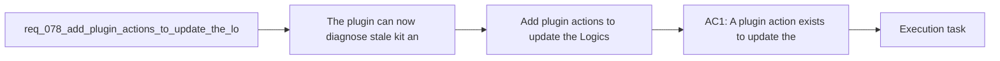

## item_101_add_plugin_actions_to_update_the_logics_kit_and_sync_codex_overlays - Add plugin actions to update the Logics kit and sync Codex overlays
> From version: 1.10.8
> Status: Done
> Understanding: 96%
> Confidence: 94%
> Progress: 100%
> Complexity: Medium
> Theme: VS Code operator remediation and kit lifecycle
> Reminder: Update status/understanding/confidence/progress and linked task references when you edit this doc.

# Problem
- The plugin can now diagnose stale-kit and missing-overlay states, but it still leaves the operator on a manual shell path for the standard remediation flow.
- In practice, the extension already knows the two common next steps:
- update the canonical `logics/skills` submodule to a kit version that includes `logics_codex_workspace.py`;
- sync the Codex workspace overlay once the manager exists.
- Without first-class actions for those steps, the plugin creates a usability gap between "I know what is wrong" and "I can fix it from the same surface".
- The missing actions matter most in the exact flows the extension now encourages:
- bootstrap completes but overlay runtime still needs materialization;
- `Check Environment` reports a missing overlay manager because the kit in the repo predates the new overlay support;
- the operator is inside VS Code and expects the tools menu to offer the supported repair path.

# Scope
- In:
  - Add a plugin action to update the Logics kit when the repository uses the canonical `logics/skills` Git submodule.
  - Add a plugin action to sync or repair the Codex workspace overlay when the manager script is available.
  - Gate those actions behind explicit Git, Python, and repository-layout checks so unsafe or unsupported cases fall back to guidance instead of silent failure.
  - Surface the actions from the plugin surfaces where the missing state is already detected, such as the tools menu or environment diagnostics.
- Out:
  - Supporting arbitrary copied, vendored, or forked kit layouts as fully automated update targets in the first pass.
  - Replacing the kit-side overlay manager with a TypeScript-only implementation.
  - Broad repository update workflows unrelated to the Logics kit submodule or the Codex overlay runtime.

# Acceptance criteria
- AC1: A plugin action exists to update the Logics kit when the repository uses the canonical `logics/skills` submodule model and the detected kit is older than the overlay-manager baseline.
- AC2: A plugin action exists to sync the Codex workspace overlay when `logics/skills/logics-flow-manager/scripts/logics_codex_workspace.py` is present and the overlay is missing, stale, or otherwise not ready.
- AC3: The plugin checks Git and repository safety before attempting kit updates, including missing Git on PATH, dirty worktree, and missing or non-submodule `logics/skills` layouts.
- AC4: Unsupported or unsafe update cases fall back to explicit operator guidance instead of partial automation or misleading success messages.
- AC5: The plugin keeps the kit and overlay logic delegated to the existing submodule and Python scripts rather than duplicating those behaviors in TypeScript.
- AC6: The new actions are surfaced from at least one user-facing remediation surface that already reports the corresponding problem state.
- AC7: Documentation and user-facing messaging explain when the plugin can remediate automatically and when it only provides manual guidance.
- AC8: The first implementation pass can expose the remediation flow from both the Tools menu and actionable environment diagnostics without expanding beyond the current wrapper role.

# AC Traceability
- AC1 -> Scope: Add a plugin action to update the Logics kit when the repository uses the canonical `logics/skills` Git submodule.. Proof: TODO.
- AC2 -> Scope: Add a plugin action to sync or repair the Codex workspace overlay when the manager script is available.. Proof: TODO.
- AC3 -> Scope: Gate those actions behind explicit Git, Python, and repository-layout checks so unsafe or unsupported cases fall back to guidance instead of silent failure.. Proof: TODO.
- AC4 -> Scope: Gate those actions behind explicit Git, Python, and repository-layout checks so unsafe or unsupported cases fall back to guidance instead of silent failure.. Proof: TODO.
- AC5 -> Scope: Supporting arbitrary copied, vendored, or forked kit layouts as fully automated update targets in the first pass.. Proof: Excluded to preserve delegation to the existing kit and script contract.
- AC6 -> Scope: Surface the actions from the plugin surfaces where the missing state is already detected, such as the tools menu or environment diagnostics.. Proof: TODO.
- AC7 -> Scope: Add a plugin action to update the Logics kit when the repository uses the canonical `logics/skills` Git submodule.. Proof: TODO.
- AC8 -> Scope: Surface the actions from the plugin surfaces where the missing state is already detected, such as the tools menu or environment diagnostics.. Proof: Implemented through `Update Logics Kit` and `Sync Codex Overlay` actions in the Tools menu plus remediation actions inside `Logics: Check Environment`.

# Decision framing
- Product framing: Not needed
- Product signals: (none detected)
- Product follow-up: No product brief follow-up is expected based on current signals.
- Architecture framing: Consider
- Architecture signals: state and sync, delivery and operations
- Architecture follow-up: Covered by `adr_008_keep_codex_workspace_overlays_repo_local_isolated_and_composable`; no new ADR is required unless plugin-owned automation exceeds the current wrapper role.

# Links
- Product brief(s): (none yet)
- Architecture decision(s): `adr_008_keep_codex_workspace_overlays_repo_local_isolated_and_composable`
- Request: `req_078_add_plugin_actions_to_update_the_logics_kit_and_sync_codex_overlays`
- Primary task(s): `task_090_add_plugin_actions_to_update_the_logics_kit_and_sync_codex_overlays`

# References
- `Related request(s): `logics/request/req_067_add_multi_project_codex_workspace_overlays_for_logics_skills.md``
- `Related request(s): `logics/request/req_076_adapt_the_vs_code_logics_plugin_to_codex_workspace_overlays.md``
- `Related request(s): `logics/request/req_077_adapt_logics_bootstrap_and_environment_checks_to_codex_workspace_overlays.md``
- `Reference: `src/logicsViewProvider.ts``
- `Reference: `src/logicsViewDocumentController.ts``
- `Reference: `src/logicsEnvironment.ts``
- `Reference: `src/logicsProviderUtils.ts``
- `Reference: `README.md`` 

# Priority
- Impact: Medium to high for real operator adoption of the overlay flow.
- Urgency: Medium, because the missing automation already shows up in manual testing of the shipped plugin behavior.

# Notes
- Derived from request `req_078_add_plugin_actions_to_update_the_logics_kit_and_sync_codex_overlays`.
- Source file: `logics/request/req_078_add_plugin_actions_to_update_the_logics_kit_and_sync_codex_overlays.md`.
- Request context seeded into this backlog item from `logics/request/req_078_add_plugin_actions_to_update_the_logics_kit_and_sync_codex_overlays.md`.
