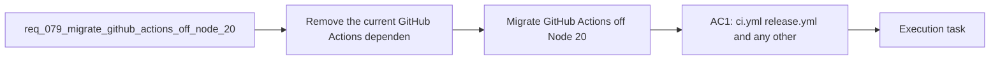

## item_102_migrate_github_actions_off_node_20_before_runner_deprecation - Migrate GitHub Actions off Node 20 before runner deprecation
> From version: 1.11.1
> Status: Done
> Understanding: 96%
> Confidence: 95%
> Progress: 100%
> Complexity: Medium
> Theme: CI and release maintenance
> Reminder: Update status/understanding/confidence/progress and linked task references when you edit this doc.

# Problem
- Remove the current GitHub Actions dependency on Node 20 based JavaScript actions before runner defaults switch to Node 24.
- Keep CI and release workflows green on Ubuntu and Windows while upgrading the workflow action stack.
- - Recent GitHub Actions runs now emit a platform warning that `actions/checkout@v4`, `actions/setup-node@v4`, and `actions/setup-python@v5` still run on Node 20.
- - GitHub indicates those actions will be forced onto Node 24 by default starting on June 2, 2026.

# Scope
- In:
- Out:

# Acceptance criteria
- AC1: `ci.yml`, `release.yml`, and any other repository workflow files that currently rely on Node 20 based GitHub-hosted JavaScript actions are updated to maintained versions that are compatible with the post-Node-20 runner contract.
- AC2: Repository validation confirms that CI and release workflows still pass on Ubuntu and Windows after the action upgrade, without regressing the existing Logics kit, VSIX packaging, or release-changelog gates.
- AC3: Workflow documentation or maintainer guidance is updated if the migration changes version expectations, action pinning, or release maintenance steps.

# AC Traceability
- AC1 -> Scope: `ci.yml`, `release.yml`, and any other repository workflow files that currently rely on Node 20 based GitHub-hosted JavaScript actions are updated to maintained versions that are compatible with the post-Node-20 runner contract.. Proof: TODO.
- AC2 -> Scope: Repository validation confirms that CI and release workflows still pass on Ubuntu and Windows after the action upgrade, without regressing the existing Logics kit, VSIX packaging, or release-changelog gates.. Proof: TODO.
- AC3 -> Scope: Workflow documentation or maintainer guidance is updated if the migration changes version expectations, action pinning, or release maintenance steps.. Proof: TODO.

# Decision framing
- Product framing: Consider
- Product signals: conversion journey
- Product follow-up: Review whether a product brief is needed before scope becomes harder to change.
- Architecture framing: Required
- Architecture signals: data model and persistence, contracts and integration
- Architecture follow-up: Create or link an architecture decision before irreversible implementation work starts.

# Links
- Product brief(s): (none yet)
- Architecture decision(s): `adr_010_pin_github_actions_to_a_node_24_compatible_baseline`
- Request: `req_079_migrate_github_actions_off_node_20_before_runner_deprecation`
- Primary task(s): `task_091_migrate_github_actions_off_node_20_before_runner_deprecation`

# Priority
- Impact:
- Urgency:

# Notes
- Derived from request `req_079_migrate_github_actions_off_node_20_before_runner_deprecation`.
- Source file: `logics/request/req_079_migrate_github_actions_off_node_20_before_runner_deprecation.md`.
- Request context seeded into this backlog item from `logics/request/req_079_migrate_github_actions_off_node_20_before_runner_deprecation.md`.
- Task `task_091_migrate_github_actions_off_node_20_before_runner_deprecation` was finished via `logics_flow.py finish task` on 2026-03-23.
