## item_103_define_budgeted_context_pack_profiles_and_deterministic_trimming_for_codex - Define budgeted context pack profiles and deterministic trimming for Codex
> From version: 1.11.1
> Status: Done
> Understanding: 97%
> Confidence: 96%
> Progress: 100%
> Complexity: High
> Theme: AI workflow and token efficiency
> Reminder: Update status/understanding/confidence/progress and linked task references when you edit this doc.

# Problem
- The current Logics context-pack flow focuses on relevance, but it does not yet enforce strict, predictable size ceilings.
- Without explicit profiles such as `tiny`, `normal`, and `deep`, operators and downstream tooling cannot choose a token budget deliberately or know why a given pack is larger than expected.
- The missing contract is a deterministic profile and trimming model that keeps Codex context small by default while still allowing deeper packs when the task actually needs them.

# Scope
- In:
  - Define the supported Codex context-pack profiles and the intent of each profile.
  - Define deterministic inclusion order and trimming rules across selected items, linked docs, summaries, and larger body excerpts.
  - Define how preview or injection surfaces report what was included, trimmed, or omitted.
  - Update operator guidance so profile selection becomes a first-class workflow choice.
- Out:
  - Adding new AI-summary fields to managed docs; that is handled by `item_104_add_ai_facing_summaries_and_compact_metadata_to_managed_logics_docs`.
  - Agent-specific routing or manifest-level context preferences; that is handled by `item_105_make_agent_manifests_declare_context_budgets_and_allowed_doc_families`.
  - Delta-based context selection from recent changes; that is handled by `item_106_build_delta_oriented_codex_context_packs_from_direct_dependencies_and_recent_changes`.
  - Token-hygiene diagnostics and redundancy detection; that is handled by `item_107_detect_redundant_or_oversized_logics_context_and_guide_token_hygiene`.

```mermaid
%% logics-kind: backlog
%% logics-signature: backlog|define-budgeted-context-pack-profiles-an|req-080-reduce-codex-token-consumption-w|the-current-logics-context-pack-flow-foc|ac1-the-logics-kit-defines-supported
flowchart LR
    Request[req_080_reduce_codex_token_consumption_wit] --> Problem[The current Logics context-pack flow focus]
    Problem --> Scope[Define budgeted context pack profiles and]
    Scope --> Acceptance[AC1: The Logics kit defines supported]
    Acceptance --> Tasks[task_092_orchestration_delivery_for_req_08]
```

# Acceptance criteria
- AC1: The Logics kit defines supported context-pack profiles such as `tiny`, `normal`, and `deep`, with an explicit purpose and deterministic maximum-selection rules for each profile.
- AC2: The context-pack contract defines deterministic ordering and trimming behavior so the same inputs produce the same included or omitted slices.
- AC3: Preview or injection surfaces can expose enough trim visibility that an operator can see why content was kept, truncated, or excluded.
- AC4: README or equivalent operator guidance explains when to choose each profile and why the default should favor smaller packs.

# AC Traceability
- req080-AC1 -> Scope: Define the supported Codex context-pack profiles and the intent of each profile.. Proof: TODO.
- req080-AC1 -> Scope: Define deterministic inclusion order and trimming rules across selected items, linked docs, summaries, and larger body excerpts.. Proof: TODO.
- req080-AC6 -> Scope: Update operator guidance so profile selection becomes a first-class workflow choice.. Proof: TODO.

# Decision framing
- Product framing: Not needed
- Product signals: (none detected)
- Product follow-up: No product brief follow-up is expected for this contract-first technical slice.
- Architecture framing: Consider
- Architecture signals: contracts and integration
- Architecture follow-up: Review whether an architecture decision is needed before implementation becomes harder to reverse.

# Links
- Product brief(s): (none yet)
- Architecture decision(s): (none yet)
- Request: `req_080_reduce_codex_token_consumption_with_budgeted_context_packs_and_agent_aware_prompt_shaping`
- Primary task(s): `task_092_orchestration_delivery_for_req_080_token_efficient_codex_context_shaping`

# References
- `README.md`
- `logics/instructions.md`
- `src/logicsViewProvider.ts`
- `src/agentRegistry.ts`
- `src/logicsCodexWorkspace.ts`

# Priority
- Impact: High, because every Codex handoff depends on a stable context-budget contract.
- Urgency: High, because the other token-efficiency slices need a shared profile vocabulary and trimming contract.

# Notes
- Derived from request `req_080_reduce_codex_token_consumption_with_budgeted_context_packs_and_agent_aware_prompt_shaping`.
- Source file: `logics/request/req_080_reduce_codex_token_consumption_with_budgeted_context_packs_and_agent_aware_prompt_shaping.md`.
- Request context seeded into this backlog item from `logics/request/req_080_reduce_codex_token_consumption_with_budgeted_context_packs_and_agent_aware_prompt_shaping.md`.
- Task `task_092_orchestration_delivery_for_req_080_token_efficient_codex_context_shaping` was finished via `logics_flow.py finish task` on 2026-03-23.
