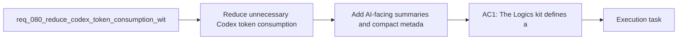

## item_104_add_ai_facing_summaries_and_compact_metadata_to_managed_logics_docs - Add AI-facing summaries and compact metadata to managed Logics docs
> From version: 1.11.1
> Status: Done
> Understanding: 97%
> Confidence: 96%
> Progress: 100%
> Complexity: High
> Theme: AI workflow and token efficiency
> Reminder: Update status/understanding/confidence/progress and linked task references when you edit this doc.

# Problem
- The current Logics corpus stores durable project knowledge, but it still often requires large document bodies to recover the useful signal for Codex.
- Without compact AI-facing summaries or structured metadata on managed docs, context packs have to choose between missing information and shipping too much prose.
- The missing capability is a summary-first document contract that lets context packs inject high-signal, low-token slices before they ever need to include larger body excerpts.

# Scope
- In:
  - Define compact AI-facing summary or metadata fields for the managed Logics doc families that participate in Codex context building.
  - Update templates, generators, or bootstrap assets so new docs can carry these compact fields consistently.
  - Define how context-pack flows prefer summaries first and fall back to larger content only when needed.
  - Add maintenance guidance so summary fields stay useful instead of becoming stale boilerplate.
- Out:
  - Defining context-pack profile budgets and trim policies; that is handled by `item_103_define_budgeted_context_pack_profiles_and_deterministic_trimming_for_codex`.
  - Agent-specific routing policy; that is handled by `item_105_make_agent_manifests_declare_context_budgets_and_allowed_doc_families`.
  - Delta-pack selection logic; that is handled by `item_106_build_delta_oriented_codex_context_packs_from_direct_dependencies_and_recent_changes`.
  - Token-hygiene diagnostics; that is handled by `item_107_detect_redundant_or_oversized_logics_context_and_guide_token_hygiene`.

# Acceptance criteria
- AC1: Managed Logics docs can expose compact AI-facing summaries or equivalent structured metadata that are materially shorter than the full body and still useful for Codex handoff.
- AC2: The supported doc templates or generation flows can create these summary fields consistently for the doc families in scope.
- AC3: Context-pack assembly rules can prefer the compact summaries first and only fall back to larger excerpts when the selected profile or task needs them.
- AC4: Maintenance guidance or lint expectations keep the new summary fields from remaining empty, stale, or redundant with the main body.
- AC5: Operator-facing documentation explains how to maintain these fields so they reduce token usage in practice.

# AC Traceability
- req080-AC2 -> Scope: Define compact AI-facing summary or metadata fields for the managed Logics doc families that participate in Codex context building.. Proof: TODO.
- req080-AC2 -> Scope: Define how context-pack flows prefer summaries first and fall back to larger content only when needed.. Proof: TODO.
- req080-AC6 -> Scope: Add maintenance guidance so summary fields stay useful instead of becoming stale boilerplate.. Proof: TODO.

# Decision framing
- Product framing: Not needed
- Product signals: (none detected)
- Product follow-up: No product brief follow-up is expected for this documentation and metadata slice.
- Architecture framing: Consider
- Architecture signals: contracts and integration
- Architecture follow-up: Review whether an architecture decision is needed before implementation becomes harder to reverse.

# Links
- Product brief(s): (none yet)
- Architecture decision(s): (none yet)
- Request: `req_080_reduce_codex_token_consumption_with_budgeted_context_packs_and_agent_aware_prompt_shaping`
- Primary task(s): `task_092_orchestration_delivery_for_req_080_token_efficient_codex_context_shaping`

# References
- `README.md`
- `logics/instructions.md`
- `logics/skills/logics-bootstrapper/assets/instructions.md`
- `src/agentRegistry.ts`
- `src/logicsCodexWorkspace.ts`

# Priority
- Impact: High, because summary-first docs are the main way to replace large prompt bodies with compact reusable memory.
- Urgency: High, because the context-pack contract and routing logic both depend on smaller doc-level building blocks.

# Notes
- Derived from request `req_080_reduce_codex_token_consumption_with_budgeted_context_packs_and_agent_aware_prompt_shaping`.
- Source file: `logics/request/req_080_reduce_codex_token_consumption_with_budgeted_context_packs_and_agent_aware_prompt_shaping.md`.
- Request context seeded into this backlog item from `logics/request/req_080_reduce_codex_token_consumption_with_budgeted_context_packs_and_agent_aware_prompt_shaping.md`.
- Task `task_092_orchestration_delivery_for_req_080_token_efficient_codex_context_shaping` was finished via `logics_flow.py finish task` on 2026-03-23.
