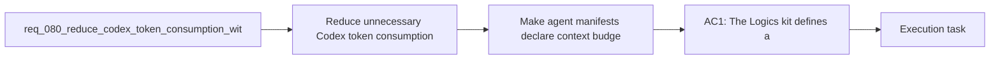

## item_105_make_agent_manifests_declare_context_budgets_and_allowed_doc_families - Make agent manifests declare context budgets and allowed doc families
> From version: 1.11.1
> Status: Done
> Understanding: 97%
> Confidence: 96%
> Progress: 100%
> Complexity: High
> Theme: AI workflow and token efficiency
> Reminder: Update status/understanding/confidence/progress and linked task references when you edit this doc.

# Problem
- The repository already has agent manifests and Codex handoff flows, but those manifests only describe prompts, not the context budget or the document families an agent should use.
- Without agent-level routing rules, Codex may receive the same broad context pack for very different tasks such as review, request writing, or implementation guidance.
- The missing contract is an agent-aware context-routing layer that lets each agent declare the smallest useful profile and the document families it should prefer or avoid.

# Scope
- In:
  - Extend the agent-manifest or handoff contract so an agent can declare a preferred context profile and allowed or disallowed Logics doc families.
  - Validate the new manifest fields in agent loading so bad manifests fail explicitly instead of silently producing oversized context.
  - Define how handoff logic resolves agent-specific routing with explicit operator overrides.
  - Update guidance or examples for agents that should opt into the new routing fields.
- Out:
  - Defining the global context-pack profiles themselves; that is handled by `item_103_define_budgeted_context_pack_profiles_and_deterministic_trimming_for_codex`.
  - Adding AI-summary fields to managed docs; that is handled by `item_104_add_ai_facing_summaries_and_compact_metadata_to_managed_logics_docs`.
  - Delta-selection logic from recent changes; that is handled by `item_106_build_delta_oriented_codex_context_packs_from_direct_dependencies_and_recent_changes`.
  - Token-hygiene diagnostics; that is handled by `item_107_detect_redundant_or_oversized_logics_context_and_guide_token_hygiene`.

# Acceptance criteria
- AC1: Agent-facing manifests or equivalent handoff configuration can declare a preferred context profile and allowed or disallowed Logics doc families.
- AC2: Agent loading or validation surfaces explicit errors for invalid routing declarations instead of silently ignoring them.
- AC3: Codex handoff behavior respects these routing declarations by default while preserving an explicit operator override path.
- AC4: At least one operator-facing surface or example makes the active routing choice inspectable enough for debugging and adoption.
- AC5: Agent authoring guidance explains when to choose a smaller or larger profile and when to narrow or widen allowed doc families.

# AC Traceability
- req080-AC3 -> Scope: Extend the agent-manifest or handoff contract so an agent can declare a preferred context profile and allowed or disallowed Logics doc families.. Proof: TODO.
- req080-AC3 -> Scope: Define how handoff logic resolves agent-specific routing with explicit operator overrides.. Proof: TODO.
- req080-AC6 -> Scope: Update guidance or examples for agents that should opt into the new routing fields.. Proof: TODO.

# Decision framing
- Product framing: Not needed
- Product signals: (none detected)
- Product follow-up: No product brief follow-up is expected for this agent-manifest contract slice.
- Architecture framing: Consider
- Architecture signals: contracts and integration
- Architecture follow-up: Review whether an architecture decision is needed before implementation becomes harder to reverse.

# Links
- Product brief(s): (none yet)
- Architecture decision(s): (none yet)
- Request: `req_080_reduce_codex_token_consumption_with_budgeted_context_packs_and_agent_aware_prompt_shaping`
- Primary task(s): `task_092_orchestration_delivery_for_req_080_token_efficient_codex_context_shaping`

# References
- `README.md`
- `logics/instructions.md`
- `src/logicsViewProvider.ts`
- `src/agentRegistry.ts`
- `src/logicsCodexWorkspace.ts`

# Priority
- Impact: Medium to high, because agent routing is the main lever for making small context defaults task-specific instead of generic.
- Urgency: Medium, because it depends on the shared profile contract from `item_103` but should land before broader handoff behavior is considered complete.

# Notes
- Derived from request `req_080_reduce_codex_token_consumption_with_budgeted_context_packs_and_agent_aware_prompt_shaping`.
- Source file: `logics/request/req_080_reduce_codex_token_consumption_with_budgeted_context_packs_and_agent_aware_prompt_shaping.md`.
- Request context seeded into this backlog item from `logics/request/req_080_reduce_codex_token_consumption_with_budgeted_context_packs_and_agent_aware_prompt_shaping.md`.
- Task `task_092_orchestration_delivery_for_req_080_token_efficient_codex_context_shaping` was finished via `logics_flow.py finish task` on 2026-03-23.
