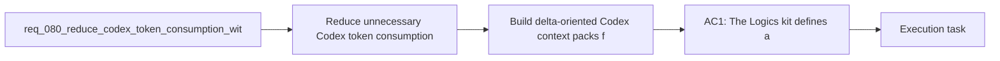

## item_106_build_delta_oriented_codex_context_packs_from_direct_dependencies_and_recent_changes - Build delta-oriented Codex context packs from direct dependencies and recent changes
> From version: 1.11.1
> Status: Done
> Understanding: 97%
> Confidence: 96%
> Progress: 100%
> Complexity: High
> Theme: AI workflow and token efficiency
> Reminder: Update status/understanding/confidence/progress and linked task references when you edit this doc.

# Problem
- Current context packs are still biased toward the full related-document graph, which can carry more history than the active task actually needs.
- Many Codex sessions only need the selected item, its direct dependencies, and the recent changes that define the current implementation delta.
- The missing capability is a delta-oriented selection mode that prefers immediate dependencies and recent change surfaces over full-history graph injection.

# Scope
- In:
  - Define how a Codex context pack can be built from the selected item, its direct dependencies, and a bounded recent-change surface.
  - Define the supported recent-change signals, such as workflow-state changes or repository diffs, and the fallback behavior when those signals are unavailable.
  - Ensure the pack contract remains deterministic and previewable when using delta selection.
  - Update guidance so operators understand when delta packs should be preferred over broader graph-based packs.
- Out:
  - Defining the global profile vocabulary and trimming ceilings; that is handled by `item_103_define_budgeted_context_pack_profiles_and_deterministic_trimming_for_codex`.
  - Adding doc-level AI summaries; that is handled by `item_104_add_ai_facing_summaries_and_compact_metadata_to_managed_logics_docs`.
  - Agent-manifest routing rules; that is handled by `item_105_make_agent_manifests_declare_context_budgets_and_allowed_doc_families`.
  - Token-hygiene diagnostics; that is handled by `item_107_detect_redundant_or_oversized_logics_context_and_guide_token_hygiene`.

# Acceptance criteria
- AC1: The Codex context-pack workflow can build a delta-oriented pack from the selected item, its direct dependencies, and bounded recent-change signals instead of defaulting to the full related-document graph.
- AC2: The recent-change contract defines deterministic sources and fallback behavior when Git, workflow metadata, or other change signals are unavailable.
- AC3: Preview or inspection surfaces make the delta selection understandable enough that an operator can see which changes or dependencies were included.
- AC4: Documentation explains when delta packs should be preferred and when a broader context profile is still warranted.

# AC Traceability
- req080-AC4 -> Scope: Define how a Codex context pack can be built from the selected item, its direct dependencies, and a bounded recent-change surface.. Proof: TODO.
- req080-AC4 -> Scope: Define the supported recent-change signals, such as workflow-state changes or repository diffs, and the fallback behavior when those signals are unavailable.. Proof: TODO.
- req080-AC6 -> Scope: Update guidance so operators understand when delta packs should be preferred over broader graph-based packs.. Proof: TODO.

# Decision framing
- Product framing: Not needed
- Product signals: (none detected)
- Product follow-up: No product brief follow-up is expected for this context-selection slice.
- Architecture framing: Consider
- Architecture signals: contracts and integration
- Architecture follow-up: Review whether an architecture decision is needed before implementation becomes harder to reverse.

# Links
- Product brief(s): (none yet)
- Architecture decision(s): (none yet)
- Request: `req_080_reduce_codex_token_consumption_with_budgeted_context_packs_and_agent_aware_prompt_shaping`
- Primary task(s): `task_092_orchestration_delivery_for_req_080_token_efficient_codex_context_shaping`

# References
- `README.md`
- `logics/instructions.md`
- `src/logicsViewProvider.ts`
- `src/agentRegistry.ts`
- `src/logicsCodexWorkspace.ts`

# Priority
- Impact: High, because full-graph context is one of the clearest causes of avoidable token spend in ongoing Codex sessions.
- Urgency: Medium to high, because delta selection should land once the profile contract is clear and before the final hygiene story is closed.

# Notes
- Derived from request `req_080_reduce_codex_token_consumption_with_budgeted_context_packs_and_agent_aware_prompt_shaping`.
- Source file: `logics/request/req_080_reduce_codex_token_consumption_with_budgeted_context_packs_and_agent_aware_prompt_shaping.md`.
- Request context seeded into this backlog item from `logics/request/req_080_reduce_codex_token_consumption_with_budgeted_context_packs_and_agent_aware_prompt_shaping.md`.
- Task `task_092_orchestration_delivery_for_req_080_token_efficient_codex_context_shaping` was finished via `logics_flow.py finish task` on 2026-03-23.
