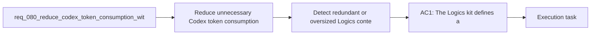

## item_107_detect_redundant_or_oversized_logics_context_and_guide_token_hygiene - Detect redundant or oversized Logics context and guide token hygiene
> From version: 1.11.1
> Status: Done
> Understanding: 97%
> Confidence: 96%
> Progress: 100%
> Complexity: High
> Theme: AI workflow and token efficiency
> Reminder: Update status/understanding/confidence/progress and linked task references when you edit this doc.

# Problem
- Even with better profiles and summaries, the Logics corpus can still waste tokens if it accumulates duplicated prose, oversized stale docs, or obsolete references that keep showing up in context packs.
- The current workflow has linting and audit primitives, but it does not yet expose a token-hygiene view that treats redundant context as a first-class maintenance problem.
- The missing capability is a diagnostic and guidance surface that identifies token-wasting patterns and explains how to keep the Logics memory model lean over time.

# Scope
- In:
  - Define token-hygiene checks for duplicated prose, oversized stale context, or obsolete linked material that should not be part of default Codex packs.
  - Decide whether the first pass should surface findings through lint, audit, plugin diagnostics, documentation, or a combination of those paths.
  - Provide actionable remediation guidance so operators know what to trim, archive, summarize, or unlink.
  - Update operator guidance so token hygiene becomes part of normal Logics maintenance instead of an afterthought.
- Out:
  - Defining the context-pack profile vocabulary; that is handled by `item_103_define_budgeted_context_pack_profiles_and_deterministic_trimming_for_codex`.
  - Adding summary-first metadata to managed docs; that is handled by `item_104_add_ai_facing_summaries_and_compact_metadata_to_managed_logics_docs`.
  - Agent-manifest routing rules; that is handled by `item_105_make_agent_manifests_declare_context_budgets_and_allowed_doc_families`.
  - Delta-oriented selection logic; that is handled by `item_106_build_delta_oriented_codex_context_packs_from_direct_dependencies_and_recent_changes`.

# Acceptance criteria
- AC1: The kit or plugin can detect and report token-wasting context patterns such as duplicated prose, oversized stale docs, obsolete linked context, or similarly low-signal context sources.
- AC2: Findings include actionable remediation guidance such as summarizing, archiving, unlinking, or shrinking the affected context source.
- AC3: The first supported surfacing path for token-hygiene findings is documented and usable without requiring operators to infer the workflow manually.
- AC4: README or operator guidance explains how token hygiene interacts with context profiles, summaries, and delta packs so the full reduced-token workflow is understandable end to end.

# AC Traceability
- req080-AC5 -> Scope: Define token-hygiene checks for duplicated prose, oversized stale context, or obsolete linked material that should not be part of default Codex packs.. Proof: TODO.
- req080-AC5 -> Scope: Provide actionable remediation guidance so operators know what to trim, archive, summarize, or unlink.. Proof: TODO.
- req080-AC6 -> Scope: Update operator guidance so token hygiene becomes part of normal Logics maintenance instead of an afterthought.. Proof: TODO.

# Decision framing
- Product framing: Not needed
- Product signals: (none detected)
- Product follow-up: No product brief follow-up is expected for this operator-hygiene slice.
- Architecture framing: Consider
- Architecture signals: contracts and integration
- Architecture follow-up: Review whether an architecture decision is needed before implementation becomes harder to reverse.

# Links
- Product brief(s): (none yet)
- Architecture decision(s): (none yet)
- Request: `req_080_reduce_codex_token_consumption_with_budgeted_context_packs_and_agent_aware_prompt_shaping`
- Primary task(s): `task_092_orchestration_delivery_for_req_080_token_efficient_codex_context_shaping`

# References
- `README.md`
- `logics/instructions.md`
- `src/logicsEnvironment.ts`
- `src/agentRegistry.ts`
- `src/logicsCodexWorkspace.ts`

# Priority
- Impact: Medium to high, because token hygiene protects the long-term value of the Logics memory model once the new context features exist.
- Urgency: Medium, because it should follow the core pack, summary, and routing contracts rather than block them.

# Notes
- Derived from request `req_080_reduce_codex_token_consumption_with_budgeted_context_packs_and_agent_aware_prompt_shaping`.
- Source file: `logics/request/req_080_reduce_codex_token_consumption_with_budgeted_context_packs_and_agent_aware_prompt_shaping.md`.
- Request context seeded into this backlog item from `logics/request/req_080_reduce_codex_token_consumption_with_budgeted_context_packs_and_agent_aware_prompt_shaping.md`.
- Task `task_092_orchestration_delivery_for_req_080_token_efficient_codex_context_shaping` was finished via `logics_flow.py finish task` on 2026-03-23.
