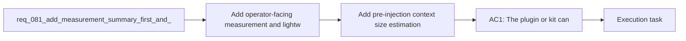

## item_108_add_pre_injection_context_size_estimation_and_budget_visibility_for_codex_handoffs - Add pre-injection context size estimation and budget visibility for Codex handoffs
> From version: 1.11.1
> Status: Ready
> Understanding: 97%
> Confidence: 96%
> Progress: 0%
> Complexity: Medium
> Theme: AI workflow observability and prompt efficiency
> Reminder: Update status/understanding/confidence/progress and linked task references when you edit this doc.

# Problem
- Codex handoffs still hide their approximate cost until after content is already injected or copied into a session.
- Without a pre-injection estimate, operators cannot compare a lightweight pack with a broader one or understand why a handoff feels expensive.
- The missing capability is a visible, deterministic size estimate that makes context cost inspectable before a Codex launch or injection decision.

# Scope
- In:
  - Show deterministic size signals before injection or launch, such as selected docs, line counts, character counts, and an approximate token estimate.
  - Explain when the estimate is directional rather than exact.
  - Surface the estimate in at least one operator-facing handoff path where it can influence the decision to inject, preview, or choose a smaller mode.
  - Document how the estimate should be interpreted alongside existing context-profile choices.
- Out:
  - Building the `summary-only` handoff mode itself; that is handled by `item_109_add_a_summary_only_first_pass_mode_for_codex_context_injection`.
  - Building `diff-first` code-oriented context flows; that is handled by `item_110_add_diff_first_codex_context_flows_for_implementation_and_review_work`.
  - Defining stale-context exclusion rules; that is handled by `item_111_exclude_or_deprioritize_stale_completed_and_weakly_linked_context_by_default`.
  - Session-hygiene guidance and task-type routing contracts; those are handled by `item_112_add_session_hygiene_guidance_when_topic_or_root_changes_materially` and `item_113_define_task_type_default_budgets_and_concise_response_contracts_for_codex_handoffs`.

# Acceptance criteria
- AC1: The plugin or kit can show a lightweight size estimate before injecting or launching a Codex context pack, using deterministic counts such as selected docs, lines, characters, or an estimated token range.
- AC2: The estimate is presented with enough context that operators can distinguish exact counts from directional approximations.
- AC3: At least one handoff path exposes the estimate before the user commits to injection or launch.
- AC4: Documentation explains how the estimate should influence pack selection or escalation decisions.

# AC Traceability
- req081-AC1 -> Scope: Show deterministic size signals before injection or launch, such as selected docs, line counts, character counts, and an approximate token estimate.. Proof: TODO.
- req081-AC1 -> Scope: Explain when the estimate is directional rather than exact.. Proof: TODO.
- req081-AC1 -> Scope: Surface the estimate in at least one operator-facing handoff path where it can influence the decision to inject, preview, or choose a smaller mode.. Proof: TODO.

# Decision framing
- Product framing: Not needed
- Product signals: (none detected)
- Product follow-up: No product brief follow-up is expected based on current signals.
- Architecture framing: Consider
- Architecture signals: contracts and integration, delivery and operations
- Architecture follow-up: Review whether the final estimate contract warrants an ADR once the UI and CLI surfaces stabilize.

# Links
- Product brief(s): (none yet)
- Architecture decision(s): (none yet)
- Request: `req_081_add_measurement_summary_first_and_diff_first_controls_to_reduce_codex_token_consumption`
- Primary task(s): `task_093_orchestration_delivery_for_req_081_observable_and_lightweight_codex_handoffs`

# References
- `README.md`
- `logics/instructions.md`
- `src/agentRegistry.ts`
- `src/logicsCodexWorkspace.ts`
- `src/logicsViewProvider.ts`
- `logics/request/req_080_reduce_codex_token_consumption_with_budgeted_context_packs_and_agent_aware_prompt_shaping.md`

# Priority
- Impact: High, because visible cost is the fastest way to change operator behavior around oversized packs.
- Urgency: High, because the other lightweight modes benefit from a shared pre-injection measurement surface.

# Notes
- Derived from request `req_081_add_measurement_summary_first_and_diff_first_controls_to_reduce_codex_token_consumption`.
- Source file: `logics/request/req_081_add_measurement_summary_first_and_diff_first_controls_to_reduce_codex_token_consumption.md`.
- Request context seeded into this backlog item from `logics/request/req_081_add_measurement_summary_first_and_diff_first_controls_to_reduce_codex_token_consumption.md`.
