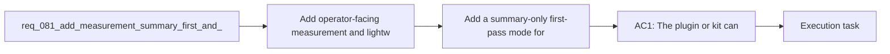

## item_109_add_a_summary_only_first_pass_mode_for_codex_context_injection - Add a summary-only first-pass mode for Codex context injection
> From version: 1.11.1
> Status: Done
> Understanding: 97%
> Confidence: 96%
> Progress: 100%
> Complexity: Medium
> Theme: AI workflow observability and prompt efficiency
> Reminder: Update status/understanding/confidence/progress and linked task references when you edit this doc.

# Problem
- Many Codex tasks do not need a full context pack on the first turn, but the workflow does not yet make a tiny first-pass mode the obvious default.
- Without a `summary-only` path, operators either over-inject context up front or manually reconstruct a smaller launch message themselves.
- The missing capability is a first-class summary-first handoff mode that starts tiny and gives a clear escalation path when deeper context is actually needed.

# Scope
- In:
  - Define a `summary-only` or equivalent ultra-compact handoff mode for Codex context injection.
  - Define the minimum content that must appear in this mode, such as identity, current need, acceptance criteria, key files, risks, or recent change pointers.
  - Define the escalation path from `summary-only` to larger modes so operators are not trapped in an under-contextualized flow.
  - Document when the lightweight mode should be preferred by default.
- Out:
  - Showing size estimation before injection; that is handled by `item_108_add_pre_injection_context_size_estimation_and_budget_visibility_for_codex_handoffs`.
  - Building diff-first code-oriented packs; that is handled by `item_110_add_diff_first_codex_context_flows_for_implementation_and_review_work`.
  - Stale-context exclusion rules, session hygiene, and task-type routing; those are handled by `item_111_exclude_or_deprioritize_stale_completed_and_weakly_linked_context_by_default`, `item_112_add_session_hygiene_guidance_when_topic_or_root_changes_materially`, and `item_113_define_task_type_default_budgets_and_concise_response_contracts_for_codex_handoffs`.

# Acceptance criteria
- AC1: At least one supported Codex handoff flow can start in a `summary-only` or equivalent ultra-compact mode before escalating to larger context.
- AC2: The summary-only payload has a defined minimum contract that stays materially smaller than the broader context modes while still being actionable.
- AC3: Operators can escalate from the summary-only mode to larger context without rebuilding the handoff from scratch.
- AC4: Guidance explains when summary-only should be the preferred default and when it should be bypassed.

# AC Traceability
- req081-AC2 -> Scope: Define a `summary-only` or equivalent ultra-compact handoff mode for Codex context injection.. Proof: TODO.
- req081-AC2 -> Scope: Define the minimum content that must appear in this mode, such as identity, current need, acceptance criteria, key files, risks, or recent change pointers.. Proof: TODO.
- req081-AC2 -> Scope: Define the escalation path from `summary-only` to larger modes so operators are not trapped in an under-contextualized flow.. Proof: TODO.

# Decision framing
- Product framing: Not needed
- Product signals: (none detected)
- Product follow-up: No product brief follow-up is expected based on current signals.
- Architecture framing: Consider
- Architecture signals: contracts and integration, delivery and operations
- Architecture follow-up: Review whether the summary-only escalation contract warrants an ADR after the portfolio lands.

# Links
- Product brief(s): (none yet)
- Architecture decision(s): (none yet)
- Request: `req_081_add_measurement_summary_first_and_diff_first_controls_to_reduce_codex_token_consumption`
- Primary task(s): `task_093_orchestration_delivery_for_req_081_observable_and_lightweight_codex_handoffs`

# References
- `README.md`
- `logics/instructions.md`
- `src/agentRegistry.ts`
- `src/logicsCodexWorkspace.ts`
- `src/logicsViewProvider.ts`
- `logics/request/req_080_reduce_codex_token_consumption_with_budgeted_context_packs_and_agent_aware_prompt_shaping.md`

# Priority
- Impact: High, because a small default first turn can cut token spend immediately on most interactive Codex sessions.
- Urgency: High, because this is one of the clearest user-facing lightweight defaults in the portfolio.

# Notes
- Derived from request `req_081_add_measurement_summary_first_and_diff_first_controls_to_reduce_codex_token_consumption`.
- Source file: `logics/request/req_081_add_measurement_summary_first_and_diff_first_controls_to_reduce_codex_token_consumption.md`.
- Request context seeded into this backlog item from `logics/request/req_081_add_measurement_summary_first_and_diff_first_controls_to_reduce_codex_token_consumption.md`.
- Task `task_093_orchestration_delivery_for_req_081_observable_and_lightweight_codex_handoffs` was finished via `logics_flow.py finish task` on 2026-03-23.
