## item_110_add_diff_first_codex_context_flows_for_implementation_and_review_work - Add diff-first Codex context flows for implementation and review work
> From version: 1.11.1
> Status: Done
> Understanding: 97%
> Confidence: 96%
> Progress: 100%
> Complexity: Medium
> Theme: AI workflow observability and prompt efficiency
> Reminder: Update status/understanding/confidence/progress and linked task references when you edit this doc.

# Problem
- Implementation and review work often need changed files, diffs, and touched paths more than long prose context.
- Without a diff-first path, the workflow can over-inject narrative history into tasks that should begin from the concrete code delta.
- The missing capability is a code-centric handoff mode that prioritizes diffs and touched files, then escalates to broader project context only when necessary.

# Scope
- In:
  - Define a `diff-first` context mode for implementation and review-oriented flows.
  - Define which code-change signals can seed that mode, such as diffs, touched files, or recent commits, and what fallback should occur when those signals are unavailable.
  - Define how `diff-first` should coexist with summary-only and broader context-pack modes.
  - Document when diff-first is the preferred default for code work versus when narrative context still needs to lead.
- Out:
  - Pre-injection measurement, summary-only, stale-context exclusion, session hygiene, and task-type response policies; those are handled by the sibling backlog items in this portfolio.

```mermaid
%% logics-kind: backlog
%% logics-signature: backlog|add-diff-first-codex-context-flows-for-i|req-080-reduce-codex-token-consumption-w|implementation-and-review-work-often-nee|ac1-implementation-and-review-oriented-f
flowchart LR
    Request[req_080_reduce_codex_token_consumption_wit] --> Problem[Implementation and review work often need]
    Problem --> Scope[Add diff-first Codex context flows for]
    Scope --> Acceptance[AC1: Implementation and review-oriented fl]
    Acceptance --> Tasks[task_093_orchestration_delivery_for_req_08]
```

# Acceptance criteria
- AC1: Implementation and review-oriented flows can prefer a `diff-first` context mode built from changed files, touched paths, or recent diffs before falling back to broader narrative context.
- AC2: The diff-first contract defines supported change signals and deterministic fallback behavior when those signals are unavailable.
- AC3: The handoff surface can make the chosen code delta visible enough for operators to understand what the diff-first pack contains.
- AC4: Guidance explains when diff-first should be preferred over summary-only or broader narrative context.

# AC Traceability
- req081-AC3 -> Scope: Define a `diff-first` context mode for implementation and review-oriented flows.. Proof: TODO.
- req081-AC3 -> Scope: Define which code-change signals can seed that mode, such as diffs, touched files, or recent commits, and what fallback should occur when those signals are unavailable.. Proof: TODO.
- req081-AC3 -> Scope: Define how `diff-first` should coexist with summary-only and broader context-pack modes.. Proof: TODO.

# Decision framing
- Product framing: Not needed
- Product signals: (none detected)
- Product follow-up: No product brief follow-up is expected based on current signals.
- Architecture framing: Consider
- Architecture signals: contracts and integration, delivery and operations
- Architecture follow-up: Review whether the diff-first seeding contract warrants an ADR once implementation constraints are clearer.

# Links
- Product brief(s): (none yet)
- Architecture decision(s): (none yet)
- Request: `req_081_add_measurement_summary_first_and_diff_first_controls_to_reduce_codex_token_consumption`
- Primary task(s): `task_093_orchestration_delivery_for_req_081_observable_and_lightweight_codex_handoffs`

# References
- `README.md`
- `logics/instructions.md`
- `src/agentRegistry.ts`
- `src/logicsCodexWorkspace.ts`
- `src/logicsViewProvider.ts`
- `logics/request/req_080_reduce_codex_token_consumption_with_budgeted_context_packs_and_agent_aware_prompt_shaping.md`

# Priority
- Impact: High, because implementation and review loops are among the highest-frequency token consumers in real Codex usage.
- Urgency: High, because diff-first behavior is one of the fastest practical ways to shrink code-focused handoffs.

# Notes
- Derived from request `req_081_add_measurement_summary_first_and_diff_first_controls_to_reduce_codex_token_consumption`.
- Source file: `logics/request/req_081_add_measurement_summary_first_and_diff_first_controls_to_reduce_codex_token_consumption.md`.
- Request context seeded into this backlog item from `logics/request/req_081_add_measurement_summary_first_and_diff_first_controls_to_reduce_codex_token_consumption.md`.
- Task `task_093_orchestration_delivery_for_req_081_observable_and_lightweight_codex_handoffs` was finished via `logics_flow.py finish task` on 2026-03-23.
