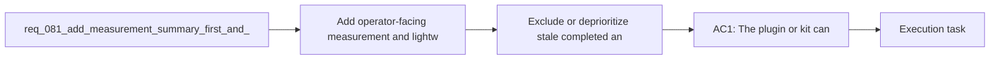

## item_111_exclude_or_deprioritize_stale_completed_and_weakly_linked_context_by_default - Exclude or deprioritize stale completed and weakly linked context by default
> From version: 1.11.1
> Status: Done
> Understanding: 97%
> Confidence: 96%
> Progress: 100%
> Complexity: Medium
> Theme: AI workflow observability and prompt efficiency
> Reminder: Update status/understanding/confidence/progress and linked task references when you edit this doc.

# Problem
- Old, completed, or weakly linked context can keep inflating new Codex sessions even after it stops being genuinely useful.
- If default selection rules do not age out stale context, the workflow slowly regresses into silent token bloat even when packs are otherwise well designed.
- The missing capability is a default exclusion or deprioritization policy that keeps older or weakly relevant context from crowding fresh work.

# Scope
- In:
  - Define which stale, completed, or weakly linked context should be excluded or deprioritized by default.
  - Define the signals used for exclusion or deprioritization, such as status, age, or graph strength.
  - Define the override path so historically important context can still be included deliberately.
  - Document how these rules interact with the broader token-efficiency portfolio and why they are safe.
- Out:
  - Explicit token-hygiene diagnostics and operator remediation reporting; that remains primarily in `req_080` and its backlog split.
  - Measurement, summary-only, diff-first, session hygiene, and task-type response defaults; those are covered by sibling items in this request.

# Acceptance criteria
- AC1: The token-efficiency workflow defines how stale, completed, or no-longer-linked context is excluded or deprioritized by default so old context stops inflating new sessions silently.
- AC2: The default exclusion or deprioritization rules are explicit enough that operators can tell why a context source did not appear.
- AC3: An override path exists for intentionally reintroducing older or weakly linked context when a task genuinely needs it.
- AC4: Documentation explains the safety tradeoff between keeping context lean and preserving access to historical decisions.

# AC Traceability
- req081-AC4 -> Scope: Define which stale, completed, or weakly linked context should be excluded or deprioritized by default.. Proof: TODO.
- req081-AC4 -> Scope: Define the signals used for exclusion or deprioritization, such as status, age, or graph strength.. Proof: TODO.
- req081-AC4 -> Scope: Define the override path so historically important context can still be included deliberately.. Proof: TODO.

# Decision framing
- Product framing: Not needed
- Product signals: (none detected)
- Product follow-up: No product brief follow-up is expected based on current signals.
- Architecture framing: Consider
- Architecture signals: contracts and integration, delivery and operations
- Architecture follow-up: Review whether the exclusion policy should be captured in an ADR once the defaults are chosen.

# Links
- Product brief(s): (none yet)
- Architecture decision(s): (none yet)
- Request: `req_081_add_measurement_summary_first_and_diff_first_controls_to_reduce_codex_token_consumption`
- Primary task(s): `task_093_orchestration_delivery_for_req_081_observable_and_lightweight_codex_handoffs`

# References
- `README.md`
- `logics/instructions.md`
- `src/agentRegistry.ts`
- `src/logicsCodexWorkspace.ts`
- `src/logicsViewProvider.ts`
- `logics/request/req_080_reduce_codex_token_consumption_with_budgeted_context_packs_and_agent_aware_prompt_shaping.md`

# Priority
- Impact: Medium to high, because silent context accumulation erodes gains from the other token-efficiency work over time.
- Urgency: Medium, because the policy should follow the lighter handoff modes rather than block them.

# Notes
- Derived from request `req_081_add_measurement_summary_first_and_diff_first_controls_to_reduce_codex_token_consumption`.
- Source file: `logics/request/req_081_add_measurement_summary_first_and_diff_first_controls_to_reduce_codex_token_consumption.md`.
- Request context seeded into this backlog item from `logics/request/req_081_add_measurement_summary_first_and_diff_first_controls_to_reduce_codex_token_consumption.md`.
- Task `task_093_orchestration_delivery_for_req_081_observable_and_lightweight_codex_handoffs` was finished via `logics_flow.py finish task` on 2026-03-23.
