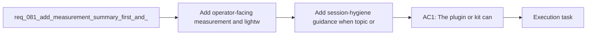

## item_112_add_session_hygiene_guidance_when_topic_or_root_changes_materially - Add session-hygiene guidance when topic or root changes materially
> From version: 1.11.1
> Status: Ready
> Understanding: 97%
> Confidence: 96%
> Progress: 0%
> Complexity: Medium
> Theme: AI workflow observability and prompt efficiency
> Reminder: Update status/understanding/confidence/progress and linked task references when you edit this doc.

# Problem
- Even a good context pack cannot prevent waste if operators keep using the same Codex session across unrelated roots, topics, or delivery slices.
- The current workflow does not yet help users recognize when a fresh session would be cheaper and less error-prone than continuing a long chat.
- The missing capability is session-hygiene guidance that nudges operators toward new chats when the working context changes materially.

# Scope
- In:
  - Define the signals that indicate a fresh Codex session should be suggested, such as root changes, topic changes, or major delivery-slice changes.
  - Define how the guidance should be surfaced so it is useful without becoming spammy.
  - Define the operator override path for cases where continuing the same session is intentional.
  - Document why session hygiene matters for token cost and response quality.
- Out:
  - Measurement, summary-only, diff-first, stale-context exclusion, and task-type response defaults; those are handled by sibling backlog items in this portfolio.

# Acceptance criteria
- AC1: Operator guidance or workflow behavior can encourage opening a fresh Codex session when the active topic, root, or delivery slice changes materially.
- AC2: The session-hygiene signals are explicit enough that operators can understand why the suggestion appeared.
- AC3: The guidance can be ignored or overridden cleanly when continuing the same session is intentional.
- AC4: Documentation explains why session hygiene reduces both token waste and context confusion.

# AC Traceability
- req081-AC5 -> Scope: Define the signals that indicate a fresh Codex session should be suggested, such as root changes, topic changes, or major delivery-slice changes.. Proof: TODO.
- req081-AC5 -> Scope: Define how the guidance should be surfaced so it is useful without becoming spammy.. Proof: TODO.
- req081-AC5 -> Scope: Define the operator override path for cases where continuing the same session is intentional.. Proof: TODO.

# Decision framing
- Product framing: Not needed
- Product signals: (none detected)
- Product follow-up: No product brief follow-up is expected based on current signals.
- Architecture framing: Consider
- Architecture signals: contracts and integration, delivery and operations
- Architecture follow-up: Review whether the session-hygiene trigger contract needs architectural capture once the behavior is implemented.

# Links
- Product brief(s): (none yet)
- Architecture decision(s): (none yet)
- Request: `req_081_add_measurement_summary_first_and_diff_first_controls_to_reduce_codex_token_consumption`
- Primary task(s): `task_093_orchestration_delivery_for_req_081_observable_and_lightweight_codex_handoffs`

# References
- `README.md`
- `logics/instructions.md`
- `src/agentRegistry.ts`
- `src/logicsCodexWorkspace.ts`
- `src/logicsViewProvider.ts`
- `logics/request/req_080_reduce_codex_token_consumption_with_budgeted_context_packs_and_agent_aware_prompt_shaping.md`

# Priority
- Impact: Medium, because session hygiene improves long-running real usage more than single-shot flows.
- Urgency: Medium, because it should follow the core lightweight handoff modes rather than block them.

# Notes
- Derived from request `req_081_add_measurement_summary_first_and_diff_first_controls_to_reduce_codex_token_consumption`.
- Source file: `logics/request/req_081_add_measurement_summary_first_and_diff_first_controls_to_reduce_codex_token_consumption.md`.
- Request context seeded into this backlog item from `logics/request/req_081_add_measurement_summary_first_and_diff_first_controls_to_reduce_codex_token_consumption.md`.
