## item_113_define_task_type_default_budgets_and_concise_response_contracts_for_codex_handoffs - Define task-type default budgets and concise response contracts for Codex handoffs
> From version: 1.11.1
> Status: Done
> Understanding: 97%
> Confidence: 96%
> Progress: 100%
> Complexity: Medium
> Theme: AI workflow observability and prompt efficiency
> Reminder: Update status/understanding/confidence/progress and linked task references when you edit this doc.

# Problem
- Different task classes do not need the same context volume, and reducing input size loses some value if prompts still ask for long, verbose output by default.
- Without task-type defaults, review, bugfix, implementation, and spec-writing flows tend to drift toward a one-size-fits-all budget and response style.
- The missing capability is a task-aware routing contract that keeps both the handoff input budget and the expected response verbosity intentionally small for each task class.

# Scope
- In:
  - Define task-type default context budgets or routing guidance for common task classes such as review, bugfix, implementation, and spec authoring.
  - Define concise response contracts or prompt defaults that keep Codex outputs brief unless deeper explanation is explicitly needed.
  - Define how operators can override these defaults when a task genuinely needs more context or a longer answer.
  - Document the relationship between task type, context budget, and expected answer length.
- Out:
  - Measurement, summary-only, diff-first, stale-context exclusion, and session hygiene; those are covered by sibling backlog items in this request.

```mermaid
%% logics-kind: backlog
%% logics-signature: backlog|define-task-type-default-budgets-and-con|req-080-reduce-codex-token-consumption-w|different-task-classes-do-not-need|ac1-task-type-guidance-or-equivalent-rou
flowchart LR
    Request[req_080_reduce_codex_token_consumption_wit] --> Problem[Different task classes do not need]
    Problem --> Scope[Define task-type default budgets and conci]
    Scope --> Acceptance[AC1: Task-type guidance or equivalent rout]
    Acceptance --> Tasks[task_093_orchestration_delivery_for_req_08]
```

# Acceptance criteria
- AC1: Task-type guidance or equivalent routing rules explain that different task classes such as review, bugfix, implementation, or spec authoring should not consume the same default context budget.
- AC2: Agent or handoff prompts can favor concise response contracts by default so output verbosity does not recreate token waste that smaller input packs just removed.
- AC3: Operators can override the default budget or response style deliberately when a task needs more context or more explanation.
- AC4: Documentation explains the intended defaults for the common task classes in scope.

# AC Traceability
- req081-AC6 -> Scope: Define task-type default context budgets or routing guidance for common task classes such as review, bugfix, implementation, and spec authoring.. Proof: TODO.
- req081-AC7 -> Scope: Define concise response contracts or prompt defaults that keep Codex outputs brief unless deeper explanation is explicitly needed.. Proof: TODO.
- req081-AC6/req081-AC7 -> Scope: Define how operators can override these defaults when a task genuinely needs more context or a longer answer.. Proof: TODO.

# Decision framing
- Product framing: Not needed
- Product signals: (none detected)
- Product follow-up: No product brief follow-up is expected based on current signals.
- Architecture framing: Consider
- Architecture signals: contracts and integration, delivery and operations
- Architecture follow-up: Review whether the task-type routing contract should be captured in an ADR once defaults are proven.

# Links
- Product brief(s): (none yet)
- Architecture decision(s): (none yet)
- Request: `req_081_add_measurement_summary_first_and_diff_first_controls_to_reduce_codex_token_consumption`
- Primary task(s): `task_093_orchestration_delivery_for_req_081_observable_and_lightweight_codex_handoffs`

# References
- `README.md`
- `logics/instructions.md`
- `src/agentRegistry.ts`
- `src/logicsCodexWorkspace.ts`
- `src/logicsViewProvider.ts`
- `logics/request/req_080_reduce_codex_token_consumption_with_budgeted_context_packs_and_agent_aware_prompt_shaping.md`

# Priority
- Impact: Medium to high, because task-aware defaults compound the gains from all the other lightweight handoff work.
- Urgency: Medium, because the portfolio can define the lighter modes first and then tune task-specific defaults on top.

# Notes
- Derived from request `req_081_add_measurement_summary_first_and_diff_first_controls_to_reduce_codex_token_consumption`.
- Source file: `logics/request/req_081_add_measurement_summary_first_and_diff_first_controls_to_reduce_codex_token_consumption.md`.
- Request context seeded into this backlog item from `logics/request/req_081_add_measurement_summary_first_and_diff_first_controls_to_reduce_codex_token_consumption.md`.
- Task `task_093_orchestration_delivery_for_req_081_observable_and_lightweight_codex_handoffs` was finished via `logics_flow.py finish task` on 2026-03-23.
