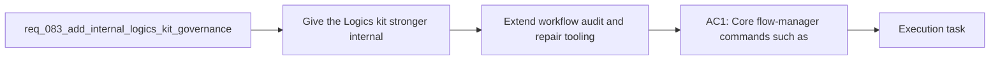

## item_116_extend_workflow_audit_and_repair_tooling_for_structural_autofix_coverage - Extend workflow audit and repair tooling for structural autofix coverage
> From version: 1.11.1
> Status: Done
> Understanding: 97%
> Confidence: 95%
> Progress: 100%
> Complexity: High
> Theme: Kit governance and automation
> Reminder: Update status/understanding/confidence/progress and linked task references when you edit this doc.

# Problem
- Give the Logics kit stronger internal automation contracts so maintainers and downstream tooling can evolve docs, skills, and workflow state predictably without relying on fragile text parsing.
- Add machine-readable outputs, schema and migration primitives, stronger governance modes, and skill-level validation so the kit is easier to automate, upgrade, and audit over time.
- - The recent token-efficiency work improved compact handoff behavior and added kit-side `# AI Context` and token-hygiene checks, but several foundational kit concerns remain outside that scope.
- - The current flow manager is still mostly optimized for human-readable terminal output and heuristic evolution:

# Scope
- In:
- Out:

# Acceptance criteria
- AC1: Core flow-manager commands such as `new`, `promote`, `close`, `finish`, or `sync` can expose machine-readable outputs, for example JSON, so downstream tools can consume stable results without scraping terminal prose.
- AC2: Managed workflow docs have an explicit schema-versioning and migration story, including a way to detect older schemas and run named migrations rather than relying only on implicit template drift.
- AC3: The workflow audit and related repair tooling can autofix or guide more structural issues than today, such as missing sections, stale placeholders, inconsistent indicators, or malformed references, while remaining deterministic.
- AC4: The kit can export a reusable machine-readable representation of workflow relationships or graph structure, and skills themselves can be validated against a structured contract that covers metadata, agent config, assets, and scripts.
- AC5: The kit defines stronger internal governance primitives such as configurable strictness modes, a more reusable section-rendering or document-assembly API, and a consolidated generated index of kit capabilities.

# AC Traceability
- AC1 -> Scope: Core flow-manager commands such as `new`, `promote`, `close`, `finish`, or `sync` can expose machine-readable outputs, for example JSON, so downstream tools can consume stable results without scraping terminal prose.. Proof: TODO.
- AC2 -> Scope: Managed workflow docs have an explicit schema-versioning and migration story, including a way to detect older schemas and run named migrations rather than relying only on implicit template drift.. Proof: TODO.
- AC3 -> Scope: The workflow audit and related repair tooling can autofix or guide more structural issues than today, such as missing sections, stale placeholders, inconsistent indicators, or malformed references, while remaining deterministic.. Proof: TODO.
- AC4 -> Scope: The kit can export a reusable machine-readable representation of workflow relationships or graph structure, and skills themselves can be validated against a structured contract that covers metadata, agent config, assets, and scripts.. Proof: TODO.
- AC5 -> Scope: The kit defines stronger internal governance primitives such as configurable strictness modes, a more reusable section-rendering or document-assembly API, and a consolidated generated index of kit capabilities.. Proof: TODO.

# Decision framing
- Product framing: Not needed
- Product signals: (none detected)
- Product follow-up: No product brief follow-up is expected based on current signals.
- Architecture framing: Consider
- Architecture signals: data model and persistence, contracts and integration, runtime and boundaries, state and sync
- Architecture follow-up: Capture an ADR only if the audit or repair contract becomes the canonical governance boundary for downstream tooling.

# Links
- Product brief(s): (none yet)
- Architecture decision(s): (none yet)
- Request: `req_083_add_internal_logics_kit_governance_migration_and_machine_readable_tooling_primitives`
- Primary task(s): `task_095_orchestration_delivery_for_req_083_kit_governance_migration_and_machine_readable_tooling_primitives`

# AI Context
- Summary: Add machine-readable outputs, schema migrations, stronger audit autofix, skill validation, and governance primitives to the Logics kit.
- Keywords: logics, kit, governance, migration, json, schema, audit, skills
- Use when: Use when planning the next kit-internal automation and governance wave that is separate from compact context-pack work.
- Skip when: Skip when the work targets another feature, repository, or workflow stage.

# References
- `logics/request/req_082_strengthen_logics_kit_primitives_for_compact_ai_context_and_reusable_handoff_generation.md`
- `logics/skills/logics-flow-manager/scripts/logics_flow.py`
- `logics/skills/logics-flow-manager/scripts/logics_flow_support.py`
- `logics/skills/logics-flow-manager/scripts/workflow_audit.py`
- `logics/skills/logics-doc-linter/scripts/logics_lint.py`
- `logics/skills/tests/test_logics_flow.py`
- `logics/skills/tests/test_workflow_audit.py`
- `logics/skills/CONTRIBUTING.md`
- `logics/skills/logics-ui-steering/SKILL.md`

# Priority
- Impact:
- Urgency:

# Notes
- Derived from request `req_083_add_internal_logics_kit_governance_migration_and_machine_readable_tooling_primitives`.
- Source file: `logics/request/req_083_add_internal_logics_kit_governance_migration_and_machine_readable_tooling_primitives.md`.
- Request context seeded into this backlog item from `logics/request/req_083_add_internal_logics_kit_governance_migration_and_machine_readable_tooling_primitives.md`.
- Task `task_095_orchestration_delivery_for_req_083_kit_governance_migration_and_machine_readable_tooling_primitives` was finished via `logics_flow.py finish task` on 2026-03-24.
