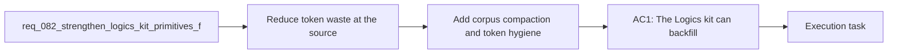

## item_119_add_corpus_compaction_and_token_hygiene_maintenance_flows_for_workflow_docs - Add corpus compaction and token hygiene maintenance flows for workflow docs
> From version: 1.11.1
> Status: Done
> Understanding: 97%
> Confidence: 95%
> Progress: 100%
> Complexity: High
> Theme: AI workflow and kit maintenance
> Reminder: Update status/understanding/confidence/progress and linked task references when you edit this doc.

# Problem
- Reduce token waste at the source by making the Logics kit itself produce compact, reusable AI-facing context instead of relying mainly on plugin-side filtering.
- Turn the recent token-efficiency work into kit-native primitives: older docs should be backfillable, connectors should reuse shared compact-context builders, and the kit should be able to emit stable handoff artifacts directly.
- - `req_080` and `req_081` improved the plugin-facing handoff flow with context budgets, summary-only and diff-first modes, stale-context filtering, and session-hygiene signals.
- - The kit now generates a compact `# AI Context` section for new or promoted request/backlog/task docs, and `workflow_audit.py` can optionally check token hygiene.

# Scope
- In:
- Out:

# Acceptance criteria
- AC1: The Logics kit can backfill, repair, or refresh `# AI Context` sections for existing managed workflow docs so compact handoff metadata is not limited to newly generated files.
- AC2: Connector or importer scripts that generate Logics workflow docs can rely on shared flow-manager helpers for compact AI context fields and template-value assembly instead of duplicating that logic per connector.
- AC3: The kit can generate a reusable `context-pack` or equivalent serialized compact handoff artifact for a selected request/backlog/task using modes such as `summary-only`, `diff-first`, or profile-driven output, so plugin or agent surfaces can consume a kit-native primitive.
- AC4: The kit provides at least one maintenance flow for compacting or flagging stale, redundant, or oversized workflow docs, with token-hygiene guidance that operators can run outside the plugin.
- AC5: Generated assets and skill-level metadata are audited or normalized so outdated workflow templates and missing capability descriptors do not silently reintroduce token-heavy or stale behavior.

# AC Traceability
- AC1 -> Scope: The Logics kit can backfill, repair, or refresh `# AI Context` sections for existing managed workflow docs so compact handoff metadata is not limited to newly generated files.. Proof: TODO.
- AC2 -> Scope: Connector or importer scripts that generate Logics workflow docs can rely on shared flow-manager helpers for compact AI context fields and template-value assembly instead of duplicating that logic per connector.. Proof: TODO.
- AC3 -> Scope: The kit can generate a reusable `context-pack` or equivalent serialized compact handoff artifact for a selected request/backlog/task using modes such as `summary-only`, `diff-first`, or profile-driven output, so plugin or agent surfaces can consume a kit-native primitive.. Proof: TODO.
- AC4 -> Scope: The kit provides at least one maintenance flow for compacting or flagging stale, redundant, or oversized workflow docs, with token-hygiene guidance that operators can run outside the plugin.. Proof: TODO.
- AC5 -> Scope: Generated assets and skill-level metadata are audited or normalized so outdated workflow templates and missing capability descriptors do not silently reintroduce token-heavy or stale behavior.. Proof: TODO.

# Decision framing
- Product framing: Not needed
- Product signals: (none detected)
- Product follow-up: No product brief follow-up is expected based on current signals.
- Architecture framing: Consider
- Architecture signals: contracts and integration, state and sync
- Architecture follow-up: Capture an ADR only if corpus compaction and token-hygiene maintenance become a repo-wide policy boundary.

# Links
- Product brief(s): (none yet)
- Architecture decision(s): (none yet)
- Request: `req_082_strengthen_logics_kit_primitives_for_compact_ai_context_and_reusable_handoff_generation`
- Primary task(s): `task_094_orchestration_delivery_for_req_082_compact_ai_context_and_reusable_handoff_generation`

# AI Context
- Summary: Extend the Logics kit with backfillable AI Context, shared connector helpers, kit-native handoff artifacts, and corpus compaction flows.
- Keywords: logics, kit, ai-context, handoff, compaction, connectors, context-pack
- Use when: Use when defining the next kit-side wave of token-efficiency work after the plugin-side context-pack improvements.
- Skip when: Skip when the work targets another feature, repository, or workflow stage.

# References
- `logics/request/req_080_reduce_codex_token_consumption_with_budgeted_context_packs_and_agent_aware_prompt_shaping.md`
- `logics/request/req_081_add_measurement_summary_first_and_diff_first_controls_to_reduce_codex_token_consumption.md`
- `logics/skills/logics-flow-manager/scripts/logics_flow.py`
- `logics/skills/logics-flow-manager/scripts/logics_flow_support.py`
- `logics/skills/logics-flow-manager/scripts/workflow_audit.py`
- `logics/skills/logics-connector-confluence/scripts/confluence_to_request.py`
- `logics/skills/logics-connector-jira/scripts/jira_to_backlog.py`
- `logics/skills/logics-connector-linear/scripts/linear_to_backlog.py`
- `logics/skills/logics-connector-figma/scripts/figma_to_backlog.py`
- `logics/skills/logics-connector-render/scripts/render_to_backlog.py`
- `logics/skills/logics-react-render-pwa-bootstrapper/scripts/bootstrap_react_render_base_assets.py`
- `logics/skills/logics-ui-steering/SKILL.md`

# Priority
- Impact:
- Urgency:

# Notes
- Derived from request `req_082_strengthen_logics_kit_primitives_for_compact_ai_context_and_reusable_handoff_generation`.
- Source file: `logics/request/req_082_strengthen_logics_kit_primitives_for_compact_ai_context_and_reusable_handoff_generation.md`.
- Request context seeded into this backlog item from `logics/request/req_082_strengthen_logics_kit_primitives_for_compact_ai_context_and_reusable_handoff_generation.md`.
- Task `task_094_orchestration_delivery_for_req_082_compact_ai_context_and_reusable_handoff_generation` was finished via `logics_flow.py finish task` on 2026-03-24.
