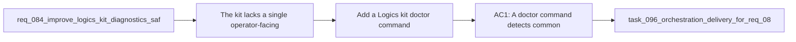

## item_124_add_a_logics_kit_doctor_command_and_explainable_diagnostics - Add a Logics kit doctor command and explainable diagnostics
> From version: 1.11.1
> Status: Done
> Understanding: 97%
> Confidence: 95%
> Progress: 100%
> Complexity: High
> Theme: Kit runtime and operator tooling
> Reminder: Update status/understanding/confidence/progress and linked task references when you edit this doc.

# Problem
- The kit lacks a single operator-facing diagnostic entrypoint for broken setup, missing dependencies, unsupported runtime situations, or malformed workflow state.
- Maintainers currently infer root causes by reading stack traces, rerunning scripts, or manually checking several directories and command prerequisites.
- This item should focus on an explainable `doctor` surface that reports what failed, why it matters, and what the operator should do next.

# Scope
- In:
  - A `doctor` or equivalent diagnostics command for the Logics kit.
  - Checks for common environment, dependency, workflow, and skill-package failure modes.
  - Explainable output that includes cause, impact, and remediation guidance.
  - A minimal machine-readable or structured internal result shape if needed by tests, without overlapping the broader JSON-output request in `req_083`.
- Out:
  - Schema versioning, graph export, or broader governance work from `req_083`.
  - Safe-write preview mechanics from `item_127`.
  - Broad plugin UI surfacing of doctor results.

# Acceptance criteria
- AC1: A doctor command detects common kit setup and runtime failures such as missing dependencies, missing workflow directories, or unsupported execution modes.
- AC2: The diagnostic output explains remediation steps in operator-facing terms instead of only surfacing raw exceptions or exit codes.
- AC3: Automated coverage exercises at least a few representative healthy and unhealthy scenarios so the doctor contract does not regress silently.

# AC Traceability
- AC1 -> Scope. Proof: implement doctor checks for common prerequisite and workflow failures.
- AC2 -> Scope. Proof: verify diagnostics include cause and remediation details.
- AC3 -> Scope. Proof: add tests or fixtures that assert representative doctor outcomes.

# Decision framing
- Product framing: Not needed
- Product signals: (none detected)
- Product follow-up: No product brief follow-up is expected based on current signals.
- Architecture framing: Not needed
- Architecture signals: (none detected)
- Architecture follow-up: No architecture decision follow-up is expected based on current signals.

# Links
- Product brief(s): (none yet)
- Architecture decision(s): (none yet)
- Request: `req_084_improve_logics_kit_diagnostics_safety_and_internal_runtime_contracts`
- Primary task(s): `task_096_orchestration_delivery_for_req_084_diagnostics_safety_and_internal_runtime_contracts`

# AI Context
- Summary: Add a doctor-style diagnostics entrypoint that can explain common kit setup and runtime failures with concrete remediation guidance.
- Keywords: doctor, diagnostics, prerequisites, remediation, workflow, skills
- Use when: Use when implementing operator-facing diagnostics and explainable failure reporting for the kit.
- Skip when: Skip when the work targets another feature, repository, or workflow stage.

# Priority
- Impact: High
- Urgency: Medium

# Notes
- Derived from request `req_084_improve_logics_kit_diagnostics_safety_and_internal_runtime_contracts`.
- Source file: `logics/request/req_084_improve_logics_kit_diagnostics_safety_and_internal_runtime_contracts.md`.
- Request context seeded into this backlog item from `logics/request/req_084_improve_logics_kit_diagnostics_safety_and_internal_runtime_contracts.md`.
- Task `task_096_orchestration_delivery_for_req_084_diagnostics_safety_and_internal_runtime_contracts` was finished via `logics_flow.py finish task` on 2026-03-24.
